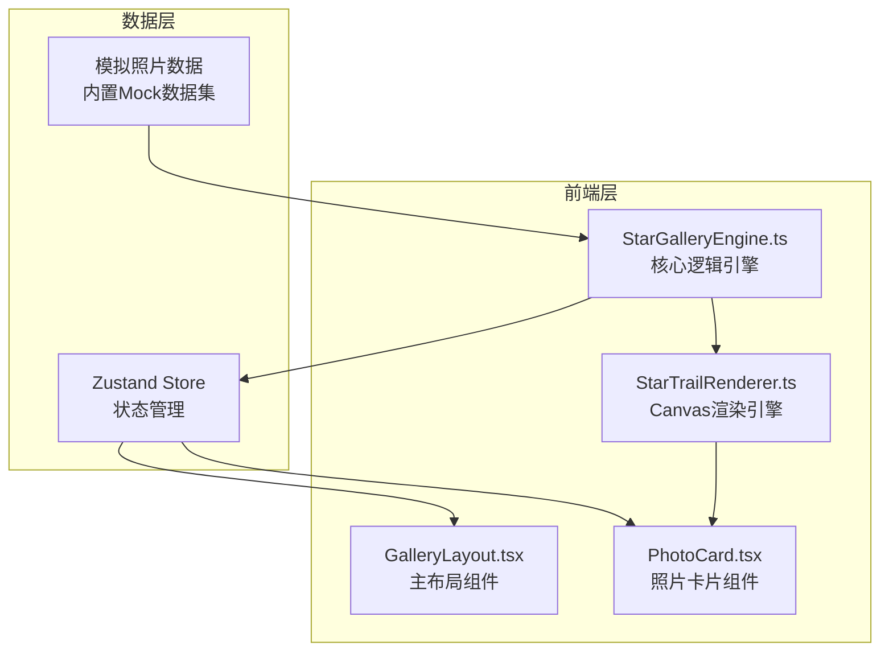
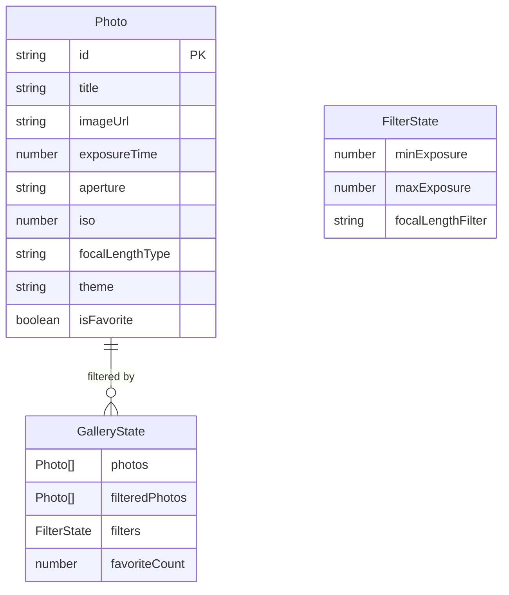

## 1. 架构设计



## 2. 技术说明
- 前端框架：React 18 + TypeScript
- 构建工具：Vite
- 样式方案：Tailwind CSS 3
- 状态管理：Zustand
- Canvas渲染：原生Canvas 2D API（无第三方Canvas库）
- 图标：lucide-react
- 字体：Orbitron（标题）+ Noto Sans SC（正文）
- 初始化工具：vite-init（react-ts模板）
- 后端：无（纯前端，使用Mock数据）

## 3. 路由定义
本项目为单页面应用，无多页面路由。

| 路由 | 用途 |
|------|------|
| / | 星轨画廊主页，包含所有功能 |

## 4. 数据模型

### 4.1 数据模型定义



### 4.2 数据定义

```typescript
interface Photo {
  id: string;
  title: string;
  imageUrl: string;
  exposureTime: number;
  aperture: string;
  iso: number;
  focalLengthType: 'wide' | 'standard' | 'telephoto';
  theme: 'warm' | 'cool';
  isFavorite: boolean;
}

interface FilterState {
  minExposure: number;
  maxExposure: number;
  focalLengthFilter: 'all' | 'wide' | 'standard' | 'telephoto';
}

interface GalleryState {
  photos: Photo[];
  filteredPhotos: Photo[];
  filters: FilterState;
  favoriteCount: number;
  setFilters: (filters: Partial<FilterState>) => void;
  toggleFavorite: (id: string) => void;
  randomize: () => void;
}
```

## 5. 模块职责

### StarGalleryEngine.ts
- 管理照片Mock数据集（12-16张预设照片数据）
- Zustand store定义：筛选状态、收藏状态、照片列表
- 筛选逻辑：根据曝光时间范围和焦距类型过滤照片
- 随机切换：随机打乱当前照片顺序
- 事件调度：通知PhotoCard组件更新动画状态

### StarTrailRenderer.ts
- 星轨线条生成：根据曝光时间计算弧线长度和密度
- 旋转动画：基于焦距调整旋转速度（广角慢、长焦快）
- 颜色渐变：暖色主题（#ff6b35→#ffd700），冷色主题（#00d4ff→#7b2ff7）
- 发光效果：使用Canvas shadowBlur和globalCompositeOperation
- 粒子爆散：点击时生成粒子数组，每帧更新位置和透明度
- 动画循环管理：requestAnimationFrame，仅可视区域卡片激活动画

### GalleryLayout.tsx
- 整体布局：左侧固定导航栏 + 右侧自适应网格 + 底部固定统计栏
- 深空渐变背景
- 导航栏组件：曝光时间双滑块、焦距下拉菜单、随机切换按钮
- 照片网格：响应式CSS Grid
- 底部统计栏
- 照片详情弹窗（毛玻璃卡片）

### PhotoCard.tsx
- Canvas星轨动画层
- 照片缩略图显示
- 鼠标悬停事件：加速旋转 + 卡片放大
- 点击事件：触发粒子爆散 + 弹出详情卡片
- 动画状态管理：isActive（是否在可视区域）、isHovered、isExploding
