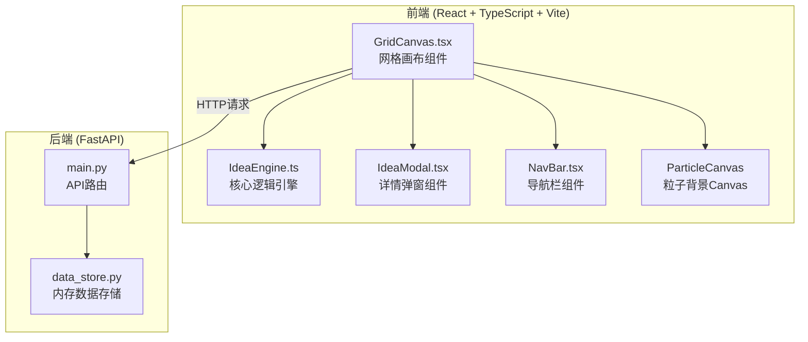
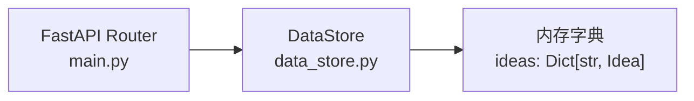
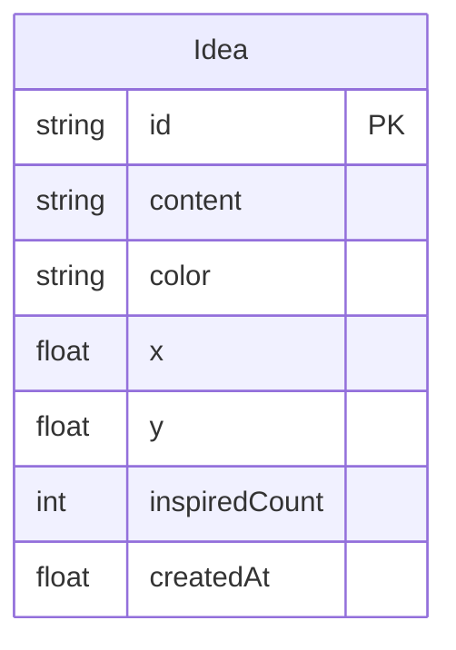

## 1. 架构设计



## 2. 技术说明

- 前端：React@18 + TypeScript + Vite + CSS Animations
- 初始化工具：Vite (create-vite)
- 后端：FastAPI + uvicorn
- 数据库：无（内存存储 data_store.py）
- 跨域：FastAPI CORS中间件允许前端localhost访问

## 3. 路由定义

| 路由 | 用途 |
|------|------|
| / | 网格画布主页，展示创意卡片网格 |
| /leaderboard | 热度榜页面，展示前10名创意排行 |

## 4. API 定义

### 4.1 TypeScript 类型定义

```typescript
interface Idea {
  id: string;
  content: string;
  color: string;
  x: number;
  y: number;
  inspiredCount: number;
  createdAt: number;
}

interface InspireRequest {
  fromId: string;
  toId: string;
}

interface IdeaCreateRequest {
  content: string;
}
```

### 4.2 API 端点

| 方法 | 路径 | 请求体 | 响应 | 用途 |
|------|------|--------|------|------|
| GET | /api/ideas | - | Idea[] | 获取所有创意 |
| POST | /api/ideas | IdeaCreateRequest | Idea | 发布新创意 |
| POST | /api/ideas/inspire | InspireRequest | Idea | 启发（融合）创意 |
| GET | /api/ideas/leaderboard | - | Idea[] | 获取热度榜(前10) |

## 5. 服务器架构图



## 6. 数据模型

### 6.1 数据模型定义



### 6.2 数据定义

- Idea.id: UUID自动生成
- Idea.content: 最大50字
- Idea.color: 从预设荧光色池中随机选取（不重复）
- Idea.x / Idea.y: 网格中的随机位置(0-1范围)
- Idea.inspiredCount: 被启发次数，初始0
- Idea.createdAt: 时间戳

## 7. 文件结构

```
├── index.html
├── package.json
├── vite.config.js
├── tsconfig.json
├── src/
│   ├── IdeaEngine.ts
│   ├── GridCanvas.tsx
│   ├── IdeaModal.tsx
│   ├── NavBar.tsx
│   └── index.tsx
├── api/
│   ├── main.py
│   └── data_store.py
```

## 8. 关键技术决策

- **粒子系统**：使用独立Canvas元素渲染，requestAnimationFrame驱动，与React组件并行运行
- **融合动画**：使用SVG叠加层绘制飞线，requestAnimationFrame驱动1.5秒动画，完成后移除SVG
- **卡片布局**：CSS Grid响应式布局 + 随机偏移量实现散布效果
- **状态管理**：React useState + useEffect，IdeaEngine作为纯逻辑层提供计算函数
- **毛玻璃效果**：CSS backdrop-filter: blur() + 半透明背景色
- **颜色分配**：预设荧光色池循环分配，确保相邻卡片颜色不同
