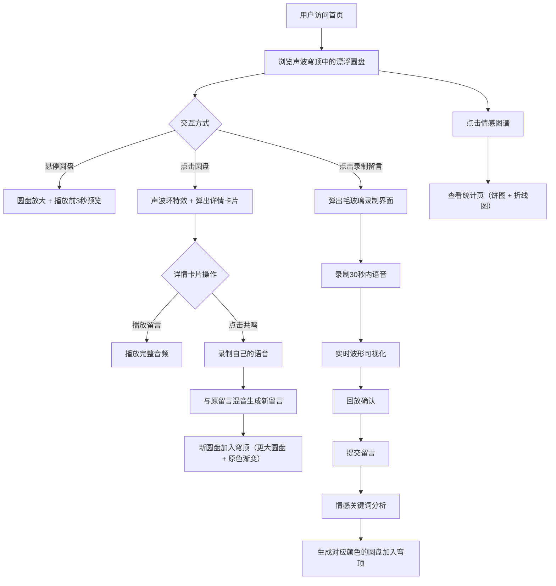

## 1. 产品概述

「回声驿站」是一个匿名声音留言板，用户可以在蒸汽波复古风格的界面上录制30秒内的语音留言，留言会以发光圆盘的形式漂浮在「声波穹顶」中。通过情感分析自动着色、共鸣混音等创新交互，打造沉浸式的声音社交体验。

- 目标用户：寻求匿名情感表达的年轻人、声音爱好者、追求新奇交互体验的用户
- 核心价值：将声音可视化为漂浮的艺术品，让匿名留言不再是冰冷的文字，而是有温度、有色彩的声音穹顶

## 2. 核心功能

### 2.1 用户角色

| 角色 | 注册方式 | 核心权限 |
|------|----------|----------|
| 匿名用户 | 无需注册 | 录制留言、浏览穹顶、共鸣留言、查看统计 |

### 2.2 功能模块

1. **声波穹顶首页**：漂浮发光圆盘、悬停预览、点击查看详情、声波环特效
2. **录制留言弹窗**：录音控制、实时波形可视化、回放、提交
3. **留言详情卡片**：留言信息展示、播放、共鸣按钮
4. **情感图谱统计页**：情感分类饼图、近7天留言折线图

### 2.3 页面详情

| 页面名称 | 模块名称 | 功能描述 |
|----------|----------|----------|
| 声波穹顶首页 | 圆盘穹顶 | 大量半透明发光圆盘慢速旋转、随机飘移，颜色根据情感渐变 |
| 声波穹顶首页 | 悬停预览 | 鼠标悬停圆盘放大，播放前3秒预览 |
| 声波穹顶首页 | 声波环特效 | 点击圆盘触发扩散声波环动画 |
| 声波穹顶首页 | 底部导航栏 | 半透明固定导航，含录制留言和情感图谱按钮 |
| 录制留言弹窗 | 毛玻璃录制界面 | 可视化波形、录音/回放/提交按钮，30秒限制 |
| 留言详情卡片 | 毛玻璃详情卡 | 显示时长、情感标签、留言时间，播放和共鸣按钮 |
| 情感图谱统计页 | 情感饼图 | 按开心/忧伤/平静/愤怒分类的圆盘数量占比 |
| 情感图谱统计页 | 留言折线图 | 近7天每日留言数量趋势 |

## 3. 核心流程

用户打开首页看到声波穹顶中漂浮的众多发光圆盘，点击底部「录制留言」按钮弹出录制界面，录制语音并提交后，新留言变成一个发光圆盘加入穹顶。用户也可以悬停圆盘预览、点击查看详情、点击「共鸣」按钮将自己的语音与原留言混音生成新留言。

## 4. 用户界面设计

### 4.1 设计风格

- 主色调：深紫(#1a0a2e)到暗红(#3d0c1c)渐变背景
- 强调色：金黄(#ffd700)、靛蓝(#4b0082)、翠绿(#00c853)、橙红(#ff4500)（对应四种情感）
- 毛玻璃效果：backdrop-filter: blur(20px)，半透明白色边框
- 噪点纹理：轻微颗粒感叠加
- 扫描线动画：CRT显示器风格的水平扫描线
- 按钮风格：圆角胶囊形，半透明毛玻璃质感，悬停发光
- 字体：显示字体用 Playfair Display（复古衬线），界面字体用 Space Mono（等宽复古）
- 布局风格：全屏沉浸式穹顶，浮动式弹窗

### 4.2 页面设计概述

| 页面名称 | 模块名称 | UI元素 |
|----------|----------|--------|
| 声波穹顶首页 | 圆盘穹顶 | 深紫暗红渐变背景，多个半透明发光圆盘随机漂浮旋转，波纹动画随音量起伏 |
| 声波穹顶首页 | 底部导航栏 | 固定底部，半透明毛玻璃，两个胶囊按钮 |
| 录制留言弹窗 | 录制界面 | 居中毛玻璃卡片，上方实时波形Canvas，下方录音/回放/提交按钮 |
| 留言详情卡片 | 详情卡 | 居中毛玻璃卡片，声波环扩散特效，留言信息，共鸣按钮 |
| 情感图谱统计页 | 统计图表 | 顶部饼图（四色情感占比），下方折线图（7天趋势），蒸汽波配色 |

### 4.3 响应式设计

- 桌面端（≥768px）：全屏穹顶，圆盘数量更多更大，鼠标悬停交互
- 移动端（<768px）：圆盘数量减少尺寸缩小，触摸点击交互替代悬停，导航栏适配小屏
- 交互优化：移动端长按替代悬停预览，所有触摸区域≥44px

### 4.4 3D场景指引

- 环境：深紫暗红渐变深空感，带有CRT扫描线和噪点纹理
- 灯光：圆盘自带发光效果（box-shadow + 渐变边框），无外部光源
- 构图：圆盘在视口内随机分布，避免重叠，形成星云般的视觉效果
- 交互：圆盘慢速自转 + 随机飘移，悬停放大1.3倍，点击声波环扩散
- 后处理：噪点纹理叠加层、扫描线动画层、圆盘模糊光晕
