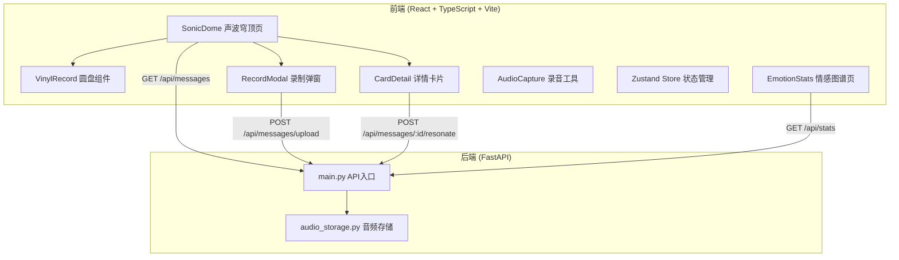
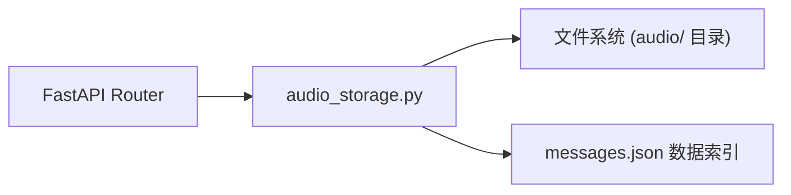
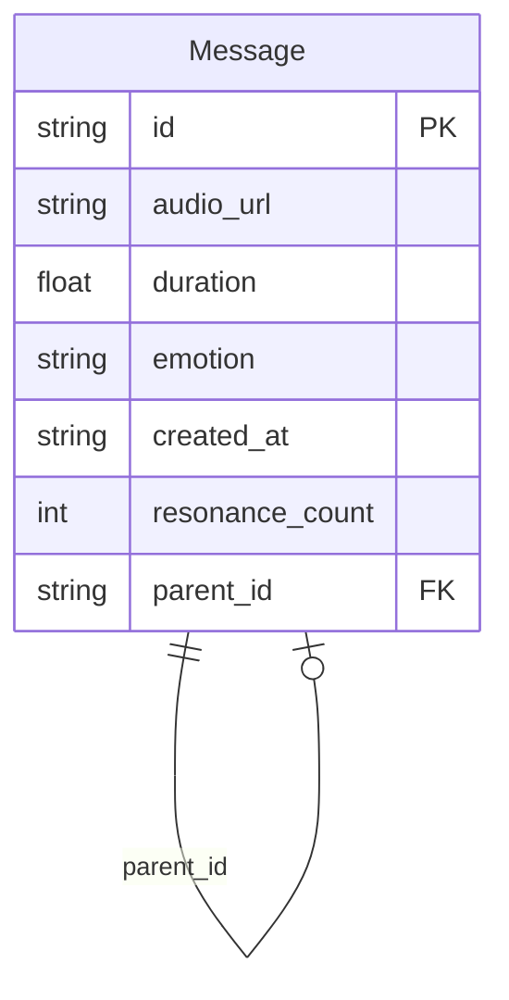

## 1. 架构设计



## 2. 技术说明

- 前端：React@18 + TypeScript + Vite + TailwindCSS + Zustand
- 初始化工具：vite-init（react-ts 模板）
- 后端：FastAPI + Uvicorn（Python）
- 数据库：JSON文件存储（无需额外数据库服务）
- 音频处理：Web Audio API（前端录音/播放/分析）
- 图表：自实现Canvas图表（饼图 + 折线图），避免额外依赖

## 3. 路由定义

| 路由 | 用途 |
|------|------|
| / | 声波穹顶首页，展示漂浮圆盘和底部导航 |
| /stats | 情感图谱统计页，展示饼图和折线图 |

## 4. API定义

### 4.1 数据类型

```typescript
interface Message {
  id: string;
  audio_url: string;
  duration: number;
  emotion: "happy" | "sad" | "calm" | "angry";
  emotion_label: string;
  created_at: string;
  resonance_count: number;
  parent_id: string | null;
  volume_data: number[];
}

interface EmotionStats {
  happy: number;
  sad: number;
  calm: number;
  angry: number;
  daily_counts: { date: string; count: number }[];
}
```

### 4.2 API端点

| 方法 | 路径 | 请求 | 响应 | 描述 |
|------|------|------|------|------|
| GET | /api/messages | - | Message[] | 获取所有留言列表 |
| POST | /api/messages/upload | FormData: audio(blob), emotion, duration, volume_data, parent_id? | Message | 上传新留言 |
| GET | /api/messages/{id}/audio | - | audio/wav | 获取留言音频 |
| POST | /api/messages/{id}/resonate | FormData: audio(blob), duration | Message | 共鸣混音 |
| GET | /api/stats | - | EmotionStats | 获取统计数据 |

## 5. 服务器架构图



## 6. 数据模型

### 6.1 数据模型定义



### 6.2 数据存储

- 音频文件存储在 `backend/audio/` 目录，文件名为 `{id}.webm`
- 留言元数据存储在 `backend/messages.json`，包含所有留言的索引信息
- 启动时自动创建目录和文件（如不存在）
