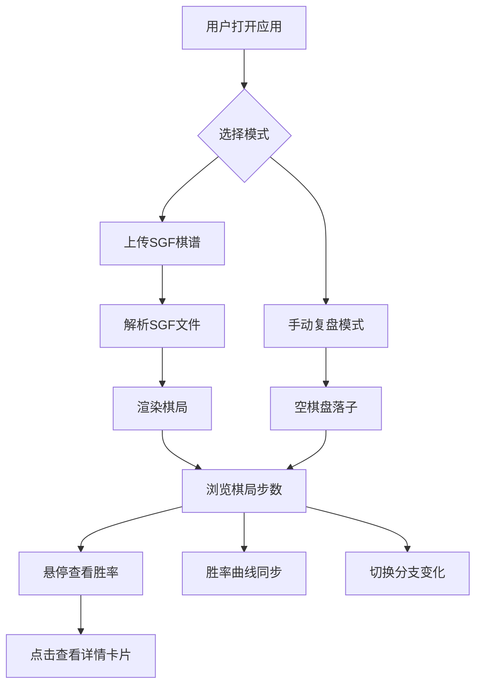

## 1. 产品概述

「墨迹棋谱」是一款在线围棋棋谱分析与复盘工具，采用水墨风格视觉语言，为围棋爱好者提供沉浸式的棋谱浏览与AI辅助分析体验。
- 核心价值：将传统围棋复盘与现代AI分析结合，以中国水墨美学呈现对局过程，让每步棋的胜率变化与关键转折一目了然
- 目标用户：围棋爱好者、棋手、围棋教练与学员

## 2. 核心功能

### 2.1 用户角色
| 角色 | 注册方式 | 核心权限 |
|------|----------|----------|
| 普通用户 | 无需注册 | 上传棋谱、手动复盘、查看AI分析 |

### 2.2 功能模块
1. **棋盘页面**：水墨风格棋盘、落子交互、涟漪动画、棋子悬停信息、点击详情卡片
2. **控制面板**：上传SGF、手动复盘、切换分支、胜率曲线图

### 2.3 页面详情
| 页面名称 | 模块名称 | 功能描述 |
|----------|----------|----------|
| 棋盘页面 | 棋盘渲染 | 19×19棋盘，宣纸米黄底色，淡墨网格线，黑白玉质棋子，落子缓动动画，涟漪扩散特效 |
| 棋盘页面 | 棋子交互 | 鼠标悬停棋子微微放大，显示该步胜率与推荐下一手；点击弹出毛玻璃详情卡片 |
| 棋盘页面 | 详情卡片 | 半透明毛玻璃卡片，展示胜率变化、目数差、AI推荐前三个位置 |
| 棋盘页面 | 关键转折标识 | 不同墨色深浅标识关键转折点步 |
| 控制面板 | 上传SGF | 上传SGF棋谱文件并解析展示 |
| 控制面板 | 手动复盘 | 前进/后退/跳转步数控制 |
| 控制面板 | 切换分支 | 浏览SGF中的分支变化图 |
| 控制面板 | 胜率曲线 | SVG图表展示从开局到当前步的胜率波动 |

## 3. 核心流程

用户打开应用后，可选择上传SGF棋谱文件或进入手动复盘模式。上传SGF后系统自动解析并渲染棋局，用户通过控制面板逐步浏览。悬停棋子查看简要信息，点击查看详细分析。胜率曲线实时跟随当前步数变化，关键转折点以墨色深浅标识。

## 4. 用户界面设计

### 4.1 设计风格
- 主色调：宣纸米黄（#F5E6C8），墨色系（#1A1A1A 到 #999999 渐变标识关键度）
- 强调色：朱砂红（#C84032）用于关键转折点高亮
- 按钮风格：圆角、半透明毛玻璃质感，悬停时微微泛光
- 字体：标题用"思源宋体"（Noto Serif SC），正文用"思源黑体"（Noto Sans SC）
- 布局：左侧毛玻璃控制面板 + 中央棋盘区域
- 图标风格：简约线条水墨风

### 4.2 页面设计概述
| 页面名称 | 模块名称 | UI要素 |
|----------|----------|--------|
| 棋盘页面 | 棋盘渲染 | 宣纸米黄底色Canvas，淡墨网格线，黑白半透明玉质棋子，落子缩放缓动动画(0.3s ease-out)，涟漪圆环扩散特效(0.6s) |
| 棋盘页面 | 棋子交互 | 悬停棋子放大1.08倍，浮现小型胜率标签和推荐落点标记；毛玻璃详情卡片(backdrop-blur) |
| 棋盘页面 | 详情卡片 | 半透明毛玻璃卡片，显示胜率变化箭头、目数差数值、3个AI推荐位置（带坐标和胜率） |
| 控制面板 | 面板整体 | 左侧固定宽度，毛玻璃背景，圆角卡片容器 |
| 控制面板 | 上传SGF按钮 | 带图标的上传按钮，点击弹出文件选择器 |
| 控制面板 | 手动复盘按钮 | 前进/后退/跳转按钮组 |
| 控制面板 | 切换分支按钮 | 分支选择下拉或列表 |
| 控制面板 | 胜率曲线 | SVG折线图，黑方胜率0-100%，关键转折点朱砂红标记 |

### 4.3 响应式适配
- 桌面端（≥1024px）：左侧控制面板 + 中央大棋盘
- 平板端（768px-1023px）：控制面板移至底部，棋盘居中自适应大小
- 触控优化：棋子点击区域放大，手势滑动切换步数

### 4.4 性能目标
- 交互响应帧率保持60fps
- 落子动画使用requestAnimationFrame驱动
- Canvas渲染层与React UI层分离，避免不必要的重绘
