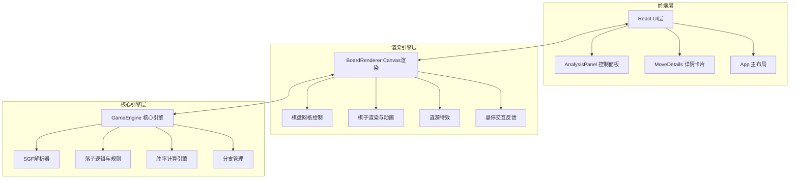

## 1. 架构设计



## 2. 技术说明
- 前端：React@18 + TypeScript + Vite + Tailwind CSS
- 初始化工具：vite-init (react-ts模板)
- 后端：无
- 数据库：无
- 状态管理：Zustand
- 渲染：Canvas 2D 用于棋盘和棋子渲染，React/HTML 用于UI面板
- 动画：requestAnimationFrame + CSS transitions
- 图表：手写SVG胜率曲线（不引入d3，减少依赖）

## 3. 路由定义
| 路由 | 用途 |
|------|------|
| / | 主页面，包含棋盘与控制面板 |

## 4. 文件结构

```
src/
├── GameEngine.ts        # 核心引擎：SGF解析、落子逻辑、胜率计算、分支管理
├── BoardRenderer.ts     # 棋盘渲染：Canvas绘制、水墨纹理、落子动画、涟漪特效
├── AnalysisPanel.tsx    # 控制面板：上传SGF、手动复盘、切换分支、胜率曲线
├── MoveDetails.tsx      # 详情卡片：胜率变化、目数差、AI推荐位置
├── App.tsx              # 主布局组件
├── main.tsx             # 入口文件
├── store.ts             # Zustand全局状态
└── index.css            # 全局样式与Tailwind
```

## 5. 核心数据结构

### 5.1 棋局状态
```typescript
interface Move {
  x: number;
  y: number;
  color: 'black' | 'white';
  moveNumber: number;
  winRate: number;
  scoreLead: number;
  isKeyMoment: boolean;
  suggestions: Suggestion[];
  comment?: string;
}

interface Suggestion {
  x: number;
  y: number;
  winRate: number;
  scoreLead: number;
  order: number;
}

interface GameState {
  board: (null | 'black' | 'white')[][];
  moves: Move[];
  currentMoveIndex: number;
  branches: Branch[];
  currentBranchIndex: number;
}

interface Branch {
  name: string;
  moves: Move[];
  startMoveIndex: number;
}
```

### 5.2 渲染状态
```typescript
interface RenderState {
  hoverPos: { x: number; y: number } | null;
  animationProgress: number;
  rippleEffects: RippleEffect[];
}

interface RippleEffect {
  x: number;
  y: number;
  startTime: number;
  duration: number;
}
```

## 6. 关键技术实现

### 6.1 SGF解析
- 解析标准SGF格式（含分支）
- 支持属性：B/W（落子）、AB/AW（添加棋子）、C（注释）、N（节点名称）、LB（标签）

### 6.2 胜率计算
- 基于棋盘局面模拟计算胜率（简化版，基于领地估算+影响函数）
- 每步棋计算后生成胜率数据供曲线图使用
- 关键转折点判定：胜率变化超过5%的步标记为关键点

### 6.3 Canvas渲染管线
1. 绘制宣纸纹理底色（预渲染离屏Canvas缓存）
2. 绘制淡墨网格线
3. 绘制所有棋子（玉质质感通过径向渐变+透明度实现）
4. 绘制当前步高亮标记
5. 绘制涟漪特效动画
6. 绘制悬停效果

### 6.4 动画系统
- 落子动画：棋子从0缩放到1，0.3s ease-out
- 涟漪特效：从落子点扩散的圆环，0.6s渐隐
- 悬停效果：棋子放大1.08倍，CSS transition
- 帧率控制：requestAnimationFrame + deltaTime

### 6.5 性能优化
- 宣纸纹理和网格线预渲染到离屏Canvas，仅棋子层动态重绘
- 棋子渲染结果缓存，仅新增/移除棋子时更新
- React UI层与Canvas渲染层分离，UI更新不触发Canvas重绘
- 使用React.memo和useMemo减少不必要的组件重渲染
