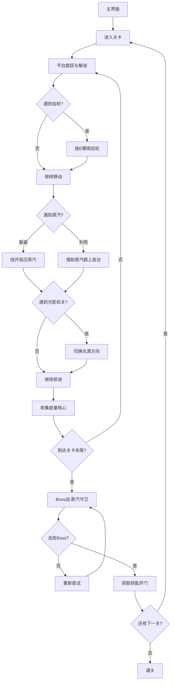

## 1. 产品概述

「暗影齿轮·蒸汽纪元」是一款2D平台解谜游戏，玩家操控一个发条傀儡在维多利亚风格的蒸汽工厂中穿梭，利用齿轮传动、蒸汽喷射和光影机关来收集能量核心并解锁通往下一层的门。目标用户为喜爱平台跳跃和解谜游戏的玩家，提供沉浸式的蒸汽朋克体验。

## 2. 核心功能

### 2.1 用户角色

| 角色 | 进入方式 | 核心权限 |
|------|----------|----------|
| 玩家 | 直接进入 | 操控傀儡、收集核心、击败Boss |

### 2.2 功能模块

1. **游戏主界面**：游戏启动画面、开始按钮、关卡选择
2. **游戏场景**：2D平台关卡，包含齿轮、蒸汽、光影机关、能量核心、Boss战
3. **HUD界面**：能量槽、关卡进度、核心数量、提示文字
4. **触屏控制层**：虚拟摇杆、操作按钮

### 2.3 页面详情

| 页面名称 | 模块名称 | 功能描述 |
|----------|----------|----------|
| 游戏主界面 | 启动画面 | 铜绿暗金标题动画、齿轮转动背景、开始/继续按钮 |
| 游戏场景 | 平台关卡 | WASD移动、空格跳跃、E键攀爬齿轮、蒸汽躲避/利用、光影机关切换、能量核心收集 |
| 游戏场景 | Boss战 | 蒸汽守卫AI攻击、齿轮蒸汽交互反击、击败获取钥匙开门 |
| HUD界面 | 能量槽 | 蒸汽压力表风格显示，受击闪烁 |
| HUD界面 | 核心计数 | 右上角核心数量+收集动画 |
| HUD界面 | 关卡进度 | 底部进度条显示当前关卡进度 |
| 触屏控制层 | 虚拟摇杆 | 左下角摇杆控制移动 |
| 触屏控制层 | 操作按钮 | 右下角跳跃/攀爬/互动按钮，半透明悬浮 |

## 3. 核心流程

玩家从主界面进入游戏 → 进入关卡 → 操控傀儡在平台间移动跳跃 → 遇到齿轮机关时按E攀爬随齿轮旋转 → 躲避或利用蒸汽喷射 → 切换光源方向让平台显现/消失 → 收集散布关卡的能量核心 → 到达关卡末尾面对蒸汽守卫Boss → 利用齿轮和蒸汽反击击败Boss → 获取钥匙开门进入下一关 → 通关或重新挑战。

## 4. 用户界面设计

### 4.1 设计风格

- 主色调：铜绿（#2D5A47）、深棕（#3C2415）、暗金（#C9A84C）
- 辅助色：铁锈红（#8B3A2A）、蒸汽白（#E8DCC8）、齿轮铜（#B87333）
- 按钮风格：圆角矩形，铜质边框，齿轮纹理装饰，按下时有蒸汽喷出效果
- 字体：标题使用装饰性维多利亚风格字体，正文使用清晰的无衬线字体
- 布局风格：全屏Canvas游戏画面 + 半透明毛玻璃HUD叠加层
- 图标风格：齿轮、蒸汽管道、发条等蒸汽朋克元素图标

### 4.2 页面设计概览

| 页面名称 | 模块名称 | UI元素 |
|----------|----------|--------|
| 游戏主界面 | 启动画面 | 暗色背景、铜质标题字体、齿轮转动动画、蒸汽粒子飘散、铜质按钮 |
| 游戏场景 | 平台关卡 | 铜绿深棕背景、齿轮管道装饰、铜锈傀儡带发光符文、半透明蒸汽粒子带光晕、光影切换平台明暗 |
| HUD界面 | 能量槽 | 蒸汽压力表圆形表盘、铜质边框、指针式指示、受击闪烁红光 |
| HUD界面 | 核心计数 | 右上角半透明面板、发光核心图标、数字增长动画 |
| HUD界面 | 关卡进度 | 底部管道风格进度条、齿轮节点标记 |
| 触屏控制层 | 虚拟摇杆 | 左下角半透明圆形摇杆、铜质外环 |
| 触屏控制层 | 操作按钮 | 右下角半透明圆形按钮、齿轮图标、按下反馈 |

### 4.3 响应式设计

- 桌面端：WASD + 空格 + E键操作，全屏Canvas渲染
- 触屏端：虚拟摇杆 + 浮动按钮，Canvas自适应屏幕尺寸
- 最小支持分辨率：360x640（移动端竖屏）
- 推荐分辨率：1920x1080（桌面端）

### 4.4 2D场景指导

- 环境：维多利亚蒸汽工厂，满是齿轮和管道，金属质感和蒸汽弥漫
- 光影：主光源为工厂顶部的蒸汽灯，产生明暗交替的光影效果；光影机关切换光源方向
- 粒子效果：蒸汽半透明粒子带光晕、齿轮转动残影轨迹、能量核心发光脉动
- 动画：傀儡移动时铜锈纹理微动、符文发光闪烁、齿轮旋转带残影、蒸汽喷射带粒子扩散
- 交互反馈：攀爬/跳跃/机关触发时屏幕震动+音效、蒸汽碰撞能量槽闪烁+泄漏声、核心收集发光+叮当声+计数动画
- 性能预算：60fps目标，粒子数量动态调整，requestAnimationFrame驱动
