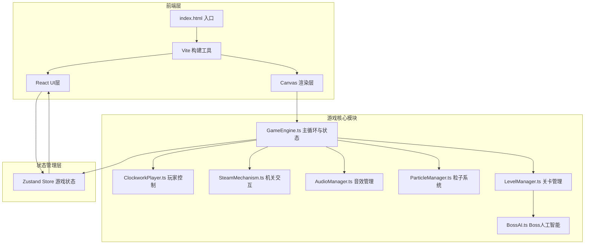
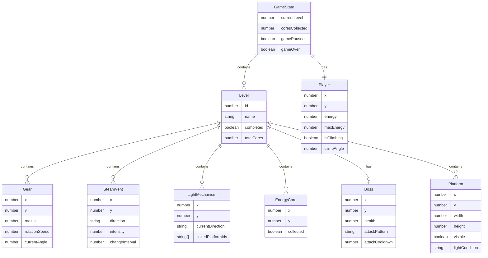

## 1. 架构设计



## 2. 技术说明

- 前端框架：React@18 + TypeScript
- 构建工具：Vite
- 样式方案：CSS Modules + CSS变量（蒸汽朋克主题色）
- 状态管理：Zustand（游戏状态同步到React UI）
- 渲染方式：Canvas 2D API（游戏画面）+ React DOM（HUD叠加层）
- 音频系统：Web Audio API（程序化生成音效）
- 初始化工具：vite-init
- 后端：无

## 3. 路由定义

| 路由 | 用途 |
|------|------|
| / | 游戏主界面，含启动画面和关卡选择 |
| /game | 游戏主场景，含Canvas和HUD |

## 4. API定义

无后端API，所有游戏逻辑在前端完成。

## 5. 数据模型

### 5.1 游戏状态数据模型



### 5.2 文件结构

```
├── index.html
├── package.json
├── tsconfig.json
├── vite.config.ts
├── src/
│   ├── main.tsx                    # React入口
│   ├── App.tsx                     # 路由和布局
│   ├── index.css                   # 全局样式
│   ├── store/
│   │   └── gameStore.ts            # Zustand游戏状态
│   ├── game/
│   │   ├── GameEngine.ts           # 主循环、碰撞检测、关卡状态
│   │   ├── ClockworkPlayer.ts      # 傀儡移动、跳跃、攀爬、能量
│   │   ├── SteamMechanism.ts       # 齿轮旋转、蒸汽喷射、光影遮挡
│   │   ├── AudioManager.ts         # Web Audio音效生成
│   │   ├── ParticleManager.ts      # 粒子系统
│   │   ├── LevelManager.ts         # 关卡数据和加载
│   │   ├── BossAI.ts              # Boss行为AI
│   │   ├── Renderer.ts            # Canvas渲染器
│   │   ├── InputManager.ts        # 输入处理（键盘+触屏）
│   │   └── types.ts               # 游戏类型定义
│   ├── levels/
│   │   ├── level1.ts              # 关卡1数据
│   │   └── level2.ts              # 关卡2数据
│   ├── components/
│   │   ├── GameCanvas.tsx          # Canvas容器组件
│   │   ├── UILayer.tsx             # HUD主组件
│   │   ├── EnergyGauge.tsx         # 蒸汽压力表能量槽
│   │   ├── CoreCounter.tsx         # 核心计数显示
│   │   ├── LevelProgress.tsx       # 关卡进度条
│   │   ├── HintText.tsx            # 提示文字
│   │   ├── TouchControls.tsx       # 触屏控制层
│   │   ├── TitleScreen.tsx         # 主界面启动画面
│   │   └── BossHealthBar.tsx       # Boss血条
│   └── pages/
│       ├── HomePage.tsx            # 主界面页面
│       └── GamePage.tsx            # 游戏页面
```
