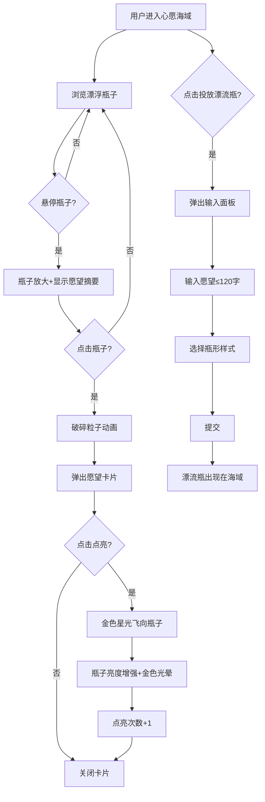

## 1. 产品概述

「心愿灯塔」是一个匿名愿望漂流瓶平台，用户可以在深海梦幻风格的界面上写下心愿、封装成发光漂流瓶，让愿望在虚拟「愿望海域」中随波漂流。其他用户可以发现、点亮他人的愿望，形成温暖的匿名互动体验。
- 核心价值：为用户提供一个诗意的匿名情感表达空间，通过「点亮」机制传递温暖与共鸣
- 目标用户：寻求情感表达与倾诉的年轻群体，喜欢唯美视觉与治愈系交互的用户

## 2. 核心功能

### 2.1 用户角色
| 角色 | 注册方式 | 核心权限 |
|------|----------|----------|
| 匿名用户 | 无需注册 | 投放漂流瓶、浏览海域、点亮瓶子、查看榜单 |

### 2.2 功能模块
1. **心愿海域（首页）**：渐变海洋背景 + 漂浮漂流瓶画布 + 投放按钮 + 底部导航
2. **投放漂流瓶**：毛玻璃输入面板，包含愿望输入、瓶形选择和提交
3. **瓶子交互**：悬浮放大预览、点击破碎粒子动画 + 愿望卡片 + 点亮功能
4. **已点亮榜**：按点亮次数排序的瓶子列表

### 2.3 页面详情
| 页面名称 | 模块名称 | 功能描述 |
|----------|----------|----------|
| 心愿海域 | 海洋画布 | 深蓝到浅蓝渐变背景，大量半透明发光瓶子慢速漂浮、随机旋转，带呼吸光晕和缓动浮动动画 |
| 心愿海域 | 漂浮瓶子 | 6种瓶形+荧光色组合，半透明毛玻璃质感，鼠标悬停微微放大并显示愿望前几字 |
| 心愿海域 | 瓶子点击交互 | 点击触发破碎粒子动画（水花+光点），弹出毛玻璃卡片展示完整愿望、提交时间和点亮按钮 |
| 心愿海域 | 点亮交互 | 点击点亮后金色星光飞向瓶子融合，瓶子亮度增加散发金色光晕，点亮次数+1 |
| 心愿海域 | 投放按钮 | 首页中央固定按钮，点击弹出毛玻璃输入面板 |
| 投放面板 | 愿望输入 | 文本框限120字 |
| 投放面板 | 瓶形选择 | 6种预设瓶形和颜色组合轮播选择 |
| 投放面板 | 提交 | 提交愿望，生成漂流瓶飘入海域 |
| 已点亮榜 | 排行列表 | 按点亮次数降序展示瓶子列表，显示愿望摘要和点亮数 |
| 底部导航 | 导航栏 | 半透明毛玻璃导航，包含「心愿海域」和「已点亮榜」两个入口 |

## 3. 核心流程

**投放漂流瓶流程**：用户点击「投放漂流瓶」→ 弹出输入面板 → 输入愿望（≤120字）→ 选择瓶形样式 → 点击提交 → 愿望封装成漂流瓶 → 瓶子出现在海域中漂浮

**浏览与点亮流程**：用户浏览海域中漂浮的瓶子 → 鼠标悬停查看愿望摘要 → 点击瓶子触发破碎粒子动画 → 弹出愿望卡片 → 点击「点亮」→ 金色星光飞向瓶子融合 → 瓶子亮度增强 + 金色光晕 → 点亮次数+1

## 4. 用户界面设计

### 4.1 设计风格
- **主题**：深海梦幻风
- **主色**：深蓝（#0a1628）到浅蓝（#1a4a6e）渐变背景
- **荧光色系**：珊瑚粉 #FF6B8A、海蓝 #4FC3F7、宝石绿 #00E5A0、日落橙 #FF8A50、月光银 #C0C8D8、星夜紫 #B388FF
- **瓶子质感**：半透明毛玻璃，带呼吸光晕和缓动浮动动画
- **字体**：标题使用衬线体营造诗意氛围，正文使用无衬线体保证可读性
- **布局**：全屏沉浸式画布 + 浮层式交互（毛玻璃面板和卡片）
- **动画**：缓动漂浮、呼吸光晕、破碎粒子、星光飞行动画，60fps流畅体验

### 4.2 页面设计概览
| 页面名称 | 模块名称 | UI元素 |
|----------|----------|--------|
| 心愿海域 | 海洋背景 | 全屏Canvas，深蓝→浅蓝渐变，叠加微弱波光粒子 |
| 心愿海域 | 漂浮瓶子 | 6种荧光色半透明瓶子，呼吸光晕，上下缓动浮动，随机旋转 |
| 心愿海域 | 投放按钮 | 页面中央固定，圆形发光按钮，脉冲动画吸引点击 |
| 心愿海域 | 愿望卡片 | 半透明毛玻璃卡片，居中弹出，显示愿望全文+时间+点亮按钮+点亮次数 |
| 投放面板 | 输入面板 | 半透明毛玻璃全屏遮罩，中央面板含文本框+样式轮播+提交按钮 |
| 已点亮榜 | 排行列表 | 毛玻璃列表项，显示瓶形缩略图+愿望摘要+点亮次数，按次数降序 |
| 底部导航 | 导航栏 | 固定底部半透明毛玻璃栏，两个Tab图标+文字 |

### 4.3 响应式适配
- 桌面端优先：Canvas全屏，瓶子密度适中，鼠标悬停交互
- 移动端适配：触摸替代悬停（长按预览），瓶子数量适当减少，触摸优化按钮尺寸
- 断点：768px以下进入移动端布局

### 4.4 漂流瓶样式定义
| 编号 | 瓶形 | 颜色 | 色值 |
|------|------|------|------|
| 1 | 圆肚瓶 | 珊瑚粉 | #FF6B8A |
| 2 | 细长瓶 | 海蓝 | #4FC3F7 |
| 3 | 方肩瓶 | 宝石绿 | #00E5A0 |
| 4 | 葫芦瓶 | 日落橙 | #FF8A50 |
| 5 | 三角瓶 | 月光银 | #C0C8D8 |
| 6 | 水滴瓶 | 星夜紫 | #B388FF |
