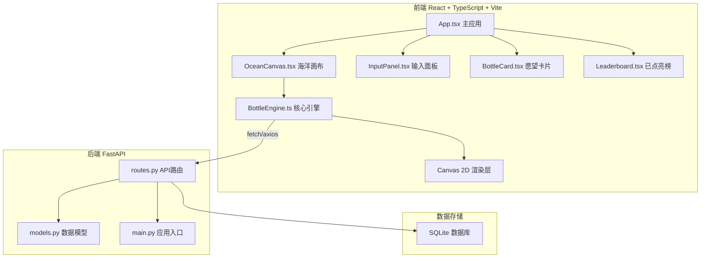
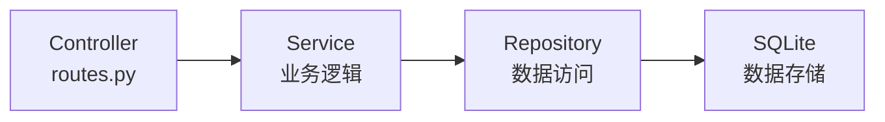
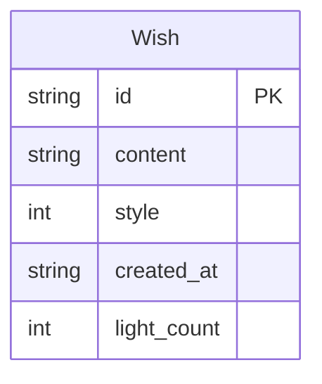

## 1. 架构设计



## 2. 技术说明
- **前端**：React 18 + TypeScript + Vite + Canvas 2D（无额外3D库，纯Canvas 2D实现高性能渲染）
- **样式方案**：CSS Modules + CSS变量（深海梦幻主题色系）
- **动画方案**：Canvas 2D + requestAnimationFrame 实现60fps流畅动画
- **后端**：FastAPI + SQLite（轻量级，无需额外数据库服务）
- **前后端通信**：RESTful API，JSON格式

## 3. 路由定义
| 路由 | 用途 |
|------|------|
| / | 心愿海域首页（全屏Canvas + 浮层交互） |

单页应用，通过组件状态切换「心愿海域」和「已点亮榜」视图。

## 4. API定义

### 4.1 提交愿望
```
POST /api/wishes
Request: { content: string, style: number }
Response: { id: string, content: string, style: number, created_at: string, light_count: number }
```

### 4.2 获取所有漂流瓶
```
GET /api/wishes
Response: [{ id, content, style, created_at, light_count }]
```

### 4.3 点亮漂流瓶
```
POST /api/wishes/{wish_id}/light
Response: { id, content, style, created_at, light_count }
```

### 4.4 获取已点亮榜
```
GET /api/wishes/leaderboard
Query: ?limit=50
Response: [{ id, content, style, created_at, light_count }]
```

### TypeScript类型定义
```typescript
interface Wish {
  id: string
  content: string
  style: BottleStyle
  created_at: string
  light_count: number
}

type BottleStyle = 1 | 2 | 3 | 4 | 5 | 6

interface BottleRenderData {
  id: string
  x: number
  y: number
  rotation: number
  scale: number
  style: BottleStyle
  content: string
  lightCount: number
  glowIntensity: number
  floatOffset: number
  floatSpeed: number
  rotationSpeed: number
}
```

## 5. 服务器架构图



## 6. 数据模型

### 6.1 数据模型定义



### 6.2 数据定义语言
```sql
CREATE TABLE wishes (
    id TEXT PRIMARY KEY,
    content TEXT NOT NULL CHECK(length(content) <= 120),
    style INTEGER NOT NULL CHECK(style BETWEEN 1 AND 6),
    created_at TEXT NOT NULL DEFAULT (datetime('now')),
    light_count INTEGER NOT NULL DEFAULT 0
);

CREATE INDEX idx_wishes_light_count ON wishes(light_count DESC);
```

## 7. 文件结构

```
├── index.html                    # Vite入口HTML
├── package.json                  # 依赖和脚本
├── vite.config.ts                # Vite配置
├── tsconfig.json                 # TypeScript配置
├── src/
│   ├── main.tsx                  # React入口
│   ├── App.tsx                   # 主应用组件
│   ├── App.css                   # 全局样式
│   ├── BottleEngine.ts           # 核心引擎：愿望提交、瓶子生成、状态管理、点亮交互
│   ├── OceanCanvas.tsx           # 海洋画布：渲染背景、漂浮瓶子、粒子特效
│   ├── BottleCard.tsx            # 愿望卡片：毛玻璃卡片、点亮按钮
│   ├── InputPanel.tsx            # 输入面板：文本框、样式选择轮播、提交
│   └── Leaderboard.tsx           # 已点亮榜：排行榜列表
└── api/
    ├── main.py                   # FastAPI应用入口
    ├── models.py                 # SQLAlchemy数据模型
    └── routes.py                 # API路由定义
```
