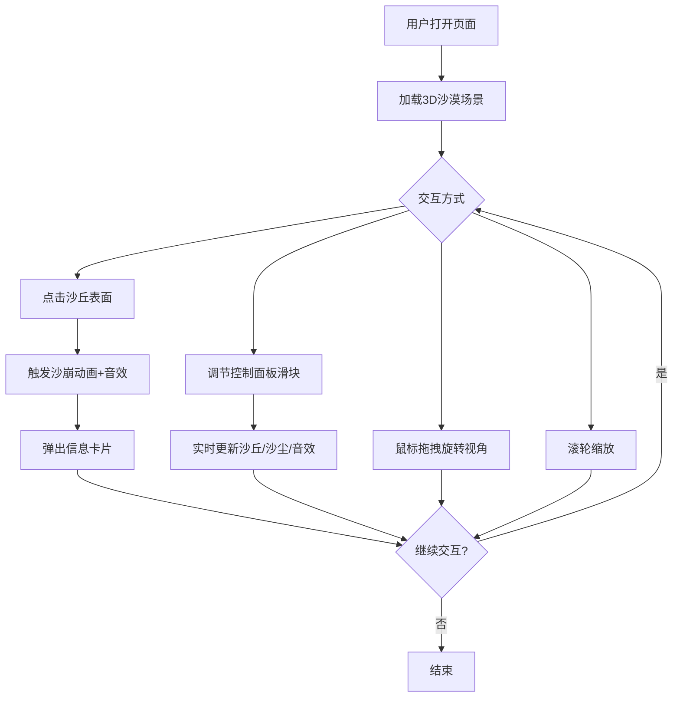

# 沙丘回声 — 产品需求文档 (PRD)

## 1. 产品概述

「沙丘回声」是一个 3D 交互可视化项目，模拟沙漠中风吹动沙丘的动态变化并产生声音反馈。目标用户为对自然现象可视化感兴趣的创作者、教育者和交互设计爱好者，产品价值在于以沉浸式视听体验呈现风沙交互的美学与物理规律。

## 2. 核心功能

### 2.1 功能模块

1. **3D 沙丘场景页**：沙漠落日风格的全屏 3D 场景，包含动态沙丘、沙尘粒子和音效反馈
2. **控制面板**：右侧半透明毛玻璃面板，调节风速、风向、沙丘起伏度及随机地貌

### 2.2 页面详情

| 页面名称 | 模块名称 | 功能描述 |
|----------|----------|----------|
| 3D 沙丘场景 | 沙丘几何体 | 半透明渐变网格 + 动态顶点位移，风场驱动沙浪形成与变形 |
| 3D 沙丘场景 | 沙尘粒子系统 | 粒子随风飘散，颜色/透明度随风速变化，缓动飘散动画 |
| 3D 沙丘场景 | 风音效 | Web Audio 持续生成低频风啸声，音量/频率随风速变化 |
| 3D 沙丘场景 | 沙崩交互 | 点击沙丘表面触发沙粒爆散 + 低频沙崩音效 + 信息卡片 |
| 3D 沙丘场景 | 信息卡片 | 半透明毛玻璃卡片显示坡度、风速、沙粒粒度 |
| 3D 沙丘场景 | 相机控制 | 鼠标拖拽旋转视角，滚轮缩放 |
| 控制面板 | 风速滑块 | 调节风的速度（0~10），影响沙丘变形和沙尘密度 |
| 控制面板 | 风向滑块 | 调节风的方向（0°~360°），影响沙浪走向 |
| 控制面板 | 沙丘起伏度滑块 | 调节沙丘高度变化幅度（0~1） |
| 控制面板 | 随机地貌按钮 | 一键随机生成新的沙丘地形 |

## 3. 核心流程

用户打开页面 → 加载 3D 沙漠场景（渐变橙黄到紫红背景 + 沙丘网格 + 沙尘粒子 + 风音效）→ 用户通过鼠标拖拽旋转视角、滚轮缩放观察 → 通过右侧控制面板调节风速/风向/起伏度 → 沙丘实时变形、沙尘密度变化、音效响应 → 用户点击沙丘任意点 → 触发沙崩动画 + 低频音效 → 弹出毛玻璃信息卡片显示该点数据

## 4. 用户界面设计

### 4.1 设计风格

- **主色调**：沙漠落日渐变 — 橙黄（#E8A838）→ 紫红（#8B2252），中间过渡橘红（#D4542A）
- **辅助色**：沙色（#C4A35A）、深沙色（#8B7355）、暗紫（#3D1F47）
- **按钮风格**：圆角半透明毛玻璃，hover 时边框高亮
- **字体**：标题使用 Playfair Display，正文使用 Noto Sans SC
- **布局风格**：全屏 3D 场景 + 右侧浮动控制面板 + 点击弹出信息卡片
- **图标风格**：Lucide 线性图标

### 4.2 页面设计概览

| 页面名称 | 模块名称 | UI 元素 |
|----------|----------|---------|
| 3D 沙丘场景 | 沙丘网格 | 半透明渐变线框网格，橙黄到紫红渐变，动态顶点位移 |
| 3D 沙丘场景 | 沙尘粒子 | 半透明圆形粒子，沙色/橙色，随风飘散缓动动画 |
| 3D 沙丘场景 | 背景渐变 | 全屏渐变从橙黄到紫红，模拟落日天空 |
| 3D 沙丘场景 | 信息卡片 | 毛玻璃效果卡片，显示坡度/风速/粒度三行数据 |
| 控制面板 | 面板容器 | 右侧固定，半透明毛玻璃，圆角 12px |
| 控制面板 | 滑块 | 自定义样式滑块，拖动时实时反馈 |
| 控制面板 | 随机地貌按钮 | 橙色渐变按钮，hover 缩放效果 |

### 4.3 响应式适配

- **桌面端**：全屏 3D 场景 + 右侧固定控制面板，鼠标交互
- **移动端**：全屏 3D 场景 + 底部可折叠控制面板，触摸交互（双指缩放、单指旋转）
- **帧率**：目标 60fps，粒子数量根据设备性能自适应

### 4.4 3D 场景指引

- **环境/氛围**：沙漠落日，渐变天空从橙黄到紫红，无 HDRI，用自定义着色器渐变
- **光照**：暖色方向光（模拟落日），低角度环境光，柔和平行阴影
- **相机**：透视相机，初始 45° 俯角，轨道控制器，阻尼 0.05
- **构图与焦点**：沙丘居中，远处地平线，视觉纵深由沙尘粒子增强
- **交互与动画**：顶点位移连续动画，粒子缓动系统，沙崩爆散动画
- **后处理效果**：无额外后处理，保证性能
- **性能预算**：粒子数 ≤ 5000，沙丘网格 ≤ 128×128 顶点
