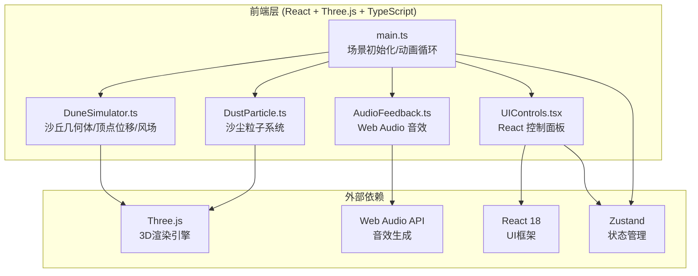

# 沙丘回声 — 技术架构文档

## 1. 架构设计



## 2. 技术说明

- **前端**：React 18 + Three.js + TypeScript + Tailwind CSS + Vite
- **初始化工具**：vite-init (react-ts 模板)
- **后端**：无
- **数据库**：无
- **状态管理**：Zustand — 管理风速、风向、起伏度等全局参数

## 3. 路由定义

| 路由 | 用途 |
|------|------|
| `/` | 全屏 3D 沙丘场景 + 控制面板（单页应用） |

## 4. 文件结构

```
├── index.html              # 入口 HTML
├── package.json            # 依赖和脚本
├── tsconfig.json           # TypeScript 配置
├── vite.config.ts          # Vite 配置
├── src/
│   ├── main.tsx            # 入口，挂载 React + 初始化 Three.js
│   ├── App.tsx             # 根组件
│   ├── scene/
│   │   ├── SceneManager.ts # 场景管理器，初始化场景/相机/渲染器/动画循环
│   │   ├── DuneSimulator.ts   # 沙丘几何体、顶点位移、风场模拟
│   │   ├── DustParticle.ts    # 沙尘粒子系统
│   │   └── AudioFeedback.ts   # Web Audio 风啸和沙崩音效
│   ├── components/
│   │   ├── UIControls.tsx     # 右侧控制面板（三个滑块+按钮）
│   │   └── InfoCard.tsx       # 点击沙丘弹出的信息卡片
│   ├── store/
│   │   └── useDuneStore.ts    # Zustand 全局状态
│   └── styles/
│       └── index.css          # 全局样式 + Tailwind
```

## 5. 核心模块设计

### 5.1 DuneSimulator

- 使用 `PlaneGeometry(20, 20, 128, 128)` 创建沙丘网格
- 通过 Perlin/Simplex 噪声函数生成初始沙丘高度图
- 每帧根据风速和风向对顶点施加位移，模拟沙浪形成
- 支持沙崩：点击某点后，该区域顶点快速下沉并产生爆散粒子
- 使用 `MeshStandardMaterial` 半透明渐变，wireframe 叠加实心渲染

### 5.2 DustParticle

- 使用 `BufferGeometry` + `Points` 渲染粒子系统
- 粒子数量：3000~5000，根据设备性能自适应
- 每帧根据风速和风向更新粒子位置，带缓动插值
- 粒子颜色从沙色到深橙色渐变，透明度随风速变化
- 使用 `PointsMaterial` 的 `size`、`color`、`opacity` 属性

### 5.3 AudioFeedback

- 使用 Web Audio API 的 `OscillatorNode` + `GainNode` 生成持续风啸
- 风啸频率范围 80~200Hz，随风速变化
- 沙崩音效：短促低频爆发（40~80Hz），快速衰减
- 音频上下文在用户首次交互后初始化（浏览器自动播放策略）

### 5.4 UIControls

- React 组件，使用 Zustand 读取和更新全局状态
- 三个自定义滑块：风速（0~10）、风向（0°~360°）、沙丘起伏度（0~1）
- 「随机地貌」按钮：重新生成噪声种子，更新沙丘高度图
- 毛玻璃面板：`backdrop-filter: blur(12px)` + 半透明背景

### 5.5 InfoCard

- 点击沙丘表面后，通过射线检测获取交点
- 计算该点坡度（通过顶点法线与竖直方向夹角）
- 显示坡度、当前风速、沙粒粒度（随机生成 0.1~0.5mm）
- 毛玻璃样式，2秒后自动淡出消失

## 6. 性能优化策略

- 沙丘网格使用 128×128 顶点，确保 GPU 友好
- 粒子系统使用 `BufferGeometry` 避免频繁 GC
- 顶点位移使用 `Float32Array` 直接操作属性缓冲区
- 帧率监控：开发模式下显示 FPS 计数器
- 移动端粒子数降至 1500，网格降至 64×64
