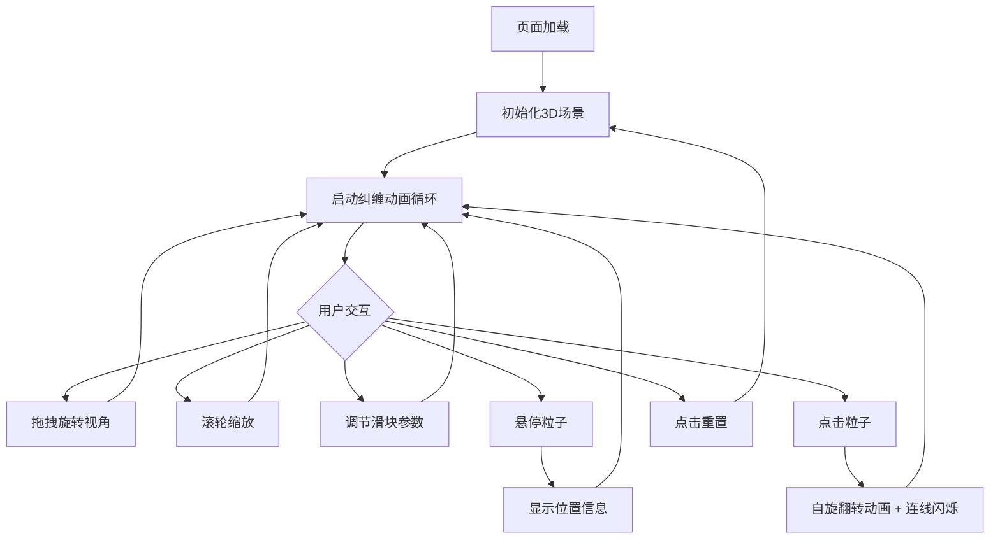

## 1. 产品概述

「量子纠缠之舞」是一款基于 Three.js 的 3D 交互可视化应用，模拟两个量子粒子在纠缠态下的运动轨迹与相互作用。用户可通过鼠标拖拽旋转视角、滚轮缩放，沉浸式观察粒子在三维空间中的纠缠舞蹈，并通过控制面板实时调节物理参数。

- 目标用户：科学爱好者、可视化开发者、量子物理学习者和科普受众
- 核心价值：将抽象的量子纠缠概念转化为直观、可交互的三维视觉体验

## 2. 核心功能

### 2.1 功能模块

1. **量子纠缠场景页**：双粒子三维纠缠动画、轨迹线实时绘制、粒子光晕呼吸动画、纠缠连线动态透明度、深空星场背景
2. **交互控制面板**：纠缠强度滑块、粒子速度滑块、观察角度滑块、重置按钮、粒子悬停信息提示、点击自旋翻转动画

### 2.2 页面详情

| 页面名称 | 模块名称 | 功能描述 |
|----------|----------|----------|
| 量子纠缠场景 | 双粒子纠缠运动 | 两个粒子围绕彼此做三维螺旋轨迹运动，轨迹线用半透明发光线条实时绘制（青蓝/粉紫双色） |
| 量子纠缠场景 | 粒子光晕动画 | 粒子本身带有呼吸光晕效果，球体发光半透明，强度周期性变化 |
| 量子纠缠场景 | 纠缠连线 | 粒子间连线根据距离动态改变透明度和颜色强度，接近时连线变亮 |
| 量子纠缠场景 | 深空星场 | 深空黑背景散布闪烁粒子星星，增强沉浸感 |
| 控制面板 | 纠缠强度滑块 | 调节粒子间相互作用力大小（0.1~2.0，默认1.0） |
| 控制面板 | 粒子速度滑块 | 调节旋转快慢（0.1~3.0，默认1.0） |
| 控制面板 | 观察角度滑块 | 相机预设视角切换（0°~360°，默认45°） |
| 控制面板 | 重置按钮 | 恢复所有参数和粒子状态到初始值 |
| 交互反馈 | 悬停信息 | 鼠标悬停粒子时显示当前位置坐标 |
| 交互反馈 | 点击自旋翻转 | 点击粒子触发自旋翻转动画，同时连线闪烁一下 |

## 3. 核心流程

用户打开页面 → 自动加载3D场景并开始纠缠动画 → 用户可自由拖拽旋转/缩放视角 → 通过右侧面板调节物理参数 → 观察粒子运动变化 → 悬停/点击粒子获取交互反馈 → 点击重置恢复初始状态

## 4. 用户界面设计

### 4.1 设计风格

- **主色调**：深紫（#1a0033）到深蓝（#001133）渐变背景
- **强调色**：青蓝（#00e5ff）和粉紫（#e040fb）分别为两个粒子颜色
- **辅助色**：连线用白色半透明，星场用暖白微光
- **按钮风格**：圆角半透明毛玻璃质感，悬停发光
- **字体**：标题用 Orbitron（科幻感），正文用 Rajdhani
- **布局风格**：全屏3D场景 + 右侧浮动毛玻璃控制面板
- **动效风格**：缓动曲线（ease-in-out），呼吸动画，粒子拖尾

### 4.2 页面设计概览

| 页面名称 | 模块名称 | UI元素 |
|----------|----------|--------|
| 量子纠缠场景 | 3D画布 | 全屏Three.js画布，深紫-深蓝渐变背景，居中粒子群 |
| 量子纠缠场景 | 粒子A | 青蓝发光半透明球体 + 呼吸光晕 + 轨迹拖尾线 |
| 量子纠缠场景 | 粒子B | 粉紫发光半透明球体 + 呼吸光晕 + 轨迹拖尾线 |
| 量子纠缠场景 | 纠缠连线 | 双粒子间白色半透明线，距离近时变亮 |
| 量子纠缠场景 | 星场背景 | 散布闪烁粒子点，暖白色微光 |
| 控制面板 | 面板容器 | 右侧固定，半透明毛玻璃（backdrop-filter: blur），圆角，深色底 |
| 控制面板 | 滑块组 | 自定义样式滑块，发光轨道，标签+数值显示 |
| 控制面板 | 重置按钮 | 圆角按钮，悬停发光，点击波纹 |
| 交互反馈 | 悬停提示 | 粒子旁浮动标签，显示 x/y/z 坐标，半透明底 |
| 交互反馈 | 点击动画 | 粒子脉冲放大 + 颜色闪白 + 连线闪亮 |

### 4.3 响应式设计

- 桌面端优先：全屏3D画布 + 右侧浮动面板
- 移动端适配：控制面板收起为底部抽屉，触摸旋转/双指缩放
- 最小宽度支持 320px，保持 60fps 性能

### 4.4 3D场景指导

- **环境/氛围**：深空黑底，无HDRI，纯程序化星场
- **灯光设置**：环境光（低强度暖白）+ 两个点光源（青蓝/粉紫）跟随粒子移动
- **相机设置**：透视相机，FOV 60°，初始距离 15，OrbitControls 自由旋转
- **构图与焦点**：双粒子居中，轨迹线环绕形成视觉焦点
- **交互与动画**：60fps动画循环，缓动物理模拟，鼠标交互即时响应
- **后处理效果**：Bloom发光效果（UnrealBloomPass），增强粒子光晕和轨迹发光
- **性能预算**：桌面60fps，移动端最低30fps，轨迹线限制最大点数（~500点）
