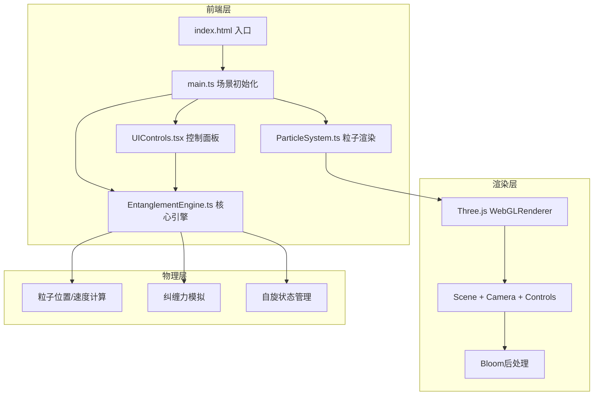

## 1. 架构设计



## 2. 技术说明

- **前端框架**：React 18 + TypeScript（严格模式）
- **3D渲染**：Three.js + @react-three/fiber + @react-three/drei + @react-three/postprocessing
- **构建工具**：Vite（React插件）
- **样式方案**：CSS Modules + 自定义CSS变量
- **状态管理**：React useState/useRef（无需Redux，状态简单）
- **后端**：无（纯前端应用）

## 3. 路由定义

| 路由 | 用途 |
|------|------|
| / | 单页应用，量子纠缠3D交互场景 |

## 4. 文件结构

```
├── index.html                    # Vite入口HTML
├── package.json                  # 依赖配置
├── vite.config.js                # Vite配置（React插件）
├── tsconfig.json                 # TypeScript严格模式配置
└── src/
    ├── main.tsx                  # React入口，挂载App组件
    ├── App.tsx                   # 主组件，组合Canvas和控制面板
    ├── EntanglementEngine.ts     # 纠缠引擎，粒子物理模拟
    ├── ParticleSystem.tsx        # 粒子渲染组件（R3F）
    ├── UIControls.tsx            # 控制面板React组件
    └── styles/
        └── controls.css          # 控制面板样式
```

## 5. 核心模块设计

### 5.1 EntanglementEngine（纠缠引擎）

```typescript
interface ParticleState {
  position: Vector3
  velocity: Vector3
  spin: number        // +1 或 -1
  spinAngle: number   // 自旋翻转动画角度
  trail: Vector3[]    // 轨迹历史点
}

class EntanglementEngine {
  particleA: ParticleState
  particleB: ParticleState
  entanglementStrength: number  // 0.1 ~ 2.0
  speed: number                 // 0.1 ~ 3.0
  time: number

  update(deltaTime: number): void  // 每帧更新物理状态
  flipSpin(particleId: 'A' | 'B'): void  // 自旋翻转
  reset(): void  // 重置到初始状态
}
```

物理模型：双粒子在三维空间中沿参数化螺旋轨迹运动，纠缠力通过弹性吸引+排斥模拟——距离过远时吸引、过近时排斥，产生稳定的纠缠轨道。纠缠强度参数调节力的系数，速度参数调节时间步长。

### 5.2 ParticleSystem（粒子渲染）

- 使用 `@react-three/fiber` 的 Canvas 和 useFrame 钩子
- 粒子用 SphereGeometry + MeshPhysicalMaterial（半透明发光）
- 光晕用 Sprite + AdditiveBlending
- 轨迹线用 BufferGeometry + Line（逐帧追加顶点）
- 连线用 Line + 动态 opacity
- Bloom后处理用 @react-three/postprocessing

### 5.3 UIControls（控制面板）

- React组件，通过 props 接收和修改引擎参数
- 三个自定义滑块 + 重置按钮
- 毛玻璃效果：`backdrop-filter: blur(20px)` + 半透明深色底
- 悬停信息通过 HTML Overlay 渲染在3D场景之上

## 6. 性能优化策略

- 轨迹线限制最大500点，超出时移除最早的点
- 使用 BufferGeometry 的 `setDrawRange` 动态更新
- Bloom效果使用低分辨率render target
- 移动端自动降低轨迹点数和粒子细分
- requestAnimationFrame 驱动，deltaTime 帧率无关动画
