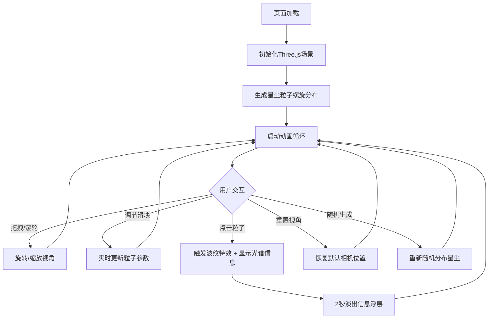

## 1. 产品概述

「星尘回廊」是一个沉浸式3D交互可视化项目，模拟在浩瀚星云中漫步的体验。用户可通过拖拽和滚轮自由旋转视角，观察由数千颗恒星组成的动态星尘走廊，每颗星尘的颜色和亮度根据其虚拟光谱类型（蓝巨星、红矮星等）变化，并沿螺旋路径缓慢流动。

- 目标用户：天文爱好者、视觉艺术爱好者、3D交互体验探索者
- 核心价值：提供震撼的深空漫步沉浸式体验，兼具科学美感与艺术表达

## 2. 核心功能

### 2.1 功能模块

1. **星尘走廊主场景**：三维螺旋星尘粒子分布与流动动画
2. **交互控制系统**：鼠标拖拽旋转、滚轮缩放、粒子点击交互
3. **参数控制面板**：粒子密度、流动速度、光谱偏移滑块及操作按钮

### 2.2 页面详情

| 页面名称 | 模块名称 | 功能描述 |
|---------|---------|---------|
| 星尘回廊主页面 | 三维星尘场景 | 数千颗星尘粒子沿螺旋路径流动，颜色和亮度根据虚拟光谱类型（蓝白、黄白、红橙）渐变，带半透明发光光晕 |
| 星尘回廊主页面 | 视角交互 | 鼠标拖拽旋转视角，滚轮缩放，交互流畅无卡顿 |
| 星尘回廊主页面 | 粒子点击交互 | 点击任意星尘粒子，触发扩散波纹光晕特效，屏幕中央显示该粒子光谱类型和亮度值（2秒淡出） |
| 星尘回廊主页面 | 控制面板 | 右侧半透明毛玻璃面板，三个滑块（粒子密度500-5000、流动速度0.1-2.0、光谱偏移），一个重置视角按钮，一个随机生成按钮 |
| 星尘回廊主页面 | 响应式适配 | 桌面和移动端全屏渲染，无滚动条 |

## 3. 核心流程

用户打开页面后，首先看到深邃星空背景中缓缓流动的星尘走廊。用户可以自由拖拽旋转视角，用滚轮缩放远近，观察不同角度的星尘分布。通过右侧控制面板调节粒子密度、流动速度和光谱偏移，实时改变场景效果。点击任意星尘粒子，屏幕中央弹出光谱信息浮层，2秒后淡出消失。点击「随机生成」按钮，星尘重新随机分布，产生新的走廊形态。

## 4. 用户界面设计

### 4.1 设计风格

- **主色调**：深蓝到紫黑的深邃星空渐变背景
- **星尘色系**：蓝白色（蓝巨星）、黄白色（类太阳星）、红橙色（红矮星）
- **控制面板**：半透明毛玻璃效果（backdrop-filter: blur），深色半透明底色
- **字体**：显示字体使用 Orbitron（科技感），UI字体使用 Rajdhani（未来感）
- **按钮风格**：圆角矩形，发光边框，悬停时光晕增强
- **滑块风格**：自定义样式，轨道为半透明渐变，滑块为发光圆形
- **布局**：全屏3D画布 + 右侧浮动控制面板

### 4.2 页面设计概览

| 页面名称 | 模块名称 | UI元素 |
|---------|---------|--------|
| 星尘回廊 | 3D画布 | 全屏渲染，背景从深蓝(#0a0a2e)渐变到紫黑(#1a0a2e)，星尘粒子带发光光晕 |
| 星尘回廊 | 控制面板 | 右侧浮动，宽280px，毛玻璃背景，圆角12px，内含标题、三个自定义滑块、两个按钮 |
| 星尘回廊 | 信息浮层 | 屏幕中央，半透明黑色底，显示光谱类型和亮度值，2秒后淡出 |

### 4.3 响应式

- 桌面端：全屏3D画布，右侧浮动控制面板
- 移动端：全屏3D画布，控制面板可折叠收起至底部，触摸拖拽旋转，双指缩放
- 所有设备：页面全屏渲染，禁止滚动条

### 4.4 3D场景指引

- **环境氛围**：深空星云感，背景从深蓝渐变到紫黑，远处有微弱星云雾气
- **光照设置**：无方向光，使用自发光粒子 + 环境雾效果
- **相机设置**：透视相机，FOV 60°，初始位置在走廊中心附近，支持自由旋转和缩放
- **构图与焦点**：螺旋走廊为中心视觉焦点，粒子密度从中心向外递减
- **交互与动画**：粒子沿螺旋路径流动，点击粒子触发波纹扩散，相机自由旋转缩放
- **后处理效果**：粒子发光光晕（AdditiveBlending），背景雾化，波纹扩散特效
- **性能预算**：5000粒子@60fps，使用BufferGeometry + Points材质批量渲染
