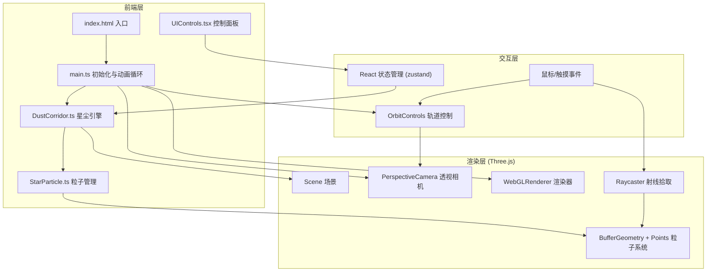

## 1. 架构设计



## 2. 技术说明

- **前端框架**：React 18 + TypeScript
- **3D渲染**：Three.js (ES Module) + OrbitControls
- **构建工具**：Vite + @vitejs/plugin-react
- **状态管理**：Zustand
- **CSS方案**：内联样式 + CSS-in-JS (React style prop)
- **无后端**：纯前端项目

### 核心依赖
| 依赖 | 版本 | 用途 |
|------|------|------|
| three | ^0.170.0 | 3D渲染引擎 |
| @types/three | ^0.170.0 | Three.js TypeScript类型 |
| react | ^18.3.0 | UI框架 |
| react-dom | ^18.3.0 | React DOM渲染 |
| zustand | ^5.0.0 | 状态管理 |
| vite | ^6.0.0 | 构建工具 |
| @vitejs/plugin-react | ^4.3.0 | Vite React插件 |
| typescript | ^5.6.0 | TypeScript编译器 |

## 3. 路由定义

本项目为单页面应用，无路由：

| 路由 | 用途 |
|------|------|
| / | 星尘回廊主页面（唯一页面） |

## 4. 文件结构

```
├── index.html                  # 入口HTML
├── package.json                # 项目配置与依赖
├── vite.config.ts              # Vite构建配置
├── tsconfig.json               # TypeScript配置
└── src/
    ├── main.ts                 # 入口：初始化场景、相机、渲染器、动画循环
    ├── DustCorridor.ts         # 核心引擎：星尘粒子生成、光谱映射、螺旋运动、视差
    ├── StarParticle.ts         # 粒子管理：单个粒子外观、发光光晕、生命周期、呼吸动画
    ├── UIControls.tsx          # React控制面板组件
    └── store.ts                # Zustand状态管理
```

## 5. 核心模块设计

### 5.1 main.ts — 入口模块
- 初始化 Three.js Scene、PerspectiveCamera (FOV 60°)、WebGLRenderer
- 创建 DustCorridor 实例并添加到场景
- 挂载 OrbitControls 实现拖拽旋转和滚轮缩放
- 吲用 Raycaster 实现粒子点击拾取
- 渲染 React UIControls 到 DOM 覆盖层
- 实现 requestAnimationFrame 动画循环，调用 DustCorridor.update()
- 窗口 resize 事件处理，保持全屏渲染

### 5.2 DustCorridor.ts — 星尘引擎
- 使用 BufferGeometry + Points 批量渲染粒子（高性能）
- 管理粒子位置数组（Float32Array），支持动态密度调整
- 螺旋路径生成算法：基于参数方程 x=r·cos(θ), y=h, z=r·sin(θ)，θ沿螺旋递增
- 光谱映射系统：将光谱类型（O/B/A/F/G/K/M）映射为颜色和亮度
- 流动动画：每帧更新粒子沿螺旋路径的角度偏移
- 视差效果：远距离粒子移动速度慢于近距离粒子
- 波纹特效：点击粒子时在点击位置生成扩散环

### 5.3 StarParticle.ts — 粒子管理
- 定义光谱类型枚举及对应颜色/亮度映射
- 粒子属性：位置、颜色、大小、亮度、光谱类型、生命阶段
- 呼吸动画：使用 sin 函数实现粒子大小的周期性缓动变化
- 发光光晕：使用自定义着色器材质或 AdditiveBlending + 精灵纹理

### 5.4 UIControls.tsx — 控制面板
- 半透明毛玻璃面板（backdrop-filter: blur(20px)）
- 三个自定义滑块：粒子密度(500-5000)、流动速度(0.1-2.0)、光谱偏移(0-1)
- 重置视角按钮：恢复相机默认位置
- 随机生成按钮：触发星尘重新分布
- 使用 Zustand store 同步参数到 DustCorridor

### 5.5 store.ts — 状态管理
- Zustand store 管理全局参数
- 字段：particleDensity、flowSpeed、spectralShift
- 操作：setParticleDensity、setFlowSpeed、setSpectralShift、resetAll、randomize

## 6. 性能优化策略

- 使用 BufferGeometry + Points 替代独立 Mesh，GPU 批量渲染
- 属性数组使用 Float32Array，避免 GC 压力
- 粒子材质使用 AdditiveBlending 实现发光效果，无需后处理
- 动画循环中使用 needsUpdate 标记而非重建几何体
- OrbitControls 启用阻尼 (damping) 提升交互流畅感
- Raycaster 仅在点击时触发，不在每帧执行
- 移动端适当降低默认粒子密度
