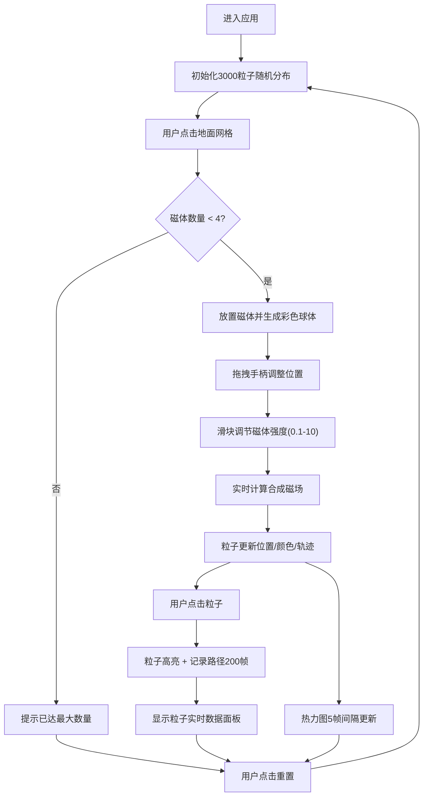

## 1. 产品概述
磁场拓扑·粒子云三维交互可视化应用，解决静态电磁场演示缺乏动态粒子轨迹感知和沉浸式交互的问题。用户可在三维空间中自定义磁体配置，观察数千颗发光粒子在合成磁场中的动态流线运动。
- 目标用户：物理教育工作者、科学可视化爱好者、电磁场研究人员
- 产品价值：通过沉浸式3D交互使抽象的电磁场概念具象化，提升教学与研究的直观性

## 2. 核心特性

### 2.1 功能模块
1. **主场景页面**：3D粒子云可视化、磁体放置交互、视角控制、热力图投影
2. **右侧控制面板**：磁体列表管理、强度参数调节、粒子追踪信息、重置功能

### 2.2 页面详情
| 页面名称 | 模块名称 | 功能描述 |
|-----------|-------------|---------------------|
| 主场景 | 磁体放置系统 | 点击地面网格放置最多4个磁体，拖拽手柄调整三维位置 |
| 主场景 | 粒子系统 | 3000个发光粒子在20x20x20立方体内沿磁场流线运动 |
| 主场景 | 粒子追踪 | 点击粒子标记高亮，记录200帧路径历史并绘制三维路径线 |
| 主场景 | 热力图投影 | y=-10平面实时渲染256x256磁场强度热力图，5帧更新间隔 |
| 主场景 | 视角控制 | 鼠标拖拽旋转（俯仰-90°~90°）、滚轮缩放、LOD优化 |
| 控制面板 | 磁体参数调节 | 滑块（0.1-10）调节每个磁体强度，磁体颜色随强度蓝→红渐变 |
| 控制面板 | 粒子信息面板 | 显示高亮粒子的实时速度、加速度、场强数值 |
| 控制面板 | 重置按钮 | 清除所有磁体、重新分布粒子、清空热力图 |

## 3. 核心流程
用户进入应用 → 查看默认随机粒子运动 → 点击地面放置磁体（最多4个）→ 拖拽调整磁体位置 → 使用滑块调节磁体强度 → 观察粒子轨迹和颜色变化 → 点击感兴趣的粒子追踪其路径 → 查看底部热力图 → 需要时点击重置按钮

## 4. 用户界面设计

### 4.1 设计风格
- 主色调：深空渐变背景（#0a0a2a → #1a1a3a 径向渐变）
- 强调色：粒子色相渐变（蓝色0.5T → 绿色2T → 红色5T+）
- UI文本：Monospace字体（Courier New），颜色#88ccff
- 控制面板：半透明毛玻璃（rgba(255,255,255,0.08)，1px边框rgba(255,255,255,0.2)）
- 交互反馈：悬停0.2s线性缩放（1.0→1.1），点击0.1s脉冲（1.0→1.15→1.0）
- 混合模式：粒子发光使用加法混合（additive blending）

### 4.2 页面设计概述
| 页面名称 | 模块名称 | UI元素 |
|-----------|-------------|-------------|
| 主场景 | 3D画布 | 80%宽度，深空径向渐变背景，OrbitControls视角控制 |
| 主场景 | 地面网格 | 可点击平面，用于磁体放置，网格线半透明青色 |
| 主场景 | 粒子系统 | Points几何体，加法混合，ShaderMaterial实现发光效果 |
| 主场景 | 磁体 | 半透明彩色球体（MeshStandardMaterial, transparent），拖拽手柄 |
| 主场景 | 热力图 | 平面投影，CanvasTexture动态更新，蓝→红颜色映射 |
| 主场景 | 粒子追踪 | 高亮粒子外圈发光环，TubeGeometry绘制路径线渐变色 |
| 控制面板 | 容器 | 20%宽度，毛玻璃效果，固定右侧，滚动条自定义样式 |
| 控制面板 | 磁体列表 | 每项显示磁体编号、颜色指示器、位置坐标预览 |
| 控制面板 | 强度滑块 | range input自定义样式，数值实时显示，悬停缩放动效 |
| 控制面板 | 粒子信息 | 速度/加速度/场强数值卡片，等宽字体对齐 |
| 控制面板 | 重置按钮 | 发光边框，脉冲点击效果，危险操作警示色 |

### 4.3 响应式
- 桌面端优先设计（1920x1080+）
- 主场景最小宽度600px，控制面板最小宽度240px
- 窗口缩放时按比例调整，控制面板在<1024px时转为浮动面板可收起

### 4.4 3D场景指导
- 环境：纯深空背景，无HDRI，使用点光源+环境光组合
- 光照：AmbientLight(0x404080, 0.4) + 2个PointLight跟随场景边缘
- 相机：PerspectiveCamera(fov=60)，初始位置(0, 15, 25)，看向原点
- 视角控制：OrbitControls，enableDamping=true，minDistance=5，maxDistance=60
- 后处理：EffectComposer + UnrealBloomPass实现粒子泛光效果
- 性能预算：粒子数LOD（距离<10: 3000，距离>40: 1500），热力图5帧更新
