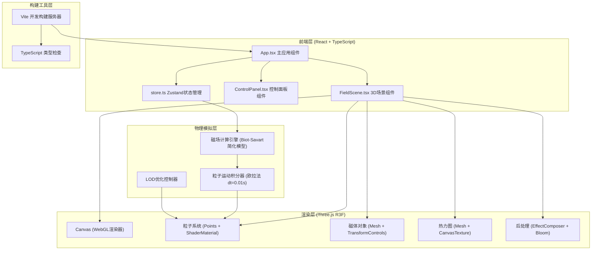

## 1. 架构设计



## 2. 技术描述
- 前端框架：React@18 + TypeScript@5
- 构建工具：Vite@5 + @vitejs/plugin-react@4
- 3D渲染库：three@0.160 + @react-three/fiber@8 + @react-three/drei@9
- 状态管理：zustand@4
- 后处理效果：@react-three/postprocessing@2
- 开发模式：纯前端，无后端依赖，浏览器端运行全部计算

## 3. 项目文件结构
| 文件路径 | 职责描述 |
|---------|---------|
| `/package.json` | 项目依赖声明（react, three, r3f, zustand等），npm run dev启动脚本 |
| `/vite.config.js` | Vite配置，启用React插件，TypeScript支持，别名配置 |
| `/tsconfig.json` | TypeScript严格模式，dom+esnext lib，jsx: react-jsx |
| `/index.html` | 入口HTML，挂载点#root，深空背景预加载 |
| `/src/App.tsx` | 主应用：布局80/20分栏，注册R3F Canvas，集成UI面板 |
| `/src/components/FieldScene.tsx` | 3D场景：粒子系统、磁体、热力图、useFrame循环更新 |
| `/src/components/ControlPanel.tsx` | 右侧面板：磁体列表、强度滑块、粒子数据、重置按钮 |
| `/src/store.ts` | Zustand Store：粒子数据、磁体列表、高亮ID、热力图数据 |
| `/src/utils/physics.ts` | 物理计算工具：磁场合成、粒子积分、场强颜色映射 |

## 4. 数据模型定义

### 4.1 Zustand Store 类型
```typescript
interface Magnet {
  id: string;
  position: { x: number; y: number; z: number };
  strength: number; // 0.1 ~ 10
}

interface Particle {
  id: number;
  position: Float32Array; // [x, y, z]
  velocity: Float32Array; // [vx, vy, vz]
  fieldStrength: number;
  trail: Array<[number, number, number]>; // 最近60帧轨迹
  trackedPath: Array<[number, number, number]>; // 高亮后200帧路径
}

interface GlobalState {
  magnets: Magnet[];
  particles: Particle[];
  highlightedParticleId: number | null;
  heatmapData: Uint8ClampedArray | null;
  particleLOD: 1500 | 3000;
  // Actions
  addMagnet: (pos: {x:number;y:number;z:number}) => void;
  updateMagnetPosition: (id:string, pos:{x:number;y:number;z:number}) => void;
  updateMagnetStrength: (id:string, strength:number) => void;
  removeMagnet: (id:string) => void;
  setHighlightedParticle: (id:number|null) => void;
  resetScene: () => void;
  setParticleLOD: (count: 1500 | 3000) => void;
  updateHeatmap: (data: Uint8ClampedArray) => void;
  batchUpdateParticles: (updater: (particles: Particle[]) => void) => void;
}
```

### 4.2 物理常量
```typescript
const SCENE_BOUND = 10; // 半边长，总空间20x20x20
const PARTICLE_COUNT_FULL = 3000;
const PARTICLE_COUNT_LOD = 1500;
const PARTICLE_RADIUS = 0.1;
const TIME_STEP = 0.01; // 欧拉积分步长
const TRAIL_LENGTH = 60;
const TRACKED_PATH_LENGTH = 200;
const HEATMAP_SIZE = 256;
const HEATMAP_UPDATE_INTERVAL = 5; // 帧间隔
const MAX_MAGNETS = 4;
const LOD_DISTANCE_NEAR = 10;
const LOD_DISTANCE_FAR = 40;
```

## 5. 核心算法描述

### 5.1 磁场合成算法
对于每个粒子位置 P，遍历所有磁体 Mi：
```
B_total = Σ (strength_i * (P - pos_i) / |P - pos_i|³)
简化磁偶极子模型 → 径向场近似
场强标量：|B_total| 用于颜色映射 / 热力图
```

### 5.2 粒子运动积分（欧拉法）
```
// 洛伦兹力简化：F = q(v × B)，此处 q=1, 质量=1
acceleration = cross(velocity, B_total) * damping
new_velocity = velocity + acceleration * TIME_STEP
new_position = position + new_velocity * TIME_STEP
边界处理：超出 ±10 时镜像反射
```

### 5.3 场强到颜色映射（HSL空间）
```
|B| < 0.5T  → hue=240° (蓝色)  饱和度=1 亮度=0.5
0.5T ~ 2T   → hue线性插值 240°→120° (蓝→绿)
2T ~ 5T     → hue线性插值 120°→0° (绿→红)
|B| > 5T    → hue=0° (红色) 亮度随强度提升至0.9
亮度 = 0.5 + min(0.4, |B|/12)
透明度 = 0.6 + min(0.4, |B|/8)
```

### 5.4 热力图生成
```
y=-10 平面，x/z ∈ [-10, 10]，256x256像素
对每个像素点 (i,j) → 世界坐标 (x, -10, z)
计算该点 Σ strength_k / |(x,-10,z) - pos_k|²
归一化后 → 蓝→红颜色查找表
写入CanvasTexture → 每5帧刷新
```

## 6. 性能优化策略
1. **粒子LOD**：相机距离>40时剔除随机一半粒子（draw call不变，geometry缩减）
2. **热力图降频**：setInterval 5帧 → 节省CPU计算 80%
3. **TypedArray批量更新**：粒子position/color使用Float32Array + BufferAttribute.setUpdateRange()
4. **加法混合**：粒子无需深度写入，减少排序开销
5. **ShaderMaterial**：粒子大小/颜色/发光直接在片元着色器计算
6. **增量更新**：transformControls拖拽时仅更新单个磁体position，不触发全局重算
