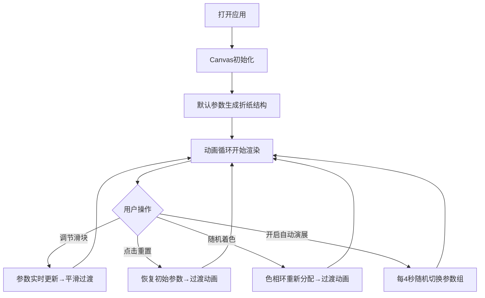

## 1. 产品概述

「时序折纸」是一款在浏览器中运行的交互式几何动画展演应用，通过实时参数调节让用户参与到动态折纸艺术的创作中。

- **主要目的**：解决传统动画播放缺乏用户参与和随机创意的问题，用户通过滑块和按钮实时控制一个程序生成的动态折纸结构的形态、色彩与光影效果。
- **目标用户**：对几何艺术、交互设计、视觉美学感兴趣的设计师、艺术家及普通用户。
- **产品价值**：将抽象的几何美学转化为可感知、可操控的沉浸式体验，让每个人都能成为动态艺术的导演。

## 2. 核心功能

### 2.1 功能模块列表

1. **主展示页**：折纸Canvas渲染区、左侧控制面板、光晕背景

### 2.2 页面详情

| 页面名称 | 模块名称 | 功能描述 |
|---------|---------|---------|
| 主展示页 | 折纸结构生成 | 默认生成12个可折叠三角形平面组成的花球形多面体，支持折叠角度0-180度调节 |
| 主展示页 | 动态粒子系统 | 折纸展开时从顶点喷射彩色粒子，抛物线轨迹1.5秒消失，粒子数量随速度递增 |
| 主展示页 | 交互控制面板 | 三个滑块（折叠角度、展开速度、粒子数量倍数）、两个按钮（重置、随机着色）、一个自动演展开关 |
| 主展示页 | 光线反射光晕 | 法线与光源角度计算反光强度0.3-1.0，面中心30px半渐变光晕 |
| 主展示页 | 自动循环模式 | 每4秒自动切换随机参数组，2秒ease-in-out平滑过渡 |

## 3. 核心流程

用户打开页面后，折纸动画自动开始播放。用户可通过左侧控制面板调节参数，或开启自动演展模式，享受光影与几何交织的沉浸式表演。

## 4. 用户界面设计

### 4.1 设计风格

- **主色调**：深色太空蓝 #1A1A2E（背景）、深海蓝 #16213E（面板）
- **强调色**：彩虹渐变 #FF6B6B → #4ECDC4（滑块轨道）、金黄 #FFD93D（滑块手柄辉光）、紫粉渐变 #6C63FF → #FF6584（按钮边框）、荧光绿 #00E676（开关激活态）
- **按钮风格**：渐变发光边框，悬停时辉光半径扩展至8px，圆角设计
- **字体方向**：现代感无衬线字体，标题加粗，正文中等字重
- **布局风格**：左控制面板（固定280px宽）+ 右侧Canvas展示区（自适应居中），窄屏时面板折叠到底部
- **视觉质感**：半透明磨砂玻璃面板、柔和径向光晕背景、发光交互元素

### 4.2 页面设计概览

| 页面名称 | 模块名称 | UI元素 |
|---------|---------|--------|
| 主展示页 | Canvas展示区 | 居中折纸模型，周围径向渐变光晕（中心透明度0.05），深色背景 |
| 主展示页 | 控制面板-滑块区 | 三个彩虹渐变轨道滑块，金黄发光手柄（16px直径，4px辉光），数值实时显示 |
| 主展示页 | 控制面板-按钮区 | 重置按钮、随机着色按钮，紫粉渐变边框，悬停发光 |
| 主展示页 | 控制面板-开关区 | 圆形自动演展开关，激活时绿色填充+180度旋转动画 |

### 4.3 响应式设计

- **桌面优先**：适配1920×1080和1366×768标准分辨率
- **窄屏适配**（<1024px）：控制面板自动折叠至页面底部（高度200px），控件水平排列
- **Canvas自适应**：折纸模型始终视口居中，按可用空间等比缩放

### 4.4 Canvas场景指导

- **环境氛围**：深空蓝背景，折纸外围包裹淡淡径向光晕
- **光源设置**：虚拟光源位于正前方45度上方，用于计算法线反光
- **相机视角**：固定正视图，折纸围绕中心点轻微旋转以展示立体感
- **构图画素**：折纸模型占视觉中心，留出充足负空间营造沉浸感
- **动画过渡**：所有参数变化使用1秒ease-in-out过渡曲线
- **性能约束**：帧率≥55FPS，粒子总数≤800颗，滑块响应延迟<50ms
