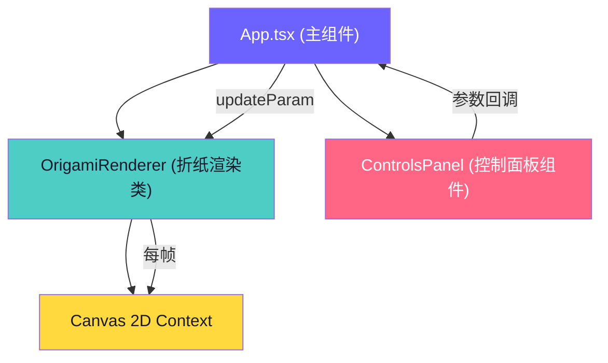

## 1. 架构设计



## 2. 技术说明

- **前端框架**：React@18 + TypeScript@5 + Vite@5
- **构建工具**：Vite（@vitejs/plugin-react）
- **渲染引擎**：原生 Canvas 2D API（高性能逐帧绘制）
- **状态管理**：React useState（轻量级本地状态）
- **UI样式**：原生CSS（不引入UI库，精确控制磨砂玻璃、发光等效果）
- **后端**：无（纯前端交互应用）
- **数据库**：无

## 3. 文件结构

```
auto10/
├── package.json
├── vite.config.js
├── tsconfig.json
├── index.html
└── src/
    ├── App.tsx          # 主组件：状态管理+Canvas初始化+参数传递
    ├── origami.ts       # 折纸核心逻辑类：几何计算/粒子/光线/渲染
    └── controls.tsx     # 控制面板组件：滑块/按钮/开关UI
```

## 4. 核心数据模型

### 4.1 OrigamiParams（控制面板参数）

```typescript
interface OrigamiParams {
  foldAngle: number;      // 折叠角度 0-180，默认30
  unfoldSpeed: number;    // 展开速度 0.5-5倍，默认1
  particleMultiplier: number; // 粒子数量倍数 0.5-2，默认1
  autoPlay: boolean;      // 自动演展开关
}
```

### 4.2 Face（折纸三角形面）

```typescript
interface Face {
  vertices: [Vec3, Vec3, Vec3];  // 3个顶点3D坐标
  baseVertices: [Vec3, Vec3, Vec3]; // 基准未折叠顶点
  hue: number;                    // 色相 0-180
  normal: Vec3;                   // 面法线
  center: Vec3;                   // 面中心点
  reflectivity: number;           // 反光强度 0.3-1.0
}
```

### 4.3 Particle（粒子）

```typescript
interface Particle {
  x: number; y: number;           // 屏幕坐标
  vx: number; vy: number;         // 速度
  gravity: number;                // 重力加速度
  hue: number;                    // 颜色色相
  size: number;                   // 直径 2-5px
  life: number;                   // 剩余寿命 0-1500ms
  maxLife: number;                // 总寿命
}
```

## 5. 关键算法

### 5.1 多面体顶点计算
- 生成12个三角形面构成花球结构（基于正二十面体变体）
- 每个面围绕折叠轴（中心-顶点连线）按 foldAngle 旋转变换

### 5.2 参数平滑插值
- 目标参数变化时，记录起始值和目标值
- 1秒 ease-in-out 曲线：`t = 0.5 - 0.5*cos(π*t)`
- 每帧根据时间进度计算当前插值

### 5.3 粒子生成策略
- 当检测到折叠角度变化（展开过程），从变化面的顶点发射
- 每面粒子数：`5 + (speed-1)*3.75`（范围5-20颗/面）
- 数量上限：800颗，超出时丢弃最早生成的粒子

### 5.4 光线反射计算
- 虚拟光源方向：归一化向量 (0, -0.707, 0.707)（45度前上方）
- 反光强度：`0.3 + 0.7 * max(0, dot(normal, lightDir))`
- 光晕绘制：面中心径向渐变，半径30px，透明度0.6→0

### 5.5 自动演展逻辑
- 4秒计时器触发切换
- 随机目标：角度 30-150°，速度 1-4x，色相偏移 ±20°
- 切换动画：2秒 ease-in-out 插值过渡

## 6. 性能保障

- **帧率控制**：requestAnimationFrame驱动，通过timestamp计算deltaTime
- **粒子池**：对象复用避免GC，数量硬上限800
- **脏检查**：参数未变化时跳过几何重计算
- **离屏缓存**：静态光晕纹理预渲染为离屏Canvas
- **响应延迟**：滑块onChange直接触发state更新→下帧同步渲染（<50ms）
