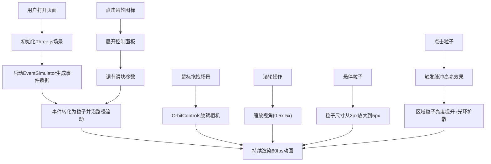
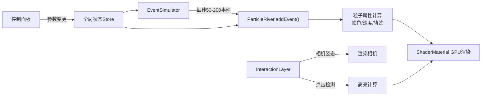

# 数据洪流·粒子之河 - 产品需求文档 (PRD)

## 1. 产品概述

「数据洪流·粒子之河」是一款面向数字艺术家和数据可视化爱好者的3D交互可视化应用，将抽象的用户行为数据流实时映射为三维空间中蜿蜒流动的彩色粒子河流。

- **核心目标**：通过沉浸式3D粒子动画，将click/scroll/input三类用户行为事件转化为可感知、可交互的视觉艺术作品
- **目标用户**：数字艺术家、数据可视化设计师、前端开发者、数据艺术爱好者
- **产品价值**：提供高度可定制、高性能的实时数据可视化体验，让无形的数据流动变得直观而富有美感

## 2. 核心功能

### 2.1 用户角色
| 角色 | 使用方式 | 核心需求 |
|------|----------|----------|
| 数字艺术家 | 浏览器直接访问，自由探索 | 视觉美感、粒子效果丰富、交互流畅 |
| 数据可视化设计师 | 演示数据流动概念 | 事件类型清晰可辨、参数可调、展示效果好 |
| 前端开发者 | 学习参考Three.js技术 | 代码结构清晰、性能优化到位、注释完整 |

### 2.2 功能模块
1. **粒子河流系统**：20000个粒子沿三维贝塞尔曲线流动，动态路径演变
2. **事件数据模拟**：每秒50-200个模拟事件（click/scroll/input），可调节频率
3. **交互式相机**：轨道控制器（OrbitControls）支持旋转、缩放、悬停高亮
4. **深空场景**：渐变背景+500颗闪烁星星
5. **脉冲高亮交互**：点击粒子触发区域高亮+扩散光环
6. **控制面板**：流速倍率、事件频率、高亮时长实时调节
7. **信息展示条**：实时PPS、相机距离、活跃粒子数

### 2.3 页面详情
| 页面名称 | 模块名称 | 功能描述 |
|-----------|-------------|---------------------|
| 主场景 | 粒子河流渲染 | 基于Three.js Points + ShaderMaterial实现20000粒子GPU加速渲染，六边形面片始终面向相机 |
| 主场景 | 深空背景 | 从#0a0a2e到#000011的径向渐变，500颗随机闪烁星星分布于50单位半径内 |
| 主场景 | 相机控制 | 鼠标拖拽旋转，滚轮缩放（0.5x-5x），始终围绕河流中心 |
| 主场景 | 点击交互 | 粒子点击检测→10单位半径高亮（亮度200%）+2秒保持→白色光环1.5秒扩散至20单位 |
| 信息条 | 实时数据 | 固定右下角：PPS、相机距离、活跃粒子总数，10秒无交互自动隐藏 |
| 控制面板 | 参数调节 | 左上角齿轮图标展开：流速倍率(0.5x-3x)、事件频率(50-200/s)、高亮时长(1-5s) |

## 3. 核心流程

**用户主要交互流程：**

**数据流向图：**

## 4. 用户界面设计

### 4.1 设计风格

- **主题**：深空科技风 / Data Art
- **主色调**：深蓝 #0a0a2e，墨黑 #000011
- **强调色**：
  - Click事件：#FF6B6B 珊瑚红
  - Scroll事件：#4ECDC4 薄荷青
  - Input事件：#FFE66D 柠檬黄
  - 控制面板主题：#4ECDC4
- **字体**：数字显示使用等宽字体，正文使用现代无衬线字体
- **视觉特征**：粒子带半透明光晕，深空背景渐变，星星闪烁

### 4.2 页面设计概览
| 页面区域 | 模块名称 | UI元素与风格 |
|-----------|-------------|-------------|
| 全屏主体 | 3D场景 | 深空渐变背景，中心粒子河流蜿蜒流动，周围星星闪烁 |
| 右下角 | 信息条 | `position:fixed; bottom:20px; right:20px; background:rgba(0,0,0,0.6); border-radius:8px; padding:12px 16px; color:#fff; font-size:14px; font-family:monospace;`，opacity过渡动画 |
| 左上角 | 齿轮图标 | `width:32px; height:32px; border-radius:50%; background:rgba(255,255,255,0.3);`，hover变纯白 `background:rgba(255,255,255,1);` |
| 左上角 | 控制面板 | 展开后包含3个自定义滑块，`轨道height:4px; border-radius:2px; 滑块width:16px; height:16px; border-radius:50%; background:#4ECDC4;` |

### 4.3 响应式设计
- **桌面优先**：主要面向桌面显示器（2560x1440及以上分辨率优化）
- **全屏自适应**：Canvas容器100vw x 100vh，自适应屏幕尺寸
- **触摸优化**：移动端支持触屏拖拽旋转、双指缩放

### 4.4 3D场景指导
- **环境氛围**：深空宇宙，无外部HDRI，使用自发光粒子+雾效创造深度感
- **灯光设置**：主光源AmbientLight(0xffffff, 0.3)，粒子自发光（emissive），无阴影计算以保证性能
- **相机设置**：PerspectiveCamera(fov=60, near=0.1, far=1000)，初始位置距离中心15单位，OrbitControls.target锁定河流中心
- **构图要点**：粒子河流沿Spline曲线从场景一端流动到另一端，占据视觉中心区域，星星散布四周创造空间层次
- **动画细节**：
  - 粒子流动：8秒生命周期，从源头出现，透明度1.0→0.0线性衰减
  - 路径演变：控制点每5秒随机位移10%-20%
  - 星星闪烁：2-4秒随机周期正弦波
  - 光环扩散：半径0→20单位，1.5秒，透明度1.0→0.0
- **性能优化**：
  - 粒子使用Points+BufferGeometry+ShaderMaterial，全部GPU计算
  - 使用InstancedMesh处理星星
  - Raycaster限制为每帧最多检测一次点击
  - 避免CPU-GPU数据回读

## 5. 性能约束与验收标准

### 5.1 性能指标
| 指标 | 最低要求 | 测试环境 |
|------|----------|----------|
| 帧率 | ≥50fps | Chrome最新版 / 2560x1440 / NVIDIA RTX 3060 |
| 粒子总数 | ≤20000个 | 持续运行 |
| 事件生成频率 | ≤200事件/秒 | 可调范围 |
| 内存占用 | ≤500MB | 运行10分钟后 |

### 5.2 验收标准
1. 三种事件类型粒子颜色区分明显（红/青/黄）
2. 粒子始终为六边形扁平面片且面向相机
3. 相机拖拽旋转流畅，缩放范围0.5x-5x
4. 点击粒子触发高亮及光环扩散效果
5. 控制面板滑块调节实时生效
6. 信息条10秒无交互自动隐藏，鼠标移入显示
7. 持续运行10分钟帧率不低于50fps
