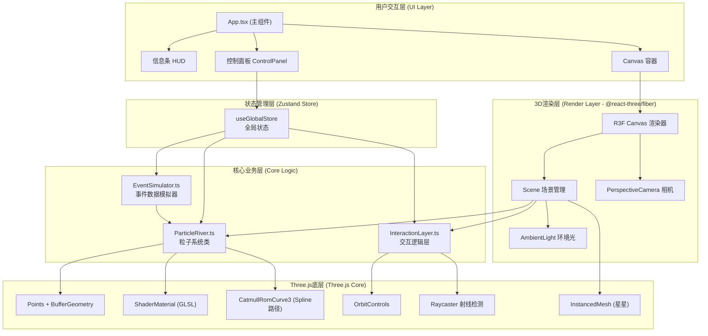
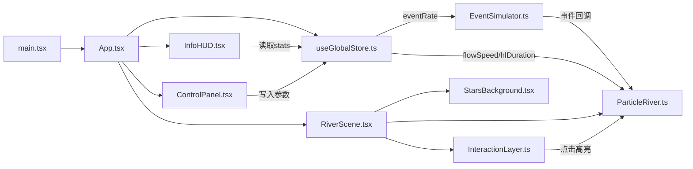

# 数据洪流·粒子之河 - 技术架构文档

## 1. 架构设计



## 2. 技术栈描述

| 层级 | 技术选型 | 版本 | 用途 |
|------|----------|------|------|
| 构建工具 | Vite | ^5.0 | 快速冷启动，HMR热更新 |
| 前端框架 | React | ^18.2 | 声明式UI组件开发 |
| 语言 | TypeScript | ^5.3 | 类型安全，代码可维护 |
| 3D渲染引擎 | Three.js | ^0.160.0 | WebGL 3D底层能力 |
| React-Three集成 | @react-three/fiber | ^8.15 | React声明式Three.js |
| 3D辅助库 | @react-three/drei | ^9.92 | OrbitControls、Stars等封装 |
| 状态管理 | Zustand | ^4.4 | 轻量级全局状态（滑块参数） |
| 类型支持 | @types/three | ^0.160.0 | Three.js TypeScript类型 |
| Vite React插件 | @vitejs/plugin-react | ^4.2 | React+TSX编译支持 |

## 3. 项目文件结构与调用关系

```
auto101/
├── index.html                          # 入口HTML，挂载点<div id="root">
├── package.json                        # 依赖与脚本
├── vite.config.js                      # Vite配置（React+TS）
├── tsconfig.json                       # TS严格配置
└── src/
    ├── main.tsx                        # React入口: createRoot → <App />
    ├── App.tsx                         # 主组件：状态管理 + R3F Canvas + UI
    │                                     调用关系：main.tsx ← App.tsx
    │                                     App.tsx 提供: useGlobalStore状态 → 子组件
    ├── stores/
    │   └── useGlobalStore.ts           # Zustand全局Store
    │                                     数据流：控制面板滑块 → Store → EventSimulator/ParticleRiver
    ├── core/
    │   ├── EventSimulator.ts           # 事件模拟器（独立类）
    │   │                                 产出：SimulatedEvent[] → 回调给 ParticleRiver
    │   │                                 依赖：useGlobalStore (eventRate)
    │   ├── ParticleRiver.ts            # 核心粒子系统类
    │   │                                 输入：EventSimulator回调事件
    │   │                                 产出：Three.js Points (挂载到R3F场景)
    │   │                                 内部：Spline路径 + ShaderMaterial + BufferGeometry
    │   └── InteractionLayer.ts         # 交互逻辑Hook
    │                                     输入：用户鼠标事件
    │                                     输出：相机姿态变化、高亮触发、点击反馈
    │                                     依赖：OrbitControls、Raycaster
    ├── components/
    │   ├── RiverScene.tsx              # R3F场景组件（包含粒子、星星、灯光）
    │   │                                 挂载：ParticleRiver实例 → 场景
    │   │                                 集成：InteractionLayer → 相机/交互
    │   ├── StarsBackground.tsx         # 星空背景组件（InstancedMesh）
    │   ├── InfoHUD.tsx                 # 信息条组件（固定右下角）
    │   │                                 读取：Store中的stats数据
    │   └── ControlPanel.tsx            # 控制面板（左上角齿轮展开）
    │                                     写入：滑块值 → useGlobalStore
    └── types/
        └── index.ts                    # 共享TypeScript类型定义
```

### 文件间调用关系图



## 4. 核心数据结构定义

```typescript
// src/types/index.ts

export type EventType = 'click' | 'scroll' | 'input';

export interface SimulatedEvent {
  id: number;
  type: EventType;
  timestamp: number;
  weight: number;        // 0.3 - 1.5，影响粒子速度
  randomSeed: number;    // 0-1，用于粒子大小/轨迹微扰
}

export interface ParticleData {
  eventId: number;
  eventType: EventType;
  progress: number;      // 0-1，沿Spline路径的进度
  speed: number;         // 由event.weight + flowSpeed倍率决定
  size: number;          // 2-6px随机
  birthTime: number;     // 粒子创建时间(ms)
  lifeSpan: number;      // 8000ms固定生命周期
  baseColor: [number, number, number];  // RGB 0-1
  highlightUntil: number;               // 高亮结束时间戳
}

export interface RiverPathPoint {
  x: number;
  y: number;
  z: number;
}

export interface HighlightPulse {
  id: number;
  centerX: number;
  centerY: number;
  centerZ: number;
  startTime: number;
  duration: number;      // 1500ms
  maxRadius: number;     // 20单位
}

export interface GlobalState {
  // 控制面板参数
  flowSpeedMultiplier: number;    // 0.5 - 3.0
  eventRate: number;              // 50 - 200 (事件/秒)
  highlightDuration: number;      // 1 - 5 (秒)
  
  // 实时统计（只读）
  pps: number;                    // 每秒粒子数
  cameraDistance: number;         // 相机距离中心
  activeParticles: number;        // 活跃粒子总数
  
  // 操作方法
  setFlowSpeed: (v: number) => void;
  setEventRate: (v: number) => void;
  setHighlightDuration: (v: number) => void;
  updateStats: (s: Partial<Pick<GlobalState, 'pps'|'cameraDistance'|'activeParticles'>>) => void;
}
```

## 5. 关键技术实现方案

### 5.1 粒子河流 - ShaderMaterial方案

**Vertex Shader核心逻辑：**
```glsl
// 接收Attributes：progress(0-1), size, baseColor, highlight, life
// 接收Uniforms：splineTexture(路径采样纹理), time, pulseList[]

// 1. 根据progress从splineTexture采样位置
// 2. 加入随机扰动形成河流宽度
// 3. 计算六边形面片始终面向相机（Billboarding）
// 4. 根据life计算透明度衰减
// 5. 根据highlight提升亮度（200%）
```

**Fragment Shader核心逻辑：**
```glsl
// 1. 六边形裁剪：discard六边形外的像素
// 2. 中心半透明光晕效果（径向渐变）
// 3. 叠加粒子基础颜色 + 高亮强度
// 4. 光晕半径随寿命线性减小
```

### 5.2 Spline路径动态演变方案
- 初始10个控制点：CatmullRomCurve3生成，X从-20到20，Y/Z随机偏移±5
- 每5000ms：对每个控制点叠加 (±10% ~ ±20%) 的随机位移
- CPU侧每帧更新splineTexture（128x1 RGBAFloat纹理，存xyz坐标）
- Shader通过progress采样纹理获取当前位置

### 5.3 性能优化策略
| 优化点 | 方案 |
|--------|------|
| 粒子数量限制 | 环形Buffer（20000槽位），超出复用最旧粒子 |
| CPU→GPU传输 | 仅更新diff属性（progress, highlightUntil），每帧1次drawCall |
| 点击检测 | Raycaster仅在mousedown时执行1次，检测与Points的相交 |
| 星空渲染 | InstancedMesh，500实例1次drawCall，闪烁用vertexShader time计算 |
| 光环效果 | 单独的RingGeometry + 透明材质，最多同时渲染3个（LRU淘汰） |

## 6. 路由与页面定义

| 路由 | 组件 | 用途 |
|------|------|------|
| `/` | App.tsx | 唯一页面，全屏Canvas+UI叠加层 |

（单页面应用，无路由跳转，使用React Router DOM仅为扩展性预留，可根据用户需求决定是否引入）

## 7. 构建与运行

| 命令 | 说明 |
|------|------|
| `npm run dev` | 启动开发服务器（Vite HMR），默认端口5173 |
| `npm run build` | 生产构建，输出到dist/ |
| `npm run preview` | 预览生产构建结果 |
| `npm run typecheck` | TypeScript类型检查（无输出模式） |
