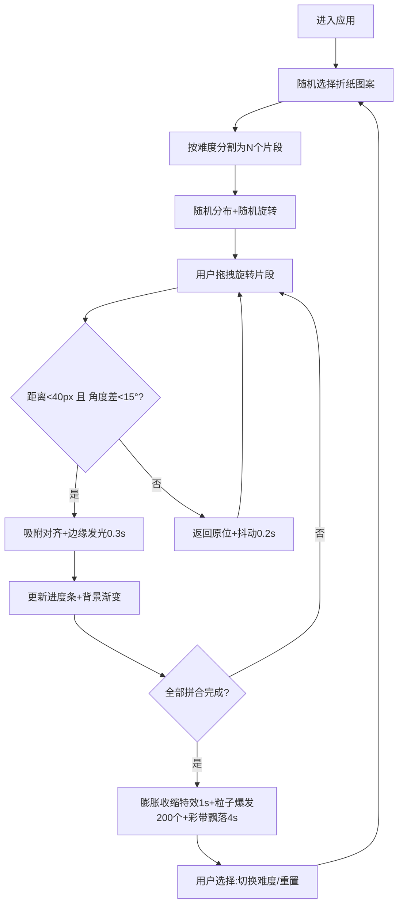

## 1. 产品概述

「折纸拼图·光影折叠」是一款基于Canvas 2D的交互式折纸拼图Web应用，为用户提供具有立体触感和动态光线反馈的数字拼图体验。解决传统数字拼图平面化、缺乏触觉反馈和视觉沉浸感的问题。

- 核心目标：通过折纸艺术形式结合光影动态效果，打造沉浸式拼图交互体验
- 目标用户：休闲游戏爱好者、折纸艺术爱好者、追求视觉美感的普通用户
- 产品价值：将传统折纸美学与数字交互结合，创造兼具挑战性与治愈感的拼图体验

## 2. 核心特性

### 2.1 功能模块

1. **拼图主界面**：Canvas画布、折纸片段渲染、拖拽旋转交互
2. **进度反馈系统**：顶部进度条、背景色调渐变、完成特效
3. **难度控制系统**：简单(6片)/普通(9片)/困难(12片)模式切换
4. **动态视觉系统**：吸附发光、错误抖动、完成粒子爆发、彩带飘落

### 2.2 页面详情

| 页面名称 | 模块名称 | 功能描述 |
|-----------|-------------|---------------------|
| 拼图主界面 | 画布区域 | Canvas 2D渲染折纸片段、粒子特效、背景渐变 |
| 拼图主界面 | 进度条模块 | 显示拼接进度，颜色灰→金渐变，悬停提示详情 |
| 拼图主界面 | 模式切换栏 | 底部按钮组：难度选择(三档)、重置按钮 |
| 拼图主界面 | 交互反馈层 | 拖拽半透明、吸附发光、错误抖动、膨胀特效 |

## 3. 核心流程

用户进入应用 → 系统随机选择折纸图案并按难度分割片段 → 片段随机分布在画布周围 → 用户拖拽旋转片段 → 接近目标位置时检测(距离<40px且角度差<15°) → 正确则吸附发光/错误则抖动弹回 → 进度条更新+背景色渐变 → 全部完成触发粒子爆发+膨胀特效+彩带飘落 → 可切换难度或重置开始新局

## 4. 用户界面设计

### 4.1 设计风格

- **主色调**：深色主题背景 `#1a1a2e`，金色强调 `#FFD700`，冷灰→暖橙渐变背景
- **辅助色**：白色描边、半透明纹理、折痕阴影(偏移3px模糊6px透明度0.3)
- **按钮风格**：圆角矩形(圆角8px)，悬浮抬高加深阴影，点击缩放0.95
- **字体方案**：标题使用优雅衬线字体(Playfair Display)，正文使用现代无衬线(Noto Sans SC)
- **布局风格**：响应式居中布局，画布自适应保持宽高比，顶部进度条+底部控制栏
- **视觉特色**：折纸质感(半透明纹理+折痕阴影)、动态光影(吸附发光+金色投影)、粒子特效

### 4.2 页面设计概述

| 页面名称 | 模块名称 | UI元素 |
|-----------|-------------|-------------|
| 拼图主界面 | 进度条模块 | 顶部通栏，宽度80%，圆角4px，灰→金平滑过渡，悬停显示数字进度 |
| 拼图主界面 | 画布区域 | 深色背景渐变(随进度变化)，折纸片段白色描边+阴影，完成投影变金色 |
| 拼图主界面 | 控制栏 | 底部居中，4个圆角按钮(简单/普通/困难/重置)，当前难度高亮 |
| 拼图主界面 | 特效层 | Canvas粒子系统，200个彩色粒子，5条彩带，膨胀动画 |

### 4.3 响应式设计

- 桌面优先设计，最小适配宽度360px，最大内容宽度1200px
- Canvas画布自适应容器宽度，保持4:3宽高比
- 移动端按钮尺寸增大(最小44px触控区)，控制栏自动换行
- 进度条在小屏幕隐藏文字只保留色块

### 4.4 动画与交互细节

- **拖拽状态**：按住时片段半透明(透明度0.7)，Z-index提升
- **吸附动画**：发光0.3秒(白→片段主色渐变)，投影变金色持续0.5秒
- **错误反馈**：抖动幅度5px频率20Hz时长0.2秒后弹回原位
- **完成特效**：所有片段向外膨胀50%再收缩(1秒)，200粒子爆发(2秒)，5条彩带飘落(4秒)
- **背景渐变**：冷灰(#2a2a3e)→暖橙(#3a2a1e)随进度线性插值
