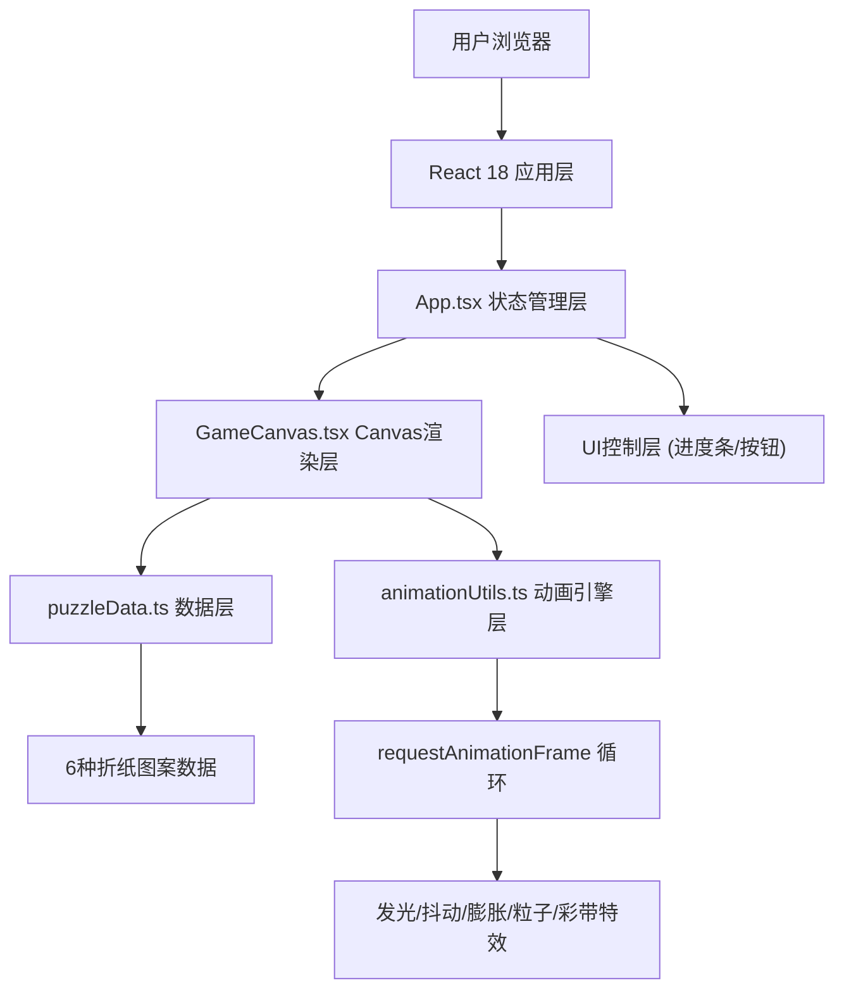

## 1. 架构设计



## 2. 技术栈说明

- **前端框架**：React 18 + TypeScript 5 (严格模式)
- **构建工具**：Vite 5 + @vitejs/plugin-react 4
- **渲染引擎**：HTML5 Canvas 2D API
- **动画系统**：requestAnimationFrame 原生实现，自定义Easing函数
- **样式方案**：内联CSS + CSS变量，响应式媒体查询
- **无后端依赖**：纯前端应用，所有数据内置

## 3. 核心数据结构定义

### 3.1 折纸片段类型

```typescript
interface PuzzlePiece {
  id: string;
  polygon: Point[];          // 多边形顶点坐标（相对中心）
  targetX: number;           // 目标X坐标（画布中心坐标系）
  targetY: number;           // 目标Y坐标
  targetRotation: number;    // 目标旋转角度（弧度）
  currentX: number;          // 当前X坐标
  currentY: number;          // 当前Y坐标
  currentRotation: number;   // 当前旋转角度
  baseColor: string;         // 主色调（发光用）
  texturePattern: number;    // 纹理类型索引 0-3
  isPlaced: boolean;         // 是否已正确放置
  zIndex: number;            // 渲染层级
}
```

### 3.2 折纸图案类型

```typescript
interface OrigamiPattern {
  id: string;
  name: string;
  aspectRatio: number;       // 宽高比
  pieces: {
    polygon: Point[];
    offsetX: number;
    offsetY: number;
    rotation: number;
    color: string;
  }[];
}
```

### 3.3 动画状态类型

```typescript
interface AnimationState {
  glowAnimations: Map<string, { startTime: number; duration: number }>;
  shakeAnimations: Map<string, { startTime: number; duration: number; amplitude: number }>;
  inflateAnimation: { startTime: number; duration: number } | null;
  particles: Particle[];
  ribbons: Ribbon[];
}
```

### 3.4 粒子/彩带类型

```typescript
interface Particle {
  x: number; y: number;
  vx: number; vy: number;
  radius: number;
  color: string;
  life: number; maxLife: number;
}

interface Ribbon {
  x: number; y: number;
  vy: number;
  swingPhase: number;
  swingAmplitude: number;
  color: string;
  length: number;
  rotation: number;
  life: number; maxLife: number;
}
```

## 4. 核心模块职责

### 4.1 puzzleData.ts
- 内置6种折纸图案（千纸鹤、富士山、樱花、金鱼、帆船、蝴蝶），每种8-12片段
- 定义三角形/四边形顶点坐标、颜色、纹理索引
- `selectRandomPattern()`：随机选择图案
- `generatePuzzlePieces(pattern, difficulty)`：按难度截取片段，设置目标位置
- `shufflePieces(pieces, canvasWidth, canvasHeight)`：随机分布+随机旋转

### 4.2 animationUtils.ts
- `easeOutCubic(t)` / `easeInOutQuad(t)`：缓动函数
- `lerp(a, b, t)`：线性插值
- `startGlowAnimation(pieceId)`：触发发光动画（0.3秒白→主色渐变）
- `startShakeAnimation(pieceId)`：触发抖动动画（5px幅度20Hz0.2秒）
- `startInflateAnimation()`：触发膨胀收缩（1秒）
- `spawnParticles(x, y, count)`：生成200粒子爆发
- `spawnRibbons(count)`：生成5条彩带
- `updateAnimations(state, deltaTime)`：逐帧更新所有动画状态

### 4.3 GameCanvas.tsx
- `useRef`管理Canvas元素和渲染状态
- `useEffect`初始化渲染循环（requestAnimationFrame 60FPS）
- 坐标系统：画布中心为原点，片段坐标相对中心
- 拖拽检测：鼠标按下→命中测试→进入拖拽模式→跟随鼠标
- 旋转控制：滚轮或右键拖拽旋转片段（15°步进）
- 吸附检测：松开时检测距离<40px且角度差<15°
- 绘制流水线：清屏→渐变背景→(目标位置预览)→阴影层→片段多边形→描边→特效层→粒子→彩带

### 4.4 App.tsx
- `useState`管理：当前图案、片段列表、难度模式、完成状态
- `useCallback`封装：`handlePiecesChange`、`handleProgress`、`handleComplete`
- 计算进度比例，控制背景色插值
- 渲染：顶部进度条、GameCanvas、底部按钮组
- 响应式：监听窗口resize，传递canvas尺寸

## 5. 性能优化方案

1. **离屏Canvas缓存**：静态片段预渲染到离屏Canvas，拖拽时直接贴图
2. **脏矩形渲染**：仅重绘变化区域（拖拽中片段+特效区域）
3. **粒子池化**：Particle对象复用，避免GC
4. **命中测试优化**：空间哈希或仅对isPlaced=false的片段做逆变换命中测试
5. **节流策略**：进度条UI更新用requestAnimationFrame节流
6. **内存管理**：完成动画后及时清理粒子数组，移除已结束动画引用

## 6. 文件组织

```
auto102/
├── .trae/documents/
│   ├── PRD-折纸拼图光影折叠.md
│   └── TechArchitecture-折纸拼图光影折叠.md
├── package.json
├── vite.config.js
├── tsconfig.json
├── index.html
└── src/
    ├── App.tsx
    ├── GameCanvas.tsx
    ├── puzzleData.ts
    └── animationUtils.ts
```
