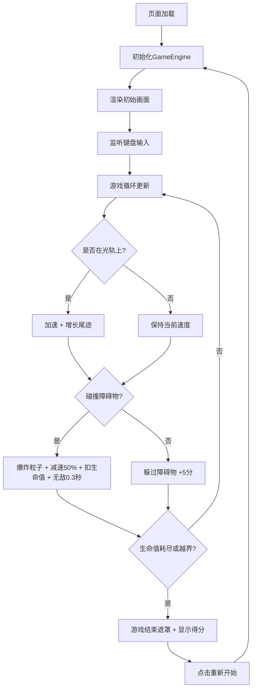

## 1. 产品概述
「光轨赛车」是一款基于浏览器的2D竞速游戏，玩家驾驶由发光粒子构成的赛车，在随机生成的彩色光轨赛道上高速飞驰，通过左右方向键躲避障碍并收集加速能量。
- 目标用户：独立游戏爱好者、休闲玩家
- 产品价值：提供视觉震撼、操作简单但富有挑战性的沉浸式光影竞速体验

## 2. 核心特性

### 2.2 功能模块
1. **游戏主场景**：Canvas 2D渲染、深空蓝渐变背景、光轨赛道、赛车、障碍物、粒子特效
2. **HUD界面**：实时得分、当前速度、碰撞剩余次数（光点显示）、最大速度时的金色光晕
3. **游戏结束界面**：半透明遮罩、最终得分、重新开始按钮

### 2.3 页面详情
| 页面名称 | 模块名称 | 功能描述 |
|-----------|-------------|---------------------|
| 游戏主界面 | Canvas渲染层 | 绘制赛车、光轨、障碍物、粒子特效 |
| 游戏主界面 | HUD信息层 | 顶部显示得分、速度、碰撞次数 |
| 游戏主界面 | 开始/结束遮罩 | 游戏开始提示、结束后显示得分和重启按钮 |

## 3. 核心流程

用户打开页面 → 游戏自动启动/提示开始 → 按左右方向键控制赛车水平移动 → 赛车在光轨范围内自动加速 → 躲避障碍物获得额外分数 → 碰撞障碍物减速并扣除生命值 → 生命值耗尽或驶出边界 → 游戏结束 → 点击重新开始

## 4. 用户界面设计

### 4.1 设计风格
- **主色调**：深空蓝渐变（#0A0A2E → #1A1A4E）作为背景
- **配色方案**：青色光轨（#00FFFF）→ 紫色光轨（#FF00FF）流动渐变，白色赛车（#FFFFFF），红紫渐变障碍物（#FF4444 → #AA44FF），金色光晕（速度最大值时）
- **字体**：细圆体（如Round、M PLUS Rounded 1c等无衬线圆角字体）
- **视觉特效**：发光粒子、流光尾迹、脉动光晕、爆炸效果、半透明闪烁无敌

### 4.2 页面设计概览
| 页面名称 | 模块名称 | UI元素 |
|-----------|-------------|-------------|
| 游戏主界面 | Canvas画布 | 深空蓝渐变背景、流动彩色光轨、发光粒子赛车、脉动障碍物、粒子尾迹与爆炸特效 |
| 游戏主界面 | HUD顶部栏 | 得分/速度/三光点生命值（白色半透明细圆体） |
| 游戏主界面 | 金色边缘光晕 | 速度达到最大值时画面边缘0.2-0.5透明度闪烁 |
| 游戏结束 | 半透明遮罩 | 居中白色最终得分 + "点击重新开始"圆角按钮 |

### 4.3 响应式设计
- 桌面端优先，Canvas固定800×600或自适应窗口
- 触屏设备可通过屏幕左右区域触摸控制赛车方向
