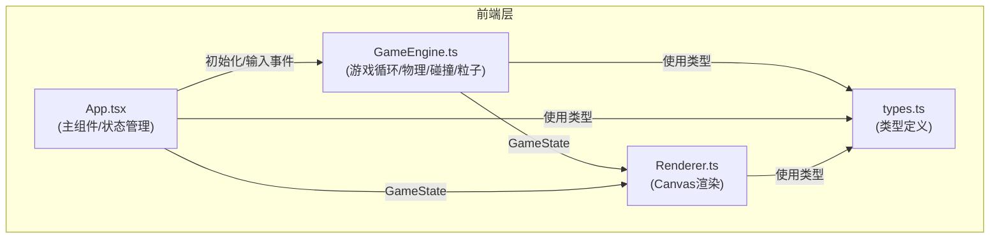

## 1. 架构设计



**数据流向说明：**
1. `App.tsx` 初始化 `GameEngine` 实例，将键盘/触摸输入事件传递给引擎
2. `GameEngine` 基于 `requestAnimationFrame` 游戏循环，每帧接收 `deltaTime` 并更新：
   - 赛车位置与速度
   - 光轨滚动位置与色相
   - 障碍物生成、移动、碰撞检测
   - 粒子系统（赛车粒子、尾迹、爆炸粒子）
   - 计分与难度递增
3. `GameEngine` 每帧输出 `GameState` 给 `App.tsx`
4. `App.tsx` 将 `GameState` 传递给 `Renderer.ts`
5. `Renderer.ts` 按图层顺序绘制：背景 → 光轨 → 障碍物 → 赛车 → 粒子 → HUD → 金色边缘光晕

## 2. 技术描述
- **前端框架**：React@18 + TypeScript@5 + Vite@5
- **渲染**：Canvas 2D API（原生性能，无额外渲染库）
- **构建工具**：Vite + @vitejs/plugin-react（开发端口3000）
- **状态管理**：React useState/useRef + 引擎内部可变状态（避免频繁re-render）
- **第三方依赖**：仅React生态核心库，零游戏引擎依赖

## 3. 文件结构
```
auto103/
├── package.json          # 依赖与启动脚本
├── vite.config.js        # Vite配置（端口3000）
├── tsconfig.json         # TypeScript严格模式（target ES2020）
├── index.html            # 入口HTML（标题"光轨赛车"）
└── src/
    ├── App.tsx           # 主组件：游戏状态管理 + UI + 输入处理
    ├── GameEngine.ts     # 核心引擎：物理、碰撞、粒子、计分、难度
    ├── Renderer.ts       # Canvas渲染器：图层绘制
    └── types.ts          # 共享类型定义（GameState, Car, Obstacle, Particle等）
```

## 4. 核心类型定义

```typescript
// types.ts
export interface Vec2 { x: number; y: number }

export interface Car {
  x: number; y: number;
  speed: number; baseSpeed: number; maxSpeedMultiplier: number;
  lives: number; invincibleTimer: number;
  trailLength: number;
  particles: CarParticle[];
}

export interface CarParticle {
  angle: number; radius: number; angularSpeed: number; size: number;
}

export interface TrailPoint { x: number; y: number; alpha: number; }

export interface Obstacle {
  id: number; x: number; y: number; radius: number;
  color: string; passed: boolean;
}

export interface Particle {
  x: number; y: number; vx: number; vy: number;
  life: number; maxLife: number; size: number; color: string;
}

export interface LightRail {
  x: number; width: number; hueOffset: number;
}

export interface GameState {
  running: boolean; gameOver: boolean;
  score: number; speed: number; lives: number;
  timeElapsed: number; difficultyLevel: number;
  obstacleInterval: number; railSpeed: number;
  car: Car; obstacles: Obstacle[];
  trail: TrailPoint[]; particles: Particle[];
  lightRails: LightRail[]; scrollOffset: number; hueShift: number;
  atMaxSpeed: boolean;
}
```

## 5. 性能优化策略
| 优化点 | 方案 |
|--------|------|
| 帧率稳定60fps | requestAnimationFrame驱动 + deltaTime归一化更新 |
| 粒子数量峰值≤300 | 对象池复用 + 生命周期严格控制（爆炸最多50粒子） |
| 内存占用≤50MB | 避免重复创建对象、及时回收离屏障碍物/粒子 |
| 渲染效率 | Canvas分层（单个画布，但按顺序批量绘制同类型元素） |
| 碰撞检测 | 简单圆形AABB预检测再精确圆形检测（每帧障碍物≤20） |
