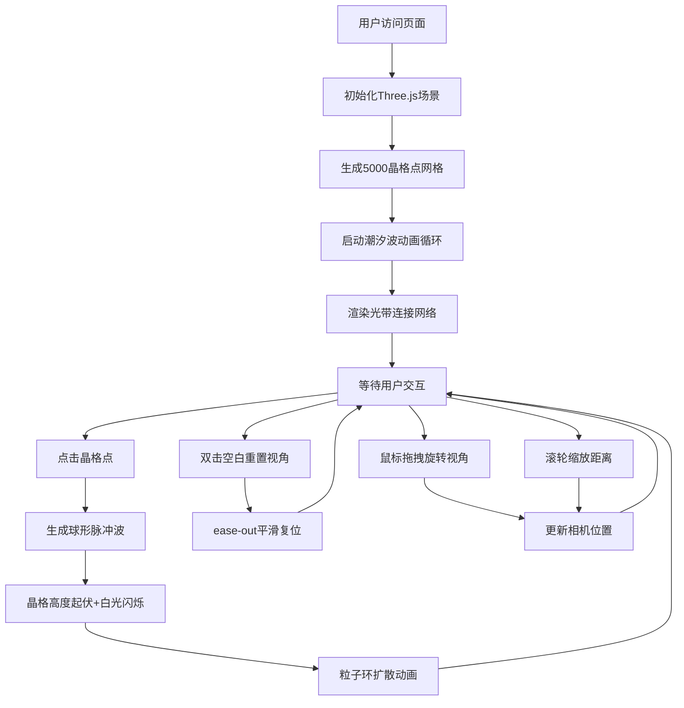

## 1. 产品概述

「晶格潮汐」是一个基于WebGL的三维交互可视化应用，通过数千个动态变化的彩色晶格点构建沉浸式的潮汐波动场，解决传统二维数据图表在展示连续空间波动时缺乏空间层次和动态沉浸感的问题。

- 主要用途：科学数据可视化演示、艺术交互装置、技术展示场景
- 目标用户：数据可视化从业者、艺术创作者、技术教育者
- 核心价值：将抽象的波动场转化为可交互、可感知的三维空间结构

## 2. 核心功能

### 2.1 用户角色

| 角色 | 注册方式 | 核心权限 |
|------|----------|----------|
| 普通用户 | 无需注册，直接访问 | 浏览潮汐场、交互操作、重置视角 |

### 2.2 功能模块

1. **主场景页面**：三维晶格潮汐场渲染、光带网络、UI信息面板
2. **视角控制模块**：鼠标拖拽旋转、滚轮缩放、双击重置
3. **交互反馈模块**：点击晶格点产生连锁脉冲波、粒子环扩散
4. **状态展示模块**：实时统计面板（晶格总数、平均高度、点击坐标）

### 2.3 页面详情

| 页面名称 | 模块名称 | 功能描述 |
|----------|----------|----------|
| 主场景 | 晶格场生成 | 5000个晶格点构成X-Z平面网格(-10到10)，Y轴高度随多波叠加动态变化(0.5-3.0) |
| 主场景 | 潮汐波模拟 | 3个以上不同频率/方向正弦波叠加，相位15秒循环(0-2π) |
| 主场景 | 颜色映射 | Y轴高度映射色相环：蓝色#0066FF→橙红色#FF6633 |
| 主场景 | 脉冲光晕 | 晶格点周围半径0.3的呼吸光晕，透明度0.2-0.6循环 |
| 主场景 | 点击脉冲 | 点击晶格点产生半径5的球形扩散波，2秒持续，高度+0.8并1.5秒回落 |
| 主场景 | 白光闪变 | 受脉冲影响的晶格瞬间变白后衰减回原色 |
| 主场景 | 粒子环 | 脉冲波边缘50个粒子组成流动环，中心色渐变至透明 |
| 主场景 | 光带网络 | 距离<2.5的晶格点用半透明光带连接，透明度0.1-0.4 |
| 主场景 | 弹性动画 | 光带随晶格运动产生0.3秒延迟的弹性拉伸效果 |
| 主场景 | 视角旋转 | 鼠标拖拽围绕中心旋转，距离10-25单位 |
| 主场景 | 缩放控制 | 滚轮缩放视角距离 |
| 主场景 | 视角重置 | 双击空白处平滑复位至45度俯视，距离15，ease-out 1秒 |
| 主场景 | 信息面板 | 左上悬浮面板显示晶格总数、平均高度、点击坐标 |
| 主场景 | 响应式设计 | 全屏自适应，保持晶格密度和间距一致性 |

## 3. 核心流程

用户打开页面后，首先看到深空蓝色渐变背景上的三维晶格潮汐场，晶格点随时间呈现连续的波浪起伏运动。用户可以：
1. 鼠标拖拽旋转视角观察不同角度的潮汐形态
2. 滚轮缩放调整观察距离
3. 点击任意晶格点触发脉冲扩散效果
4. 双击空白区域重置视角
5. 查看左上角面板的实时数据统计

## 4. 用户界面设计

### 4.1 设计风格

- **主色调**：深空蓝渐变背景（#0B0C2A → #1B1B3A）
- **强调色**：晶格色相渐变 #0066FF → #FF6633，脉冲高光 #FFFFFF
- **面板风格**：毛玻璃半透明（rgba(20,20,40,0.7) + blur(10px)），圆角12px，1px #FFFFFF20 边框
- **字体**：现代无衬线字体（如SF Pro、Noto Sans SC），数字使用等宽字体提升可读性
- **交互反馈**：鼠标悬停面板时 scale(1.02) + box-shadow 发光效果

### 4.2 页面设计概述

| 页面名称 | 模块名称 | UI元素 |
|----------|----------|--------|
| 主场景 | 3D视口 | 全屏Canvas，深空渐变背景，晶格点阵+光带网络，正交/透视相机 |
| 主场景 | 信息面板 | 固定左上角，半透明毛玻璃卡片，三行统计数据，悬浮缩放发光 |
| 主场景 | 脉冲效果 | 点击后白色冲击波+50粒子流动环，2秒生命周期 |
| 主场景 | 光带网络 | 动态线条，透明度随高度差变化，弹性拉伸 |

### 4.3 响应式设计

- 桌面优先设计，全屏Canvas自适应窗口尺寸
- 监听window.resize事件，自动更新相机宽高比和渲染尺寸
- 晶格点间距采用世界坐标系，与屏幕分辨率无关，保持视觉密度一致
- 信息面板采用固定定位，移动端自动调整字号和面板大小

### 4.4 3D场景指导

- **环境氛围**：深空宇宙感，暗调环境光配合平行主光源，强调晶格的体积感和色彩
- **灯光设置**：
  - AmbientLight：强度0.4，冷白色调 #8899FF
  - DirectionalLight：强度1.0，位置(10, 15, 10)，暖白色调 #FFF5E6
  - PointLight：强度0.6，位置(0, 5, 0)，跟随场景中心提供补光
- **相机设置**：
  - PerspectiveCamera，fov 60度
  - 初始位置：(10.6, 10.6, 10.6)，lookAt(0, 0, 0) —— 等效45度俯视
  - 距离范围：10-25单位，OrbitControls阻尼效果0.08
- **构图焦点**：场景中心为视觉焦点，潮汐波最高区域自然引导视线
- **交互动画**：
  - 晶格点脉冲：scale和emissive强度动画
  - 视角过渡：1秒ease-out缓动
  - 光带弹性：lerp插值模拟0.3秒延迟
- **后期处理**：轻微Bloom效果增强发光感，FXAA抗锯齿
- **性能预算**：5000实例化网格，每帧主线程计算<5ms，目标>45FPS
