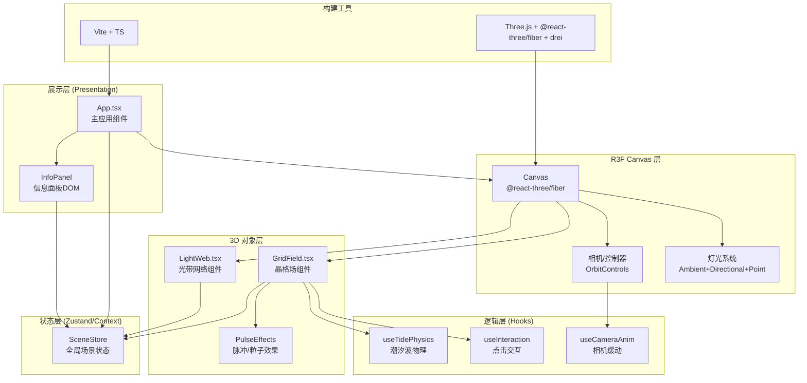

## 1. 架构设计



## 2. 技术描述

- **前端框架**：React 18 + TypeScript（严格模式）
- **构建工具**：Vite 5.x + @vitejs/plugin-react
- **3D 渲染**：
  - Three.js ^0.160.0
  - @react-three/fiber ^8.15.0（R3F声明式Three.js封装）
  - @react-three/drei ^9.92.0（OrbitControls等工具组件）
  - @types/three ^0.160.0
- **性能优化**：
  - InstancedMesh 批量渲染5000晶格点（单次draw call）
  - LineSegments + BufferGeometry 高效光带渲染
  - 帧调度用 useFrame deltaTime 而非setInterval
  - 避免每帧reconcile，使用ref直接操作three对象
- **状态管理**：React Context + useRef（避免R3F中的React重渲染开销）
- **物理/动画**：
  - 正弦波叠加公式驱动潮汐（纯数学计算，无物理引擎）
  - 自定义ease-out缓动函数
  - lerp线性插值模拟弹性延迟

## 3. 路由定义

| 路由 | 用途 |
|------|------|
| / | 主场景（单页应用，无路由跳转） |

单页全屏应用，无需路由系统。

## 4. 核心数据结构与类型定义

```typescript
// 晶格点数据结构（紧凑内存布局，TypedArray友好）
interface LatticeData {
  baseX: Float32Array;   // 基础X坐标 [N]
  baseZ: Float32Array;   // 基础Z坐标 [N]
  baseHeight: Float32Array; // 潮汐基础高度Y [N]（每帧更新）
  pulseOffset: Float32Array; // 脉冲叠加高度 [N]
  pulseStrength: Float32Array; // 白光强度 0-1 [N]
  haloPhase: Float32Array; // 光晕相位 [N]
}

// 脉冲事件
interface PulseEvent {
  id: number;
  centerX: number;
  centerZ: number;
  startTime: number;     // 秒级时间戳
  duration: number;      // 2秒
  maxRadius: number;     // 5单位
}

// 相机平滑过渡
interface CameraTransition {
  active: boolean;
  startTime: number;
  duration: number;      // 1秒
  startPos: [number, number, number];
  startTarget: [number, number, number];
  endPos: [number, number, number];     // 默认(10.6,10.6,10.6)
  endTarget: [number, number, number];  // 默认(0,0,0)
}

// 场景统计状态
interface SceneStats {
  totalPoints: number;   // 5000
  avgHeight: number;
  lastClickCoord: [number, number, number] | null;
  lastClickTime: number;
}

// 潮汐波参数
interface WaveParams {
  freq: number;   // 空间频率（rad/单位）
  speed: number;  // 时间速度（rad/秒）
  dirX: number;   // X方向分量
  dirZ: number;   // Z方向分量
  amp: number;    // 振幅
  phase: number;  // 初相位
}
```

## 5. 组件划分与职责

### 5.1 文件结构

```
auto108/
├── package.json
├── tsconfig.json
├── vite.config.js
├── index.html
└── src/
    ├── main.tsx          ← 入口（ReactDOM.createRoot）
    ├── App.tsx           ← 主组件：Canvas+相机+灯光+面板+状态
    ├── GridField.tsx     ← 晶格场：InstancedMesh+潮汐+点击脉冲+光晕
    ├── LightWeb.tsx      ← 光带网络：邻居查询+LineSegments+弹性延迟
    ├── types.ts          ← 共享类型定义
    ├── utils.ts          ← 潮汐公式、颜色映射、缓动函数等工具
    └── styles.css        ← 全局样式（背景、面板、全屏）
```

### 5.2 组件职责

**App.tsx**
- 挂载R3F `<Canvas>`，配置阴影、像素比、dpr
- 配置灯光（AmbientLight、DirectionalLight、PointLight）
- 配置OrbitControls（minDistance=10, maxDistance=25, enableDamping）
- 管理SceneStats状态（总数、平均高度、点击坐标）
- 渲染DOM层信息面板（fixed定位，毛玻璃样式）
- 处理Canvas双击事件 → 触发视角重置过渡
- 管理PulseEvent队列，分发至GridField/LightWeb

**GridField.tsx**
- 生成71x71≈5000点的X-Z平面网格（步长≈0.282，范围-10~10）
- 创建InstancedMesh（sphere geometry，半径0.08）
- 预计算每个点的waveParams叠加系数（3个波：{freq,speed,dir,amp}）
- useFrame中：
  - 更新全局相位 phase = (time/15)*2π
  - 对每个点计算baseHeight = 0.5 + Σ amp * sin(freq*(dirX*x+dirZ*z) + speed*phase + offset)，归一化至3.0上限
  - 叠加pulseOffset（来自PulseEvent的距离衰减+时间窗口）
  - 高度映射颜色：lerpColor(#0066FF, #FF6633, t)，t=(y-0.5)/2.5
  - 混合白光：lerp(baseColor, #FFF, pulseStrength[i])
  - 更新实例矩阵（位置+scale）与颜色
  - 处理光晕：haloPhase += delta*2，根据sin生成透明度，用emissive强度近似
- Raycaster点击检测 → 找到最近晶格点 → 派发PulseEvent到App状态

**LightWeb.tsx**
- 接收来自GridField的位置数组（Float32Array长度N*3）
- 空间哈希（2.5单位cell）建立邻居索引，每帧查找距离<2.5的点对
- 过滤上限≈20000条线（超出抽样），构建Float32Array位置缓冲
- 弹性延迟：维护上帧渲染位置prevPositions，每帧pos = lerp(prev, curr, 1-exp(-delta/0.3))
- LineSegments + ShaderMaterial：
  - 顶点颜色根据两端晶格高度差插值
  - 透明度根据高度差映射0.1-0.4
  - linewidth=1（OpenGL限制，可ShaderMaterial中用msdf扩宽）

### 5.3 关键算法

**潮汐波叠加（3个波）**
```
wave1: freq=0.8, dir=(1,0.3), speed=1.0, amp=0.8
wave2: freq=1.3, dir=(-0.4,1), speed=0.7, amp=0.6
wave3: freq=0.5, dir=(0.7,-0.7), speed=1.4, amp=0.5
height = 0.5 + clamp(wave1+wave2+wave3, 0, 2.5)
```

**颜色渐变（线性插值十六进制）**
将#0066FF和#FF6633转为RGB，根据t=(y-0.5)/2.5做RGB分量lerp。

**脉冲高度与衰减**
对给定PulseEvent：
```
elapsed = time - startTime
t = elapsed / duration           // 0..1
wavefront = maxRadius * t
for each lattice (x,z):
  d = sqrt((x-cx)^2 + (z-cz)^2)
  if |d - wavefront| < 0.5:
    envelope = cos(π*(d-wavefront))  // 峰值在波前
    heightOffset = 0.8 * envelope * (1-t)
    whiteStrength = envelope * (1-t/1.5)
```

**视角缓动（ease-out cubic）**
```
function easeOutCubic(t) { return 1 - pow(1-t, 3) }
相机位置和target均按easeOutCubic在start..end插值
```

**空间哈希邻居查询**
```
cellSize = 2.5
key(x,z) = floor(x/cellSize) + K*floor(z/cellSize)
对每个点，只查自身+8邻居cell，暴力配对 → O(N*平均邻居数)
```

## 6. 性能优化策略

1. **InstancedMesh**：5000球=1 draw call，geometry共享；使用instanceColor避免逐材质切换
2. **TypedArray**：所有位置/颜色数据用Float32Array连续存储，避免GC
3. **useFrame节流**：将主线程计算拆分为每帧<5ms，邻居查询在worker不可行时用时间切片
4. **Ref而非State**：three对象引用通过useRef存，避免R3F触发React reconcile
5. **像素比限制**：dpr={[1, 2]}，Retina屏上不超采样
6. **frustumCulled=false**：晶格点跨越视口范围，避免每帧视锥剔除计算
7. **LineSegments合并**：所有光带共享一个BufferGeometry，1 draw call

## 7. 兼容性与回退

- WebGL2首选，WebGL1回退（Three.js自动处理）
- 不支持WebGL时显示友好提示DOM
- 移动端触控：OrbitControls默认支持触控旋转/捏合缩放
