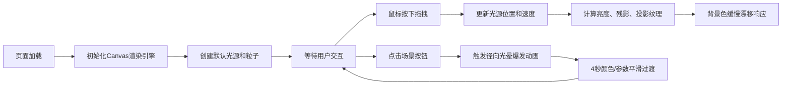

## 1. 产品概述

「浮光影踪」是一款基于Canvas 2D的交互式动态投影映射Web应用，通过用户拖拽发光粒子光源在虚拟背景墙上投射动态彩色光影，营造沉浸式光影叙事体验。

- **核心价值**：解决静态背景墙缺乏动态光影叙事和用户参与感的问题，提供可交互的艺术化光影展示
- **目标用户**：数字艺术爱好者、展览展示设计师、互动装置创作者
- **市场定位**：轻量级、高性能、纯前端的光影交互原型工具

## 2. 核心功能

### 2.1 功能模块

1. **主画布区域**：动态光源、投影纹理、粒子系统、背景墙渲染
2. **场景控制模块**：晨曦/极光场景切换按钮，毛玻璃效果，过渡动画
3. **粒子系统**：100个内部发光粒子 + 20个残影粒子，速度驱动亮度变化
4. **投影纹理系统**：六边形蜂窝网格动态纹理，色相偏移，距离衰减

### 2.3 页面详情

| 页面名称 | 模块名称 | 功能描述 |
|-----------|-------------|---------------------|
| 主画布页 | 动态光源 | 用户拖拽椭圆光源（80x60px），100个粒子白蓝渐变，20个残影轨迹，速度驱动亮度（80%-120%） |
| 主画布页 | 投影纹理 | 光源2.5倍半径椭圆投影区，40x30六边形网格，±30度色相偏移，距离衰减（10→8px），15px边缘模糊 |
| 主画布页 | 场景切换按钮 | 左下角晨曦、右下角极光，毛玻璃（模糊10px+半透明边框），悬停放大1.1倍+旋转5度，点击涟漪30px/0.3s |
| 主画布页 | 场景过渡 | 晨曦：暖橙渐变+色相0-30度+亮度+20%；极光：冷紫绿+120-240度+15%纯白粒子；均4秒过渡 |
| 主画布页 | 环境响应 | 背景基色0.1度/帧漂移到光源色调；松开鼠标0.2衰减减速；切换时径向光晕爆发0-200px/0.8s |

## 3. 核心流程

用户进入页面 → 看到全屏背景墙和两个场景按钮 → 按住鼠标拖拽光源 → 光源移动产生残影和投影 → 投影纹理随位置/时间动态变化 → 背景色缓慢响应 → 点击场景按钮 → 径向光晕爆发 → 4秒平滑过渡到新场景 → 可继续拖拽体验

## 4. 用户界面设计

### 4.1 设计风格
- **主色调**：深空暗色（#1a1a2e → #0f0f1a 径向渐变），营造沉浸氛围
- **强调色**：
  - 默认场景：蓝白系（#FFFFFF → rgba(100,150,255,0.2)）
  - 晨曦场景：暖橙系（#FFA500 → #FF4500）
  - 极光场景：冷紫绿系（#00FF7F → #8A2BE2）
- **按钮样式**：圆形（r=25px），毛玻璃（backdrop-filter: blur(10px)，1px半透明白边框）
- **动画风格**：平滑缓动（ease-in-out），60FPS稳定帧率，径向光晕爆发
- **视觉层次**：背景墙 → 投影纹理（底层）→ 残影轨迹 → 光源粒子（顶层）

### 4.2 页面设计概览

| 页面名称 | 模块名称 | UI元素 |
|-----------|-------------|-------------|
| 主画布页 | 背景墙 | 径向渐变（中心#1a1a2e → 边缘#0f0f1a），100vw×100vh全屏，色相随光源0.1度/帧漂移 |
| 主画布页 | 投影区域 | 椭圆遮罩，15px模糊边缘，内部六边形网格（40×30密度），±30度色相偏移（2秒周期） |
| 主画布页 | 光源 | 80×60px椭圆，100粒子（2-5px），中心→边缘颜色渐变，20残影粒子（0.3s淡出） |
| 主画布页 | 晨曦按钮 | 左下角fixed定位，圆形r=25px，Canvas绘制简化太阳图标，悬停scale(1.1)+rotate(5deg) |
| 主画布页 | 极光按钮 | 右下角fixed定位，圆形r=25px，Canvas绘制简化极光图标，悬停动画同上 |
| 主画布页 | 场景过渡 | 切换时径向光晕（r:0→200px，0.8s，透明度0.9→0），4秒颜色平滑插值 |

### 4.3 响应式设计
- 采用桌面优先设计，100vw×100vh全屏Canvas自适应
- 移动端支持触摸拖拽（touchstart/touchmove/touchend）
- 场景按钮在小屏幕上适当缩小（最小r=20px），保持可点击区域≥44px
- 粒子数量在低端设备自动降级（最低80个）保持60FPS
