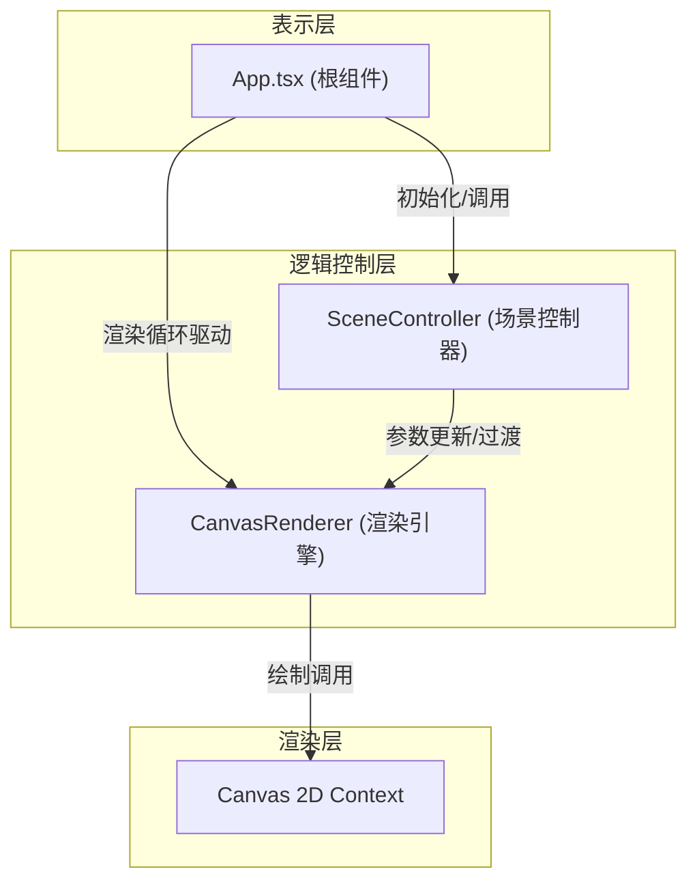

## 1. 架构设计



## 2. 技术选型说明

- **前端框架**：React 18 + TypeScript（严格模式，target ES2020）
- **构建工具**：Vite + @vitejs/plugin-react
- **渲染技术**：Canvas 2D API（纯CPU渲染，不依赖WebGL）
- **状态管理**：React useState/useRef（轻量级，无需额外库）
- **初始化方式**：手动创建配置文件（用户指定精确文件结构）

## 3. 文件结构定义

| 文件路径 | 职责说明 |
|---------|---------|
| `package.json` | 项目依赖：react, react-dom, typescript, vite, @vitejs/plugin-react；脚本：dev, build |
| `vite.config.js` | Vite开发服务器配置，React插件启用 |
| `tsconfig.json` | TypeScript严格模式，target ES2020，JSX React模式 |
| `index.html` | 入口HTML，viewport设置，div#root挂载点 |
| `src/App.tsx` | 根组件：Canvas引用、鼠标/触摸事件处理、场景按钮UI、requestAnimationFrame循环 |
| `src/utils/sceneController.ts` | 场景预设数据、颜色插值算法、过渡状态机、对外API（switchScene） |
| `src/utils/canvasRenderer.ts` | 核心渲染类：粒子系统、光源绘制、投影纹理生成、六边形网格、场景过渡光晕 |

## 4. 核心数据结构

### 4.1 粒子接口
```typescript
interface Particle {
  x: number;          // 相对光源中心X偏移
  y: number;          // 相对光源中心Y偏移
  size: number;       // 粒子大小 (2-5px)
  baseSize: number;   // 原始大小（用于距离缩放）
  alpha: number;      // 当前透明度
  angle: number;      // 圆周角度位置（用于椭圆分布）
  radiusRatio: number; // 0-1，距中心比例（颜色渐变依据）
}
```

### 4.2 残影接口
```typescript
interface TrailParticle {
  x: number;          // 绝对画布坐标X
  y: number;          // 绝对画布坐标Y
  size: number;       // 残影大小
  alpha: number;      // 透明度（随时间衰减）
  bornTime: number;   // 创建时间戳
  lifetime: number;   // 生命周期（0.3s = 300ms）
}
```

### 4.3 场景配置接口
```typescript
interface SceneConfig {
  id: 'default' | 'dawn' | 'aurora';
  name: string;
  // 粒子颜色：中心 → 边缘 渐变
  particleColorCenter: string;   // HEX
  particleColorEdge: string;     // RGBA
  // 投影纹理色相范围（度）
  textureHueMin: number;
  textureHueMax: number;
  // 整体亮度倍率
  brightnessMultiplier: number;
  // 纯白粒子混入比例（极光特有）
  whiteParticleRatio: number;
}
```

### 4.4 光源状态接口
```typescript
interface LightSource {
  x: number;           // 当前X
  y: number;           // 当前Y
  prevX: number;       // 上一帧X（速度计算）
  prevY: number;       // 上一帧Y
  vx: number;          // X方向速度 px/帧
  vy: number;          // Y方向速度 px/帧
  speed: number;       // 合速度大小
  brightness: number;  // 当前亮度（0.8-1.2）平滑过渡
  targetBrightness: number;
  isDragging: boolean;
  decay: number;       // 松开后衰减系数 0.2
}
```

### 4.5 过渡光晕接口
```typescript
interface BurstEffect {
  active: boolean;
  x: number;
  y: number;
  currentRadius: number;
  maxRadius: number;   // 200px
  startTime: number;
  duration: number;    // 800ms
  color: string;       // 目标场景主色
}
```

## 5. 关键算法设计

### 5.1 颜色渐变与插值
- 粒子颜色：`lerpColor(centerColor, edgeColor, radiusRatio)`，半径比例0→1线性插值
- 场景过渡：每帧对颜色通道RGB做线性插值 `c = from + (to-from) * t/4000`（4秒=~240帧）
- HSL色相偏移：`hue = baseHue + 30 * sin(π * t / 1000)`，周期2秒

### 5.2 六边形蜂窝网格
- 轴向坐标(q, r) → 像素坐标转换，横向间距 `size * 1.5`，纵向间距 `size * sqrt(3)`
- 每行偏移交错（奇数行向右偏移size*0.75）
- 投影遮罩：使用`ctx.clip()`配合椭圆Path实现投影区域限制

### 5.3 亮度平滑过渡
- 速度阈值：`<10 px/帧 → 0.8`，`>30 px/帧 → 1.2`，区间线性映射
- 亮度实际值每帧趋近目标：`brightness += (target - brightness) * 0.1`

### 5.4 距离衰减
- 六边形大小：`actualSize = 10 - 2 * (distFromCenter / maxDiagonal)`，范围10→8px

## 6. 性能优化策略

1. **粒子池复用**：100个内部粒子对象常驻，每帧仅更新属性不创建新对象；残影使用环形缓冲队列（容量20）
2. **离屏缓存**：六边形网格图案缓存到离屏Canvas，每帧仅做色相偏移重绘而非重建几何
3. **脏矩形裁剪**：理论优化，实际全屏场景下略过；投影区域使用clip减少绘制像素
4. **requestAnimationFrame调度**：与屏幕刷新同步，避免setTimeout抖动
5. **requestAnimationFrame内部批量绘制**：先投影→再残影→再光源，减少状态切换
6. **DPR适配**：`canvas.width = innerWidth * devicePixelRatio`，`ctx.scale(dpr, dpr)`避免模糊同时控制像素量
