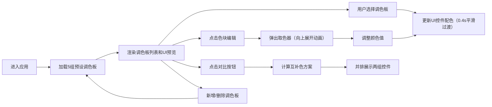

## 1. 产品概述

「色板·UI预览」是一款面向设计师的浏览器端动态配色方案展示工具，帮助用户快速预览和分享色彩组合在真实UI控件上的表现效果。

- 核心价值：解决设计师在配色决策过程中难以直观评估色彩在实际UI元素上表现的痛点，提升配色方案的决策效率
- 目标用户：UI设计师、前端开发者、产品经理

## 2. 核心功能

### 2.1 功能模块

1. **调色板管理面板**：预设调色板列表、颜色编辑、新增/删除调色板
2. **UI控件预览区域**：按钮、滑块、卡片三种典型控件的实时配色预览
3. **对比模式**：当前调色板与互补色方案并排对比展示

### 2.2 页面详情

| 页面名称 | 模块名称 | 功能描述 |
|-----------|-------------|---------------------|
| 主应用 | 左侧调色板管理面板 | 5组预设调色板、4色网格排列、颜色取色器编辑、新增空调色板、删除调色板 |
| 主应用 | 右侧UI预览区域 | 主按钮（悬停渐变）、圆形滑块（内外阴影）、卡片（边框+内阴影）、平滑过渡动画 |
| 主应用 | 对比模式切换 | 一键切换对比视图、自动计算互补色方案、垂直分割线并排展示 |

## 3. 核心流程

用户进入应用 → 查看预设调色板 → 选择/编辑调色板颜色 → 实时预览UI控件效果 → 开启对比模式查看互补色方案 → 新增/删除自定义调色板

## 4. 用户界面设计

### 4.1 设计风格
- **主色调**：跟随当前选中调色板动态变化
- **布局风格**：左右分栏布局（左侧300px深色面板，右侧自适应浅色预览区）
- **按钮风格**：圆角设计，悬停微缩放（scale 1.02）
- **字体**：现代无衬线字体，支持中文显示
- **动效**：所有颜色过渡0.4秒平滑动画、取色器向上展开动画、滑块拖动数值标签

### 4.2 页面设计

| 页面名称 | 模块名称 | UI元素 |
|-----------|-------------|-------------|
| 主应用 | 调色板管理面板 | 深色背景#1E1E2E、4列色块网格、原生取色器、新增/删除按钮、动画展开 |
| 主应用 | UI预览区域 | 浅灰背景#F5F5F5、主按钮+圆形滑块+卡片三件套、悬停缩放效果、对比模式分割线 |
| 主应用 | 响应式适配 | 移动端汉堡菜单折叠左侧面板、预览区域全宽显示 |

### 4.3 响应式设计
- **桌面端**（>768px）：左右分栏布局，左侧固定300px
- **移动端**（≤768px）：左侧面板折叠为汉堡菜单，预览区域全宽
- **触控优化**：色块和按钮尺寸适配触控操作，滑块支持触摸拖动

### 4.4 性能指标
- 调色板切换动画帧率 ≥ 50fps
- 颜色计算和渲染更新 ≤ 10ms
- 页面加载时间 ≤ 2s
