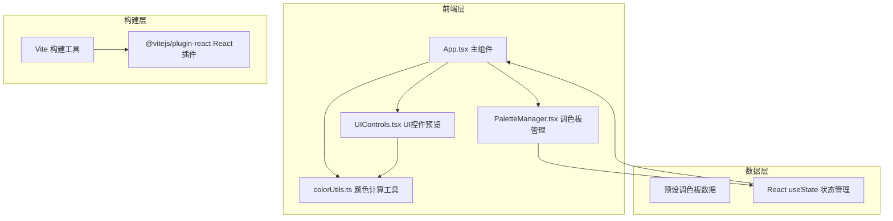

## 1. 架构设计



## 2. 技术栈说明

- **前端框架**：React 18 + TypeScript（严格模式）
- **构建工具**：Vite + @vitejs/plugin-react
- **样式方案**：原生CSS + 内联动态样式（CSS transition实现动画）
- **状态管理**：React useState Hooks（组件内状态）
- **图标方案**：lucide-react

## 3. 模块职责与数据流向

| 文件 | 职责 | 输入 | 输出/回调 |
|------|------|------|-----------|
| App.tsx | 全局状态管理、布局渲染、调色板选择、对比模式切换 | 预设调色板数据 | selectedPalette → PaletteManager/UIControls；onPaletteUpdate回调接收更新 |
| PaletteManager.tsx | 调色板列表展示、颜色编辑（取色器）、新增/删除调色板 | palettes[], selectedId, onUpdate/onAdd/onDelete/onSelect | 编辑后触发回调更新App状态 |
| UIControls.tsx | 三种UI控件（按钮/滑块/卡片）渲染，动态样式绑定 | colors{primary,secondary,accent,background}, isCompare, compareColors | 渲染带过渡动画的控件组 |
| colorUtils.ts | 互补色计算、颜色深浅变体生成、HEX/RGB转换 | 颜色字符串 | 计算后的颜色字符串 |

## 4. 文件结构

```
auto11/
├── package.json
├── vite.config.js
├── tsconfig.json
├── index.html
├── src/
│   ├── App.tsx              # 主组件，状态管理中心
│   ├── PaletteManager.tsx   # 调色板管理组件
│   ├── UIControls.tsx       # UI控件预览组件
│   ├── utils/
│   │   └── colorUtils.ts    # 颜色计算工具函数
│   └── types/
│       └── index.ts         # TypeScript类型定义
```

## 5. 数据模型

### 5.1 调色板数据结构

```typescript
interface PaletteColor {
  primary: string;      // 主色
  secondary: string;    // 辅色
  accent: string;       // 强调色
  background: string;   // 背景色
}

interface Palette {
  id: string;
  name: string;
  colors: PaletteColor;
}
```

### 5.2 预设调色板

```typescript
const PRESET_PALETTES: Palette[] = [
  { id: 'mono', name: '极简黑白', colors: { primary: '#2D2D2D', secondary: '#5A5A5A', accent: '#8C8C8C', background: '#F8F8F8' } },
  { id: 'autumn', name: '暖秋', colors: { primary: '#C05621', secondary: '#DD6B20', accent: '#ED8936', background: '#FFF5E6' } },
  { id: 'ocean', name: '海洋', colors: { primary: '#2B6CB0', secondary: '#3182CE', accent: '#4299E1', background: '#EBF8FF' } },
  { id: 'cyberpunk', name: '赛博朋克', colors: { primary: '#702459', secondary: '#B83280', accent: '#ED64A6', background: '#1A1025' } },
  { id: 'macaron', name: '马卡龙', colors: { primary: '#9F7AEA', secondary: '#B794F4', accent: '#D6BCFA', background: '#FAF5FF' } }
];
```

## 6. 性能优化方案

1. **CSS transition 优先**：颜色过渡使用原生CSS transition，避免JS动画开销
2. **React.memo 优化**：子组件使用memo包裹，避免不必要重渲染
3. **useCallback 缓存**：回调函数使用useCallback缓存引用
4. **批量状态更新**：颜色更新合并处理，减少渲染次数
5. **计算结果缓存**：互补色计算结果使用Map缓存，避免重复计算
