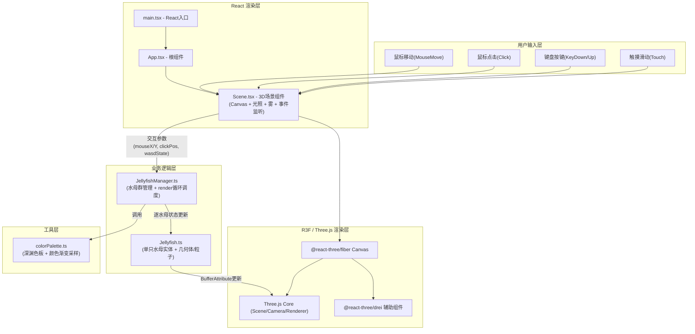

## 1. 架构设计



**数据流向说明（自上而下）：**

1. `用户输入` → `Scene.tsx`：通过R3F的useThree/useFrame + DOM事件监听捕获
2. `Scene.tsx` → `JellyfishManager`：以参数形式传入 `update(delta, inputParams)` 方法
3. `JellyfishManager` → `Jellyfish[]`：遍历调用 `jelly.update(delta, sharedParams)`
4. `Jellyfish` → Three.js 几何体：直接修改 BufferAttribute.needsUpdate / matrix
5. `colorPalette` → `Jellyfish`：在update中按需调用采样函数，不保存引用

## 2. 技术描述

- **前端框架**：React 18 + TypeScript 5（strict模式，target ES2020）
- **构建工具**：Vite 5 + @vitejs/plugin-react
- **3D 引擎**：Three.js r160 + @react-three/fiber 8 + @react-three/drei 9
- **状态管理**：无全局store，交互状态以props/args流式传递，每帧更新
- **音频系统**：原生 Web Audio API（OscillatorNode + GainNode 虚拟60BPM脉冲）
- **性能优化策略**：
  - 水母伞盖：SphereBufferGeometry 共享 + 逐实例 `instanceMatrix`（InstancedMesh）
  - 粒子系统：全局共享 Points + 每帧更新 position/size BufferAttribute
  - 触须：复用 CurvePath geometry + LineSegments 批量渲染
  - 对象池：粒子池/水母池预分配，避免每帧GC
  - useFrame 内禁止 new 对象，所有 Vector3/Color 复用临时变量

## 3. 路由定义

| 路由 | 用途 |
|------|------|
| / | 主场景（唯一页面，无路由切换，纯沉浸式体验） |

## 4. API 定义

本应用为纯前端项目，无后端接口。以下为核心模块TypeScript类型定义：

```typescript
// ==== colorPalette.ts ====
interface PaletteSampleParams {
  mouseX: number;        // 0-1 屏幕X坐标
  clickFrequency: number; // 最近1秒点击次数
  intensity?: number;    // 0-1 交互强度
}
type GradientStop = { t: number; color: THREE.ColorRepresentation };
function sampleAbyssPalette(params: PaletteSampleParams): THREE.Color;
function sampleParticleColor(base: THREE.Color): THREE.Color;

// ==== Jellyfish.ts ====
interface JellyfishConfig {
  id: number;
  radius: number;           // 伞盖半径 0.5-1.8
  tentacleCount: number;    // 6-10
  floatAmplitude: number;   // 浮动幅度 1-3
  floatPeriod: number;      // 浮动周期 3-8s
  rotationSpeed: number;    // 自转速度 rad/s
  basePosition: THREE.Vector3;
}
interface JellyfishUpdateParams {
  delta: number;
  time: number;
  sharedHue: number;        // 0-1 全局色相偏移
  opacityTarget: number;    // 0.6-1.0 伞盖透明度目标
  pulseCenters: Array<{ pos: THREE.Vector3; radius: number; strength: number }>;
  orbitOffset: THREE.Vector3; // 公转中心偏移（WASD控制）
  particleEmitRate: number;  // 每帧粒子发射数
}
class Jellyfish {
  constructor(config: JellyfishConfig) {}
  update(params: JellyfishUpdateParams): void {}
  // 将几何体/材质挂载到父场景
  attachTo(scene: THREE.Object3D, particleSystem: SharedParticleSystem): void {}
}

// ==== JellyfishManager.ts ====
interface ManagerUpdateParams {
  delta: number;
  time: number;
  mouseX: number;           // 0-1
  mouseY: number;           // 0-1
  clickWorldPos: THREE.Vector3 | null;
  wasd: { W: boolean; A: boolean; S: boolean; D: boolean };
  isMobile: boolean;
}
interface SharedParticleSystem {
  emit(position: THREE.Vector3, color: THREE.Color, count: number): void;
}
class JellyfishManager {
  constructor(count: number, particleSystem: SharedParticleSystem) {}
  update(params: ManagerUpdateParams): void {}
  getGroup(): THREE.Group {}
}
```

## 5. 数据模型（内存对象结构）

### 6.1 数据模型定义

```mermaid
erDiagram
    JELLYFISH_MANAGER ||--o{ JELLYFISH : "管理 8-12 只"
    JELLYFISH ||--o{ TENTACLE : "6-10 条"
    JELLYFISH ||--o{ PARTICLE_POOL : "引用全局粒子池"
    SHARED_PARTICLE_SYSTEM ||--|| PARTICLE_POOL : "持有"
    SCENE_CONTEXT ||--|| JELLYFISH_MANAGER : "持有引用"
    SCENE_CONTEXT ||--|| INPUT_STATE : "持有当前输入快照"

    JELLYFISH {
        number id
        number radius
        Vector3 basePosition
        number floatPhase
        number tentaclePhase
        Color currentColor
        number targetOpacity
        number pulseIntensity "0-1 点击脉冲强度"
        number tentacleWaveMultiplier "触须摆动幅度倍率"
    }

    TENTACLE {
        number index
        CubicBezierCurve3 curve
        Vector3[] controlPoints "10-15个控制点"
        Float32Array waveOffsets "每个控制点波浪相位偏移"
    }

    PARTICLE_POOL {
        Float32Array positions "N*3"
        Float32Array colors "N*3"
        Float32Array sizes "N"
        Float32Array lifetimes "N 剩余生命周期 0-1"
        number activeCount
    }

    INPUT_STATE {
        number mouseX "0-1"
        number mouseY "0-1"
        Vector3 clickWorldPos "最近点击的世界坐标，null表示无"
        boolean W A S D
        number clickFrequency "最近1秒点击次数"
    }
```

## 6. 模块文件结构与调用关系

```
auto112/
├── index.html                 ← 入口HTML，#root 容器
├── package.json               ← 依赖定义、dev脚本
├── vite.config.js             ← Vite构建配置
├── tsconfig.json              ← TS严格配置，target ES2020
└── src/
    ├── main.tsx               ← ReactDOM.render(<App/>, #root)
    ├── App.tsx                ← 根组件：全屏布局 + 提示文字淡出
    ├── components/
    │   └── Scene.tsx          ← R3F Canvas + 光照/雾/水面 + 监听所有输入事件 → 调用 manager.update()
    ├── managers/
    │   └── JellyfishManager.ts  ← 构造8-12只Jellyfish + 公转计算 + 参数分发 → 调用 jelly.update()
    ├── entities/
    │   └── Jellyfish.ts       ← 伞盖(InstancedMesh索引) + 触须(Line) + 顶点动画 + 粒子发射
    ├── utils/
    │   └── colorPalette.ts    ← 深渊色板 + 渐变采样 + 粒子颜色提亮工具
    └── systems/               ← (可选创建) SharedParticleSystem.ts 粒子池批量渲染
```

**调用链（箭头 = 调用方向）：**
1. `main.tsx` → `App.tsx` → `components/Scene.tsx`
2. `Scene.tsx` (useFrame) → `JellyfishManager.update(delta, params)` 每帧一次
3. `JellyfishManager.update` → `Jellyfish.update(delta, params)` 每只每帧一次
4. `Jellyfish.update` → `utils/colorPalette.sampleAbyssPalette()` + `SharedParticleSystem.emit()`
5. `Scene.tsx` 监听 window mousemove/click/keydown/keyup/touch* → 更新内部ref状态 → 下帧传入 update
