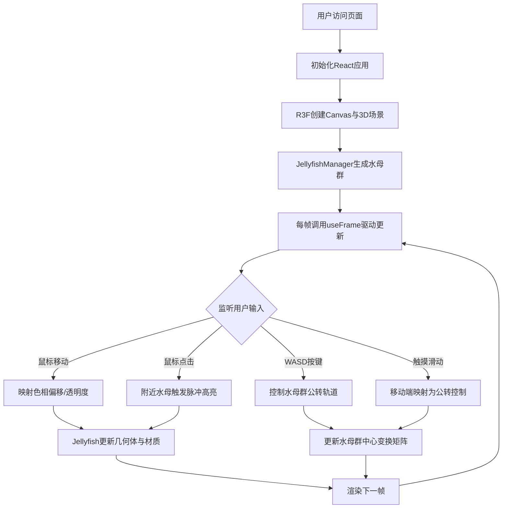

## 1. 产品概述

「幽光水母·幻梦海」是一款基于WebGL的沉浸式3D交互可视化应用，通过算法生成发光水母群，让用户在浏览器中体验梦幻的深海光影秀。应用面向数据艺术家、创意爱好者和普通用户，提供无需安装的沉浸式深海探索体验。

- **核心价值**：将复杂的算法生成艺术与直观的人机交互结合，打造令人难忘的沉浸式视觉体验
- **目标用户**：数据艺术家、交互设计爱好者、新媒体艺术观众、普通休闲用户
- **核心差异点**：实时算法驱动的水母行为系统、多维度输入（鼠标+键盘+触摸）映射视觉变化、全场景动态光照与粒子效果

## 2. 核心功能

### 2.1 用户角色

| 角色 | 参与方式 | 核心体验 |
|------|----------|----------|
| 普通用户 | 直接访问网页 | 鼠标/键盘与水母互动，观赏光影秀 |
| 数据艺术家 | 可扩展源码 | 调整算法参数，创造自定义水母形态 |

### 2.2 功能模块

1. **主场景页面**：全屏3D渲染、水母群展示、环境光照与雾气
2. **交互控制系统**：鼠标位置映射、点击脉冲触发、键盘公转控制、触摸滑动适配
3. **粒子与特效系统**：水母伞盖边缘粒子拖尾、菲涅尔发光效果、贝塞尔曲线触须动画
4. **音频节拍系统**：Web Audio虚拟低音脉冲驱动水面网格波动
5. **响应式适配层**：桌面/移动端性能自动降级、交互方式自动切换

### 2.3 页面详情

| 页面名称 | 模块名称 | 功能描述 |
|----------|----------|----------|
| 主场景 | 3D渲染画布 | Three.js全屏画布，R3F驱动的场景树 |
| 主场景 | 水母群渲染 | 12/8只半透明发光水母实例化渲染 |
| 主场景 | 环境系统 | 深蓝渐变背景、FogExp2雾气、旋转点光源 |
| 主场景 | 水面网格 | 20x20半透明网格，随音频节拍波动 |
| 主场景 | 提示文字 | 顶部中央1px半透明白色操作提示，3秒后淡出 |
| 主场景 | 输入监听 | 鼠标移动/点击、键盘WASD、触摸滑动事件 |

## 3. 核心流程

## 4. 用户界面设计

### 4.1 设计风格

- **主色调**：深邃蓝紫色系（#0a0a2e → #030314 垂直渐变），交互瞬间点缀洋红 #FF00FF
- **视觉语言**：有机生物形态 + 赛博发光边缘 + 深邃雾气氛围
- **水母伞盖**：半透明 + 菲涅尔边缘发光 + 顶点动画脉动
- **触须**：发光线条贝塞尔曲线 + 波浪摆动动画
- **粒子**：高饱和高亮度微型光点 + 线性缩小消散

### 4.2 页面设计概述

| 页面名称 | 模块名称 | UI 元素 |
|----------|----------|---------|
| 主场景 | 全屏画布 | 无边框无菜单，沉浸式视觉体验 |
| 主场景 | 提示文字 | 1px白色，opacity 0.3，顶部居中，3秒淡出 |
| 主场景 | 景深层次 | 雾气+近大远小，营造深海纵深感 |
| 主场景 | 水面网格 | 底部20x20网格，线条#1a1a4e，节拍起伏 |

### 4.3 响应式

- **桌面端（≥768px）**：12只水母，粒子发射率3-5/帧，雾密度0.008，键鼠交互
- **移动端（<768px）**：8只水母，粒子发射率1-2/帧，雾密度0.012，触摸滑动替代公转键
- **帧率目标**：稳定30FPS以上，理想60FPS，使用InstancedMesh/Points减少Draw Call
- **交互延迟**：输入到视觉变化≤50ms，所有过渡使用lerp/eased平滑插值（0.3-0.5s）

### 4.4 3D 场景指引

- **环境**：程序化深蓝渐变背景（非HDRI），FogExp2雾气营造深海幽闭感
- **光照**：AmbientLight(0.1强度) + 旋转PointLight(蓝紫色，20秒周期) + 水母自发光
- **相机**：PerspectiveCamera，fov 60，初始位置z=15，跟随水母群缓慢呼吸式推拉
- **构图**：水母群围绕场景中心公转，底部水面网格提供空间参照
- **交互动画**：鼠标位置→色相/透明度lerp过渡，点击→脉冲闪烁(0.4s渐回)，触须增幅(0.8s)
- **后处理**：使用@react-three/drei内置EffectComposer可添加Bloom效果（可选，视性能）
- **资产来源**：纯程序化几何体，无外部3D模型/纹理资源，性能预算单场景≤50个Draw Call
