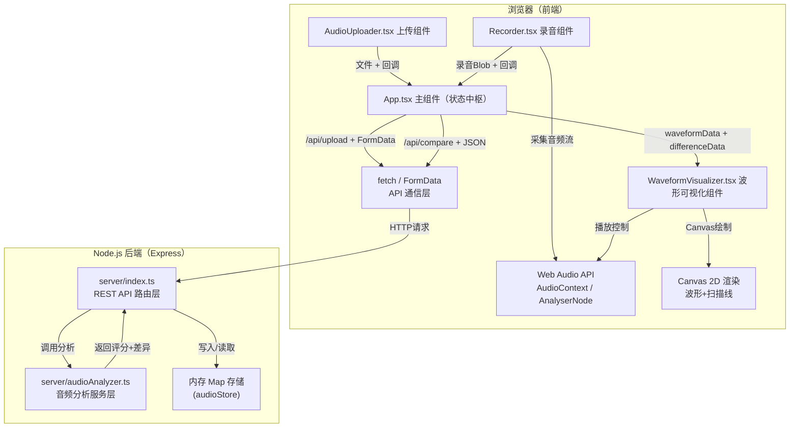
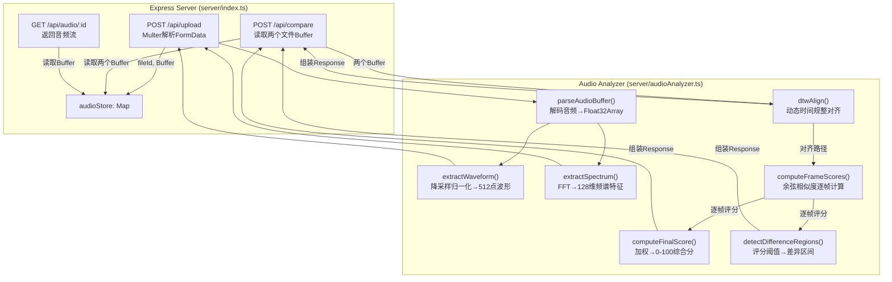

## 1. 架构设计



## 2. 技术描述

### 2.1 技术栈选型

| 层级 | 技术 | 版本/说明 |
|------|------|----------|
| 前端框架 | React | 18.x |
| 前端语言 | TypeScript | 严格模式（strict: true） |
| 构建工具 | Vite | 5.x + @vitejs/plugin-react |
| 后端框架 | Express | 4.x |
| 后端运行 | ts-node | 直接执行 TypeScript |
| 音频处理（前端） | Web Audio API | AudioContext / MediaRecorder / AnalyserNode |
| 音频分析（后端） | 自定义实现 | FFT频谱对比 + DTW简化版动态时间规整 |
| 图标库 | lucide-react | 线性图标 |
| HTTP通信 | fetch API + FormData | 浏览器原生 |
| 数据存储 | 内存 Map | 文件ID → Buffer（无需持久化） |
| 唯一ID | uuid | v4 生成文件标识 |
| CORS | cors 中间件 | 允许Vite dev server跨域 |

### 2.2 初始化与构建说明

- **初始化工具**：Vite React TypeScript 模板 + 手动创建 server 目录
- **开发启动**：`npm run dev` 同时启动 Vite 前端（5173）与 Express 后端（3001）
- **API代理**：Vite 配置中将 `/api/*` 请求代理到 `http://localhost:3001`

## 3. 路由定义

### 3.1 前端路由（单页应用）

| 路由 | 页面 | 说明 |
|------|------|------|
| / | 主页 | 所有功能模块集成（单页SPA） |

### 3.2 后端API路由

| 路由 | 方法 | 用途 |
|------|------|------|
| /api/upload | POST | 上传标准音频/录音文件，返回文件ID与波形元数据 |
| /api/compare | POST | 对比两个音频文件，返回评分与差异区间数据 |
| /api/audio/:id | GET | 根据文件ID获取音频Blob（用于播放） |
| /health | GET | 健康检查，返回OK |

## 4. API 定义

### 4.1 POST /api/upload

**请求**（multipart/form-data）：
```typescript
interface UploadRequest {
  file: File;          // 音频文件（mp3/wav），最大10MB
  type: 'standard' | 'recording'; // 文件类型标识
}
```

**成功响应**（200 OK）：
```typescript
interface UploadResponse {
  fileId: string;                      // uuid v4
  fileName: string;                    // 原始文件名
  duration: number;                    // 时长（秒）
  sampleRate: number;                  // 采样率
  waveformData: number[];              // 归一化振幅数组（0-1），长度=512
  spectrumData: number[];              // 平均频谱特征（用于快速对比），长度=128
}
```

**失败响应**（400/413）：
```typescript
interface ErrorResponse {
  error: string;     // 错误信息
  code: 'FILE_TOO_LARGE' | 'INVALID_FORMAT' | 'PARSE_ERROR';
}
```

### 4.2 POST /api/compare

**请求**（application/json）：
```typescript
interface CompareRequest {
  standardFileId: string;   // 标准音频文件ID
  recordingFileId: string;  // 录音文件ID
}
```

**成功响应**（200 OK）：
```typescript
interface CompareResponse {
  score: number;                       // 综合评分 0-100
  alignmentPath: [number, number][];   // DTW对齐路径：[[标准帧索引, 录音帧索引], ...]
  frameScores: number[];               // 逐帧相似度评分（0-1），长度=N
  differenceRegions: DifferenceRegion[]; // 差异较大的区间
  alignedWaveformA: number[];          // 对齐后的标准波形（用于渲染）
  alignedWaveformB: number[];          // 对齐后的录音波形（用于渲染）
  differenceMask: number[];            // 差异遮罩数组（0-1，>0.6标记为红色）
}

interface DifferenceRegion {
  startTime: number;    // 起始时间（秒）
  endTime: number;      // 结束时间（秒）
  avgScore: number;     // 区间平均评分（0-1，<0.6为显著差异）
  description: string;  // 文字描述，如"该区间发音差异较大"
}
```

## 5. 后端服务架构



### 后端核心数据结构

```typescript
interface AudioFile {
  id: string;                    // uuid v4
  fileName: string;
  type: 'standard' | 'recording';
  buffer: Buffer;                // 原始文件Buffer
  mimeType: string;              // audio/mpeg | audio/wav
  size: number;                  // 字节数
  decoded: Float32Array | null;  // 解码后PCM数据（单声道）
  sampleRate: number;
  duration: number;              // 秒
  waveformData: number[];        // 512点归一化波形
  spectrumData: number[];        // 128维频谱特征
  uploadedAt: number;            // timestamp
}
```

## 6. 数据流与组件调用关系

### 6.1 文件目录结构

```
auto113/
├── package.json              # 根依赖+脚本（npm run dev → 并发启动前后端）
├── vite.config.js            # Vite配置+API代理到3001端口
├── tsconfig.json             # TS严格模式配置
├── index.html                # Vite入口HTML
├── client/
│   └── src/
│       ├── App.tsx           # 主组件（状态管理+子组件编排）
│       ├── main.tsx          # React入口
│       ├── index.css         # 全局样式（暗黑主题+CSS变量）
│       ├── types/
│       │   └── index.ts      # 前后端共享TypeScript类型
│       ├── utils/
│       │   └── api.ts        # fetch封装（上传/对比/获取音频）
│       └── components/
│           ├── AudioUploader.tsx     # 标准音频上传组件
│           ├── Recorder.tsx          # 录音组件
│           ├── WaveformVisualizer.tsx # 波形可视化+播放控制
│           └── ScoreGauge.tsx        # 圆形评分仪表盘
└── server/
    ├── index.ts              # Express入口（路由+中间件）
    └── audioAnalyzer.ts      # 音频分析工具（FFT+DTW+评分）
```

### 6.2 组件调用与数据流向说明

**App.tsx（状态中枢）：**
- 持有状态：`standardFile`（上传信息）、`recordingBlob`（录音）、`compareResult`（对比结果）、`isProcessing`
- 提供回调：`onStandardUpload(file)` → 调用 upload API → 保存 standardFile
- 提供回调：`onRecordingComplete(blob, duration)` → 上传录音 → 触发 compare
- 向下传递：`<WaveformVisualizer standard={} recording={} diff={} />`

**AudioUploader.tsx → App.tsx：**
- 用户拖拽/选择文件 → `onUpload(f: File)` 回调 → 父组件处理上传逻辑

**Recorder.tsx → App.tsx：**
- `getUserMedia()` 获取麦克风流 → MediaRecorder 录制 → ondataavailable 积累 Blob
- 停止 → `onComplete(blob, duration)` 回调 → 父组件处理

**App.tsx → WaveformVisualizer.tsx：**
- props：`standardWaveform`, `recordingWaveform`, `differenceMask`, `isPlaying`, `playbackRate`
- 内部使用 Canvas 绘制两行波形 + 差异高亮 + 扫描线
- 通过 Web Audio API 控制双播放器同步

## 7. 核心算法说明

### 7.1 DTW 简化实现（server/audioAnalyzer.ts）
- 约束条件：窗口 Sakoe-Chiba Band（±20% 长度），降低复杂度 O(N·M) → O(N·W)
- 距离度量：欧氏距离（逐帧振幅差）
- 路径回溯：动态规划矩阵从右下角回溯至起点，生成对齐路径

### 7.2 FFT 频谱特征提取
- 使用原生 Web Audio API 的 `AnalyserNode` 或后端自实现简化FFT
- 每帧 Hanning 窗 → 128点FFT → 取前64维对数幅度谱 → L2归一化

### 7.3 综合评分公式
```
finalScore = 0.6 * avgFrameSimilarity + 0.25 * spectrumCosineSimilarity + 0.15 * durationSimilarity
```
- avgFrameSimilarity：逐帧振幅相似度均值
- spectrumCosineSimilarity：全局频谱余弦相似度
- durationSimilarity：时长匹配度（1 - |dA-dB|/max(dA,dB)）

---

## 8. 性能保障策略

| 模块 | 策略 |
|------|------|
| 音频解码 | 使用 AudioContext.decodeAudioData（Web Audio 原生优化） |
| 波形降采样 | 512点固定长度：原始PCM → 等间隔抽帧取绝对值最大值 → 归一化0-1 |
| DTW加速 | 带窗约束（±20%），使用Float32Array内存连续，避免GC |
| Canvas渲染 | requestAnimationFrame循环，每帧局部重绘（扫描线区域） |
| 播放同步 | 单一 AudioContext，两个 AudioBufferSourceNode 同时 start() |
