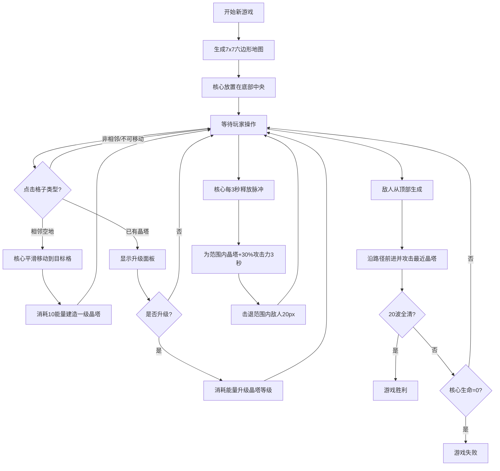

## 1. 产品概述

「跃光晶塔」是一款在浏览器中运行的2D塔防游戏，创新性地解决了传统塔防游戏中防守单位位置固定、缺乏动态变化的问题。玩家通过控制一颗可移动的能量核心，在随机生成的六边形网格地图上灵活建造和升级晶塔防御单位，抵御沿路径前进的敌人波次。

- **核心玩法**：动态塔防 - 玩家控制能量核心在地图上移动，在相邻格子建造/升级晶塔，核心通过能量脉冲为附近晶塔充能
- **目标用户**：喜欢策略塔防类游戏、追求新颖玩法的网页游戏玩家
- **产品价值**：通过"可移动建造者"机制为传统塔防注入动态策略深度，六边形网格提供丰富的空间战术

---

## 2. 核心功能

### 2.1 用户角色
无需用户注册，单用户游戏体验。

### 2.2 功能模块
1. **游戏主界面**：六边形网格战场、控制栏、状态栏
2. **六边形网格系统**：7x7随机地图生成、三种地形（平原/高地/能量池）、点击交互与格子选中
3. **能量核心系统**：核心移动（线性插值平滑移动，120px/s）、生命值、能量管理、能量脉冲释放
4. **晶塔建造升级系统**：三级晶塔（白/蓝/紫）、建造消耗能量、升级面板、高地加成
5. **敌人波次系统**：20波敌人、三种敌人类型（小兵/斥候/坦克）、AI路径、攻击最近晶塔
6. **战斗系统**：晶塔自动攻击、核心脉冲击退+充能加成、三级晶塔死亡爆炸
7. **粒子特效系统**：建造生长动画、攻击光弹、脉冲光环、敌人爆散碎片
8. **音效系统**：攻击音效、脉冲音效、击毁音效（Web Audio API）
9. **UI状态显示**：生命/能量条、波次信息、重新开始按钮
10. **响应式适配**：<768px屏幕自动缩放网格

### 2.3 页面详情

| 页面名称 | 模块名称 | 功能描述 |
|---------|---------|---------|
| 游戏主界面 | 六边形网格地图 | 7x7随机生成，三种地形显示，点击选中格子，高亮相邻可移动格子 |
| 游戏主界面 | 能量核心 | 玩家控制单位，显示当前位置，平滑移动动画，脉冲光环特效 |
| 游戏主界面 | 晶塔单位 | 三级渐变外观，自动攻击光弹，升级面板弹窗 |
| 游戏主界面 | 敌人单位 | 沿路径移动，三种类型外观差异，攻击晶塔，死亡碎片爆散 |
| 游戏主界面 | 底部控制栏 | 生命条（红→绿渐变）、能量条（蓝→白渐变）、波次信息、重开按钮 |
| 升级面板 | 晶塔升级UI | 显示当前等级、升级消耗、升级按钮、关闭按钮 |

---

## 3. 核心流程

### 主游戏流程描述
玩家开始新游戏 → 生成7x7随机六边形地图 → 核心放置在底部中央 → 玩家点击相邻格子：若为空地则核心移动并建造一级晶塔，若为已有晶塔则弹出升级面板 → 晶塔自动攻击射程内敌人 → 核心每3秒释放脉冲为附近晶塔充能并击退敌人 → 敌人从顶部生成沿路径前进，到达底部或击毁核心则游戏失败 → 20波全清则游戏胜利 → 玩家可随时点击重开按钮重新开始。

---

## 4. 用户界面设计

### 4.1 设计风格
- **设计主题**：深空科技风 / 能量晶塔主题
- **主色调**：深空蓝 #0A0E27（背景）、蓝白渐变能量池 #00BFFF、晶塔白→蓝→紫渐变
- **辅助色**：高地暖棕 #5C4033、平原灰蓝 #2A3355、半透明白色网格线（15%透明度）
- **按钮风格**：圆形重开按钮（直径40px），白色图标，悬停放大1.1倍，悬停背景半透明白（0.2透明度）
- **渐变条**：生命条红→绿渐变，能量条蓝→白渐变，细长条形
- **字体**：monospace等宽字体，字号14px，颜色浅灰 #CCCCCC
- **光效风格**：柔和径向渐变、脉动发光、向外扩散光环

### 4.2 页面设计概述

| 页面名称 | 模块名称 | UI元素 |
|---------|---------|---------|
| 游戏主界面 | 整体布局 | 画布占100%宽×90vh高，底部固定30px控制栏，深空蓝背景 |
| 游戏主界面 | 六边形网格 | 半透明白色线条（#FFFFFF 15%），平原#2A3355，高地#5C4033带斜线纹理，能量池#00BFFF 40%透明度脉动（2秒周期） |
| 游戏主界面 | 能量核心 | 发光球体，选中状态高亮边框，移动时线性插值平滑过渡 |
| 游戏主界面 | 晶塔外观 | 一级：白色棱柱（高40px×底宽30px）；二级：蓝色渐变棱柱+40%攻击；三级：紫色棱柱+80%攻击+旋转光效+死亡爆炸 |
| 游戏主界面 | 粒子特效 | 建造：从底部生长0.5秒+粒子溅射；攻击：15px拖尾光弹（0.3秒）；脉冲：蓝色光环扩散（0.4秒，透明度0.6→0）；死亡：4-6枚碎片飞散200px |
| 底部控制栏 | 左侧状态 | 细长渐变条：生命条（红→绿）+数值、能量条（蓝→白）+数值 |
| 底部控制栏 | 中间信息 | 「波次 X/20」「剩余敌人：Y」 monospace 14px #CCCCCC |
| 底部控制栏 | 右侧按钮 | 圆形直径40px重开按钮，白色刷新图标，悬停放大1.1倍+半透明白背景 |
| 升级面板 | 弹窗 | 半透明黑底深蓝边框，显示当前等级、下一级属性、升级按钮 |

### 4.3 响应式设计
- **桌面优先**（≥768px）：网格单元格标准尺寸，UI元素标准大小
- **移动端适配**（<768px）：网格单元格宽度缩小至60px，所有文字缩小0.8倍，按钮缩小0.8倍，保持布局完整性
- **触控优化**：增大可点击区域，确保六边形格子和按钮在移动端可准确点击

### 4.4 性能指标
- **目标帧率**：稳定60FPS，最低平均帧率≥45FPS
- **粒子上限**：同时存在≤300个粒子特效
- **单帧耗时**：动画计算每帧≤6ms
- **渲染技术**：Canvas 2D API，所有实体与粒子均通过Canvas绘制
