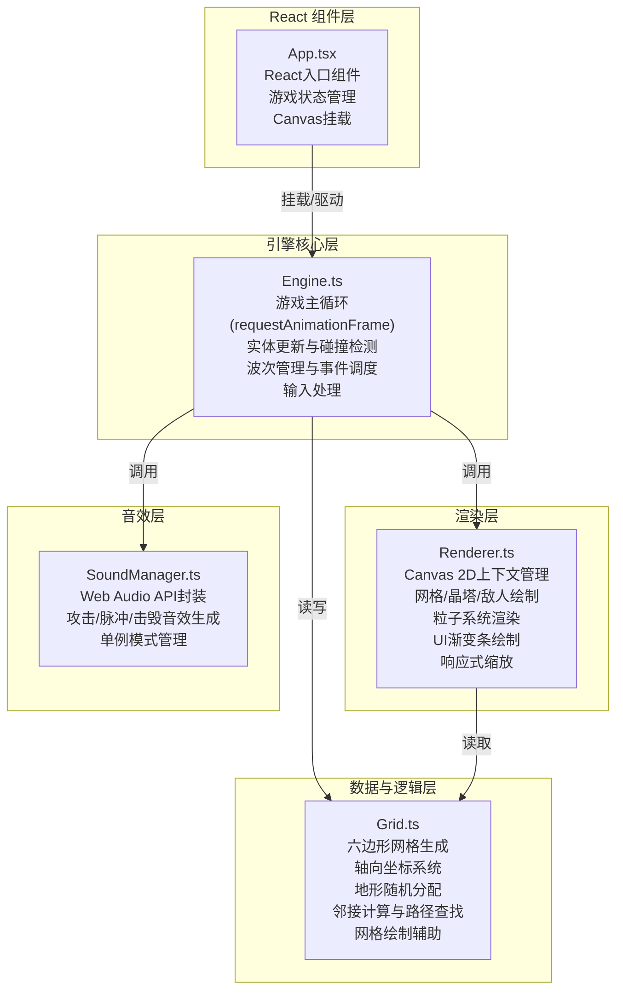

## 1. 架构设计

「跃光晶塔」采用纯前端架构，基于React + TypeScript + Vite构建，使用Canvas 2D进行游戏渲染，Web Audio API实现音效。整体采用分层架构：React组件层负责UI容器与状态管理，引擎层负责游戏逻辑与主循环，渲染层负责Canvas绘制，数据层负责网格与实体数据，音效层负责音频播放。



---

## 2. 技术描述

| 层次 | 技术选型 | 版本/说明 |
|-----|---------|----------|
| **前端框架** | React | 18.x，函数组件 + Hooks |
| **开发语言** | TypeScript | 严格模式（strict: true） |
| **构建工具** | Vite | 5.x，使用 @vitejs/plugin-react 插件 |
| **渲染引擎** | Canvas 2D API | 原生浏览器API，高性能2D绘制 |
| **音效引擎** | Web Audio API | 原生浏览器API，程序化生成音效 |
| **状态管理** | React useState/useRef | 轻量状态管理，游戏状态用ref避免重渲染 |
| **包管理器** | npm | 按用户需求指定 |

### 初始化方式
按用户指定的文件组织，不使用脚手架模板，手动创建以下核心文件：
- `package.json` - 指定依赖与启动脚本
- `vite.config.js` - Vite + React插件配置
- `tsconfig.json` - TypeScript严格模式配置
- `index.html` - 入口HTML页面
- `src/App.tsx` - React入口组件
- `src/Engine.ts` - 游戏引擎主类
- `src/Grid.ts` - 六边形网格模块
- `src/Renderer.ts` - Canvas渲染器
- `src/SoundManager.ts` - 音效管理器

---

## 3. 路由定义

本游戏为单页应用，无需多路由。

| 路由 | 用途 |
|-----|-----|
| `/` (默认) | 游戏主界面，包含Canvas画布与底部控制栏 |

---

## 4. 数据模型定义

### 4.1 核心TypeScript类型

```typescript
// 六边形坐标（轴向坐标系统 q, r）
interface HexCoord {
  q: number;
  r: number;
}

// 地形类型
type TerrainType = 'plain' | 'highland' | 'energy_pool';

// 六边形格子
interface HexCell {
  coord: HexCoord;
  terrain: TerrainType;
  hasTower: boolean;
  towerId?: string;
  pixelX: number;  // 屏幕像素坐标
  pixelY: number;
}

// 晶塔等级
type TowerLevel = 1 | 2 | 3;

// 晶塔
interface Tower {
  id: string;
  coord: HexCoord;
  level: TowerLevel;
  x: number;
  y: number;
  range: number;          // 120px
  attackInterval: number; // 1.2秒
  lastAttackTime: number;
  baseDamage: number;
  buildProgress: number;  // 0-1 建造动画进度
  chargedUntil: number;   // 充能结束时间戳
  deathExplosionTriggered: boolean;
}

// 敌人类型
type EnemyType = 'normal' | 'scout' | 'tank';

// 敌人
interface Enemy {
  id: string;
  type: EnemyType;
  x: number;
  y: number;
  hp: number;
  maxHp: number;
  speed: number;
  pathIndex: number;      // 当前路径点索引
  attackCooldown: number;
}

// 能量核心
interface Core {
  x: number;
  y: number;
  targetX: number;
  targetY: number;
  isMoving: boolean;
  moveSpeed: number;      // 120px/s
  hp: number;
  maxHp: number;
  energy: number;
  maxEnergy: number;
  currentCell: HexCoord;
  lastPulseTime: number;
}

// 粒子类型
type ParticleType = 'build' | 'projectile' | 'pulse' | 'death' | 'explosion';

// 粒子
interface Particle {
  id: string;
  type: ParticleType;
  x: number;
  y: number;
  vx: number;
  vy: number;
  life: number;           // 剩余生命（秒）
  maxLife: number;
  color: string;
  size: number;
}

// 游戏波次
interface Wave {
  waveNumber: number;
  totalEnemies: number;
  spawnedCount: number;
  enemiesPerType: { normal: number; scout: number; tank: number };
}

// 游戏整体状态
type GameStatus = 'playing' | 'won' | 'lost';

interface GameState {
  status: GameStatus;
  grid: HexCell[][];
  core: Core;
  towers: Map<string, Tower>;
  enemies: Enemy[];
  particles: Particle[];
  currentWave: number;
  waveTimer: number;
  spawnTimer: number;
  remainingEnemies: number;
  selectedCell: HexCoord | null;
  upgradePanelTowerId: string | null;
}
```

### 4.2 核心常量

| 常量名 | 值 | 说明 |
|-------|---|-----|
| GRID_SIZE | 7 | 六边形网格边长（7x7） |
| HEX_WIDTH | 80px | 六边形宽度（桌面端） |
| HEX_HEIGHT | 约69.3px | 六边形高度 = width * √3/2 |
| CORE_MOVE_SPEED | 120px/s | 核心线性插值移动速度 |
| TOWER_RANGE | 120px | 晶塔攻击射程 |
| TOWER_ATTACK_INTERVAL | 1.2s | 晶塔攻击间隔 |
| TOWER_COST_L1 | 10 | 一级晶塔建造消耗 |
| TOWER_COST_L2 | 20 | 二级升级消耗 |
| TOWER_COST_L3 | 35 | 三级升级消耗 |
| HIGHLAND_BONUS | 0.15 | 高地攻击力加成15% |
| ENERGY_POOL_BONUS | 5/s | 能量池额外能量回复 |
| ENERGY_REGEN | 2/s | 自然能量回复 |
| PULSE_INTERVAL | 3s | 核心脉冲释放间隔 |
| PULSE_RADIUS | 100px | 脉冲作用半径 |
| PULSE_KNOCKBACK | 20px | 脉冲击退距离 |
| PULSE_CHARGE_DURATION | 3s | 脉冲充能持续时间 |
| PULSE_CHARGE_BONUS | 0.3 | 脉冲攻击力加成30% |
| TOTAL_WAVES | 20 | 总波次数 |
| WAVE_INTERVAL | 8s | 波次间隔 |
| EXPLOSION_RADIUS | 60px | 三级晶塔爆炸半径 |
| EXPLOSION_DAMAGE | 100 | 三级晶塔爆炸伤害 |
| MAX_PARTICLES | 300 | 粒子系统上限 |
| TARGET_FPS | 60 | 目标帧率 |

---

## 5. 核心模块接口

### 5.1 Grid 模块接口

```typescript
// 生成7x7六边形网格（随机地形）
function generateGrid(size: number): HexCell[][];

// 轴向坐标转像素坐标
function hexToPixel(q: number, r: number, hexWidth: number): { x: number; y: number };

// 像素坐标转轴向坐标
function pixelToHex(x: number, y: number, hexWidth: number): HexCoord;

// 获取相邻六格坐标
function getNeighbors(coord: HexCoord): HexCoord[];

// 判断两格是否相邻
function isAdjacent(a: HexCoord, b: HexCoord): boolean;

// 计算六边形距离
function hexDistance(a: HexCoord, b: HexCoord): number;

// 绘制单个六边形（供Renderer调用）
function drawHex(
  ctx: CanvasRenderingContext2D,
  x: number,
  y: number,
  size: number,
  fill: string,
  stroke: string,
  lineWidth: number
): void;

// 生成敌人路径点（自上而下绕行路径）
function generateEnemyPath(hexWidth: number, gridSize: number): { x: number; y: number }[];
```

### 5.2 Engine 模块接口

```typescript
class GameEngine {
  constructor(canvas: HTMLCanvasElement, renderer: Renderer, soundManager: SoundManager);
  
  // 启动游戏
  start(): void;
  
  // 停止游戏
  stop(): void;
  
  // 重置游戏（新游戏）
  reset(): void;
  
  // 处理Canvas点击事件
  handleClick(pixelX: number, pixelY: number): void;
  
  // 升级指定晶塔
  upgradeTower(towerId: string): boolean;
  
  // 获取当前游戏状态（供React UI使用）
  getStateSnapshot(): {
    hp: number; maxHp: number;
    energy: number; maxEnergy: number;
    wave: number; totalWaves: number;
    remainingEnemies: number;
    status: GameStatus;
  };
  
  // 主循环 update 阶段
  private update(deltaTime: number): void;
  
  // 主循环 render 阶段
  private render(): void;
}
```

### 5.3 Renderer 模块接口

```typescript
class Renderer {
  constructor(canvas: HTMLCanvasElement);
  
  // 更新画布尺寸（响应式适配）
  resize(width: number, height: number): void;
  
  // 清空画布
  clear(): void;
  
  // 绘制完整场景
  drawScene(state: GameState): void;
  
  // 绘制网格
  private drawGrid(grid: HexCell[][], selectedCell: HexCoord | null, coreCoord: HexCoord): void;
  
  // 绘制晶塔
  private drawTowers(towers: Map<string, Tower>, now: number): void;
  
  // 绘制敌人
  private drawEnemies(enemies: Enemy[]): void;
  
  // 绘制核心
  private drawCore(core: Core): void;
  
  // 绘制粒子
  private drawParticles(particles: Particle[]): void;
  
  // 绘制UI渐变条
  drawStatusBars(
    hp: number, maxHp: number,
    energy: number, maxEnergy: number,
    wave: number, totalWaves: number,
    remaining: number
  ): void;
}
```

### 5.4 SoundManager 模块接口

```typescript
class SoundManager {
  static getInstance(): SoundManager;
  
  // 初始化AudioContext（需用户交互后调用）
  init(): void;
  
  // 晶塔攻击音效：600Hz 正弦波 0.1秒
  playTowerAttack(): void;
  
  // 核心脉冲音效：300Hz 三角波 0.2秒 + 白噪声
  playCorePulse(): void;
  
  // 敌人击毁音效：200Hz 方波 短促
  playEnemyDestroy(): void;
}
```

---

## 6. 性能优化策略

| 优化点 | 策略 |
|-------|------|
| **Canvas渲染** | 单次requestAnimationFrame中批量绘制，避免频繁Canvas状态切换 |
| **粒子系统** | 池化管理，达到300上限时淘汰最早的粒子，每帧统一更新 |
| **实体更新** | 空间分区（按hex cell）减少塔-敌距离检测，仅检查相邻格子范围内敌人 |
| **React渲染** | 游戏数据用useRef存储，UI状态（HP/能量/波次）用useState节流更新（每100ms同步一次） |
| **内存管理** | 粒子/敌人死亡立即从数组中移除，Map存储tower按id O(1)查找 |
| **响应式缩放** | 监听window.resize，仅在尺寸变化时重新计算网格像素坐标 |
| **音效生成** | 缓存AudioBuffer，避免每次播放重复生成波形数据 |
