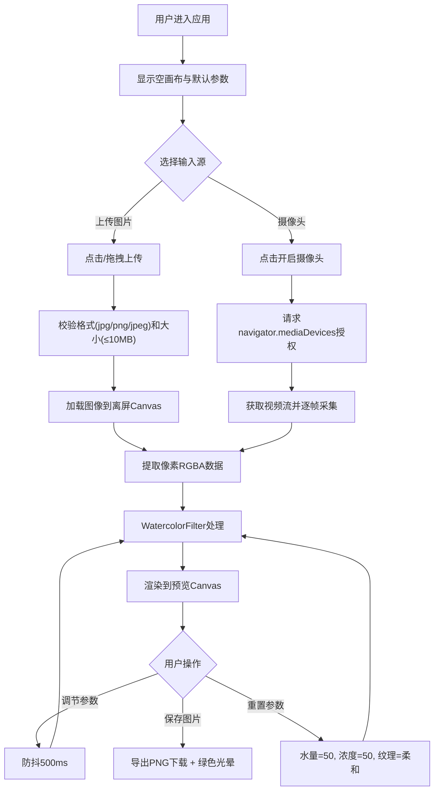

## 1. 产品概述

「水彩时光」是一款基于Web端的实时水彩滤镜交互工具，为艺术爱好者和摄影创作者提供将普通照片或摄像头画面转化为数字水彩画的沉浸式体验。通过模拟水彩颜料在纸面上的扩散、沉淀与边缘暗化效果，赋予每张照片手工水彩的随机质感与温润魅力。

- 核心解决问题：降低数字艺术创作门槛，让无需专业绘画技能的用户也能创作出具有艺术感的水彩作品
- 目标用户：艺术爱好者、摄影创作者、设计师、教育工作者
- 市场价值：填补浏览器端高质量实时水彩滤镜工具的空白，提供零安装、即时可用的艺术创作体验

## 2. 核心功能

### 2.1 用户角色
| 角色 | 注册方式 | 核心权限 |
|------|---------|----------|
| 普通用户 | 无需注册，直接使用 | 上传图片、开启摄像头、调节滤镜参数、保存作品 |

### 2.2 功能模块
1. **主工作区**：左侧控制面板（280px）+ 右侧画布预览区（响应式）
2. **输入源模块**：图片上传（点击/拖拽）、摄像头实时取景
3. **滤镜参数控制**：水量滑块（0-100）、颜料浓度滑块（0-100）、笔触纹理下拉菜单（柔和/粒状/粗糙）
4. **操作按钮区**：保存为图片、重置参数
5. **状态反馈系统**：处理中进度动画、摄像头开启指示、保存成功光晕

### 2.3 页面详情
| 页面名称 | 模块名称 | 功能描述 |
|---------|---------|----------|
| 主工作页 | 输入源区 | 支持点击/拖拽上传jpg/png/jpeg（≤10MB），提供摄像头开关按钮 |
| 主工作页 | 参数滑块区 | 水量滑块控制扩散半径与混合随机度（3-15px），颜料浓度控制沉淀噪点与饱和度增益，均带tooltip显示当前值 |
| 主工作页 | 纹理选择区 | 下拉菜单选择笔触纹理类型：柔和（水痕）、粒状（纸纹）、粗糙，不同类型对应不同边缘暗化算法 |
| 主工作页 | 操作按钮区 | "保存为图片"按钮导出PNG（保持原始尺寸），"重置参数"按钮恢复默认值（水量50、浓度50、柔和） |
| 主工作页 | 画布预览区 | Canvas渲染水彩效果，保持原始宽高比居中，左上角纸纹叠加层，半透明加载动画覆盖层 |
| 主工作页 | 状态指示区 | 摄像头开启时显示闪烁红点，保存成功时画布边缘淡绿色光晕闪烁 |

## 3. 核心流程

用户打开应用后，首先看到空画布和默认参数。用户可选择上传图片或开启摄像头：
1. 上传图片：点击或拖拽图片到上传区 → 系统校验格式和大小 → 加载像素数据 → 应用默认滤镜 → 实时预览
2. 开启摄像头：点击开启按钮 → 请求用户授权 → 获取视频流 → 逐帧采集像素 → 实时应用滤镜并预览
3. 参数调节：拖动滑块或选择纹理 → 防抖触发（500ms内）→ 滤镜重计算 → 更新画布
4. 保存作品：点击保存按钮 → 导出当前画布为PNG → 触发保存成功光晕 → 浏览器自动下载

## 4. 用户界面设计

### 4.1 设计风格
- **主色调**：浅米色 #F5F0E8（背景，模拟水彩纸质感）
- **主题色**：#4A90D9（按钮、滑块轨道、进度动画线条）
- **边框色**：浅木色 #D4C4A8（画布边框，2px实线）
- **辅助色**：淡绿色（保存成功光晕）、红色（摄像头指示点）
- **按钮样式**：圆角矩形，柔和阴影 box-shadow: 2px 2px 8px rgba(0,0,0,0.1)，悬停 transform: scale(1.03) ease-out 0.2s
- **字体选择**：标题使用 "Noto Serif SC"（中文衬线，艺术感），正文使用 "Noto Sans SC"（现代无衬线，可读性）
- **布局风格**：左右两栏固定-弹性布局，卡片式分区，大量留白营造艺术创作氛围
- **装饰元素**：画布左上角纸纹叠加层（canvas生成像素噪声，透明度0.03），各卡片边缘微阴影

### 4.2 页面设计概述
| 页面名称 | 模块名称 | UI元素 |
|---------|---------|--------|
| 主工作页 | 左侧控制面板 | 280px固定宽度，垂直堆叠的卡片分区（输入源、参数、操作），每个卡片圆角12px，背景#FFFFFFCC，内边距20px，卡片间距16px |
| 主工作页 | 输入源卡片 | 拖拽区域虚线边框（默认#CCCCCC，悬停#4A90D9），内部图标+提示文字，下方摄像头按钮（带摄像头图标） |
| 主工作页 | 参数滑块卡片 | 每组滑块：标签+数值tooltip（悬停显示，深色背景浅色文字透明度0.9，圆角4px），滑块轨道#E0E0E0，填充部分#4A90D9，圆形滑块手柄直径18px |
| 主工作页 | 纹理选择卡片 | 标签+自定义下拉菜单（与滑块同宽，圆角8px，箭头图标），选项hover高亮主题色背景 |
| 主工作页 | 操作按钮卡片 | 两个按钮并排或垂直排列，"保存"按钮主题色填充白色文字，"重置"按钮描边样式主题色边框 |
| 主工作页 | 右侧预览区 | flex:1填充剩余空间，垂直水平居中画布，画布外层容器相对定位（用于加载动画和光晕层） |
| 主工作页 | 画布组件 | 2px #D4C4A8实线边框，最大宽度90%容器宽度，max-height 85vh，保持aspect-ratio |
| 主工作页 | 加载动画层 | 绝对定位覆盖画布，半透明背景rgba(245,240,232,0.85)，居中旋转线动画（#4A90D9）+ "处理中..."文字 |
| 主工作页 | 摄像头指示器 | 画布下方红色圆点（width:10px, height:10px, border-radius:50%），keyframe 1s循环透明度1→0.2 |
| 主工作页 | 保存光晕 | 画布外层box-shadow动画，inset 0 0 30px rgba(100,200,100,0)→rgba(100,200,100,0.6)→0，0.3s过渡 |

### 4.3 响应式
- **设计策略**：Desktop-first，移动端自适应
- **断点设置**：768px以下切换为上下布局（控制面板在上，占满宽度，预览区在下）
- **触控优化**：滑块触摸目标区域扩大到44px高度，按钮最小点击区域48x48px
- **摄像头适配**：移动端优先使用后置摄像头，可切换前后置

### 4.4 性能指标视觉反馈
- 处理中状态：旋转线使用CSS conic-gradient + animation，不阻塞主线程
- 所有交互动画：使用transform和opacity，确保GPU加速，动画帧率60fps
- 滤镜处理期间：UI保持响应，可随时取消或调节下一次参数
