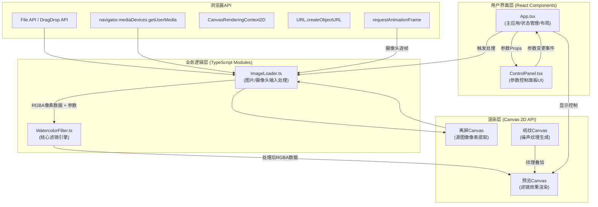
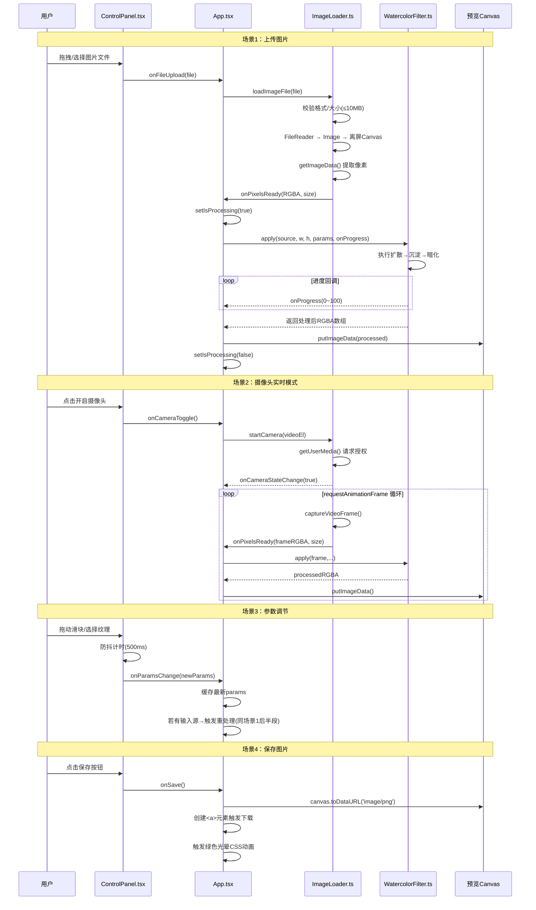

## 1. 架构设计



## 2. 技术描述

- **前端框架**：React@18 + TypeScript@5（严格模式）
- **构建工具**：Vite@5 + @vitejs/plugin-react@4
- **样式方案**：CSS Modules + 内联样式（动态样式部分），全局CSS变量管理主题色
- **渲染技术**：Canvas 2D API（像素级处理通过Uint8ClampedArray + ImageData）
- **状态管理**：React Hooks（useState、useRef、useEffect、useCallback、useMemo）
- **性能优化**：
  - 离屏Canvas进行像素提取，避免频繁DOM操作
  - 参数变更防抖（500ms lodash-like自定义实现），避免过度计算
  - requestAnimationFrame调度摄像头帧处理，同步屏幕刷新率
  - 高分辨率图片（>1920x1080）分块处理或Web Worker（可选优化，首版主进程+进度指示）

**初始化方式**：手动创建配置文件 + npm install（不使用脚手架命令以精确控制文件结构）

## 3. 路由定义

| 路由 | 用途 |
|------|------|
| / | 主工作页（唯一页面，单页应用） |

## 4. 模块接口定义

### 4.1 类型定义 (src/types.ts)

```typescript
// 滤镜参数
export interface FilterParams {
  waterAmount: number;      // 水量 0-100
  pigmentConcentration: number; // 颜料浓度 0-100
  brushTexture: 'soft' | 'grainy' | 'rough'; // 笔触纹理
}

// 笔触纹理配置
export interface TextureConfig {
  edgeDarkeningStrength: number;  // 边缘暗化强度 0-1
  noisePattern: 'water' | 'paper' | 'rough'; // 噪点模式
  grainSize: number;              // 颗粒大小
}

// 输入源类型
export type InputSourceType = 'image' | 'camera' | 'none';

// 处理状态
export interface ProcessingState {
  isProcessing: boolean;
  progress: number; // 0-100
}

// 画布尺寸
export interface CanvasSize {
  width: number;
  height: number;
}
```

### 4.2 ImageLoader 模块接口

```typescript
class ImageLoader {
  // 事件回调
  onPixelsReady: (data: Uint8ClampedArray, size: CanvasSize) => void;
  onError: (message: string) => void;
  onCameraStateChange: (active: boolean) => void;

  // 加载本地图片文件（支持拖拽/点击上传）
  loadImageFile(file: File): Promise<void>;

  // 开启摄像头并开始逐帧采集
  startCamera(videoElement: HTMLVideoElement): Promise<void>;

  // 停止摄像头
  stopCamera(): void;

  // 手动从视频采集一帧
  captureVideoFrame(video: HTMLVideoElement): { data: Uint8ClampedArray; size: CanvasSize };

  // 销毁资源
  dispose(): void;
}
```

### 4.3 WatercolorFilter 模块接口

```typescript
class WatercolorFilter {
  // 应用滤镜并返回处理后的像素数据
  apply(
    sourcePixels: Uint8ClampedArray,
    width: number,
    height: number,
    params: FilterParams,
    onProgress?: (progress: number) => void
  ): Uint8ClampedArray;

  // 内部算法步骤（公开以便单测/调试）
  colorDiffusion(/*...*/): void;      // 颜色扩散
  pigmentSedimentation(/*...*/): void; // 颜料沉淀
  edgeDarkening(/*...*/): void;        // 边缘暗化

  // 获取纹理配置映射
  static getTextureConfig(type: FilterParams['brushTexture']): TextureConfig;
}
```

### 4.4 ControlPanel Props 接口

```typescript
interface ControlPanelProps {
  params: FilterParams;
  onParamsChange: (params: FilterParams) => void;
  onFileUpload: (file: File) => void;
  onCameraToggle: () => void;
  isCameraActive: boolean;
  onSave: () => void;
  onReset: () => void;
  isProcessing: boolean;
}
```

## 5. 核心算法流程

### 5.1 水彩滤镜处理管线
```
输入RGBA像素数组
    ↓
[步骤1] 颜色扩散 (Color Diffusion)
    - 根据水量计算扩散半径 r = 3 + (waterAmount/100) * 12 (范围3-15px)
    - 对每个像素，在半径r内随机选取N个邻域像素（N与水量正相关）
    - 颜色相似度阈值内的像素进行加权平均混合
    - 使用随机种子确保可复现性（可选）
    ↓
[步骤2] 颜料沉淀 (Pigment Sedimentation)
    - 计算每个像素的局部方差，识别边缘/纹理区域
    - 根据颜料浓度参数，在高方差区域叠加随机噪点
    - 饱和度增益：HSV空间提升S通道 * (1 + concentration/200)
    ↓
[步骤3] 边缘暗化 (Edge Darkening)
    - Sobel算子计算水平/垂直梯度 Gx, Gy
    - 梯度幅值 magnitude = sqrt(Gx²+Gy²)
    - 沿梯度方向两侧像素进行暗化处理
    - 暗化强度与笔触纹理联动：soft=0.3, grainy=0.5, rough=0.7
    ↓
输出处理后RGBA像素数组
```

### 5.2 性能优化策略
1. **整图处理循环优化**：避免嵌套循环中函数调用，内联核心计算
2. **临时数组复用**：处理过程中复用同一Float32Array存储中间结果，减少GC压力
3. **Sobel算子优化**：使用可分离卷积或整数运算
4. **跳步采样**：预览时可每2-4像素计算一次再插值（首版全像素保证质量）
5. **进度报告**：在循环中每N行调用一次onProgress回调（N = height/20）

## 6. 数据流向图（详细）



## 7. 文件结构与职责

```
auto117/
├── package.json              # 依赖声明 + npm run dev 启动脚本
├── vite.config.js            # Vite + React 插件配置
├── tsconfig.json             # TypeScript 严格模式配置
├── index.html                # 入口HTML（含Google Fonts引入）
└── src/
    ├── main.tsx              # React DOM 挂载入口
    ├── App.tsx               # 主组件：布局、状态管理、数据流调度
    ├── App.css               # 全局布局样式、CSS变量、动画关键帧
    ├── types.ts              # 共享类型定义（FilterParams等）
    ├── ImageLoader.ts        # 输入源模块：图片/摄像头加载、像素提取
    ├── WatercolorFilter.ts   # 核心引擎：水彩滤镜算法实现
    ├── ControlPanel.tsx      # UI组件：控制面板（输入、滑块、按钮）
    └── ControlPanel.css      # ControlPanel 组件样式（滑块自定义等）
```

**调用关系**：
- `App.tsx` → `import { ImageLoader } from './ImageLoader'`（实例化并持有引用）
- `App.tsx` → `import { WatercolorFilter } from './WatercolorFilter'`（调用apply静态方法）
- `App.tsx` → `import ControlPanel from './ControlPanel'`（渲染并传递props）
- `App.tsx` → `import type { FilterParams, ... } from './types'`
- `ControlPanel.tsx` → `import type { FilterParams, ControlPanelProps } from './types'`
- `WatercolorFilter.ts` → `import type { FilterParams, TextureConfig } from './types'`
- `ImageLoader.ts` → `import type { CanvasSize } from './types'`
