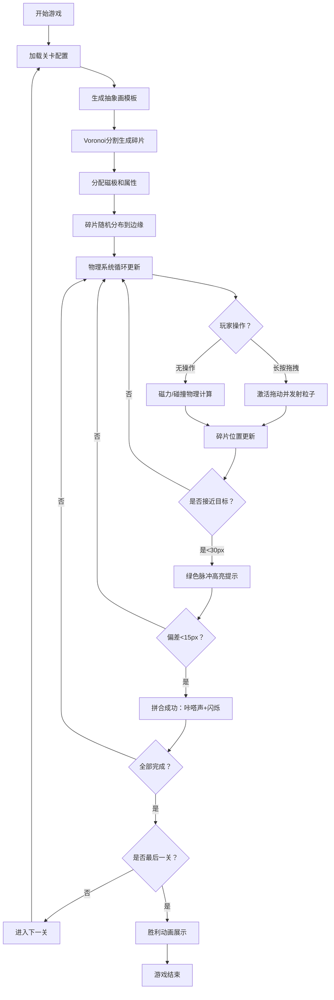

## 1. 产品概述

「磁力重构·碎片迷宫」是一款基于浏览器的2D物理拼图游戏，通过引入磁力物理系统解决传统拼图游戏缺乏动态物理反馈和空间策略深度的问题。玩家拖拽带磁性粒子的彩色碎片块，利用同极相斥、异极相吸的磁力特性，将碎片引导到正确位置拼合成完整的抽象画。

- 目标用户：休闲游戏玩家、益智类游戏爱好者
- 核心价值：创新的磁力物理玩法 + 绚丽的粒子视觉效果 + 递进式关卡难度设计

## 2. 核心功能

### 2.1 功能模块

1. **游戏主界面**：画布渲染区域、顶部信息面板、底部控制按钮
2. **磁力物理系统**：碎片磁极、吸引力/排斥力计算、弹性碰撞、摩擦力
3. **碎片与谜题系统**：Voronoi图不规则碎片生成、磁极随机分配、拼合检测
4. **粒子特效系统**：拖拽拖尾粒子、能量反馈粒子、胜利动画粒子
5. **关卡进度系统**：5个递增难度关卡、尺寸/碎片数量/磁力强度递进

### 2.2 页面详情

| 页面名称 | 模块名称 | 功能描述 |
|---------|---------|---------|
| 游戏主页面 | 画布区域 | 渲染抽象画模板、磁性碎片、粒子拖尾、目标区域高亮 |
| 游戏主页面 | 顶部信息栏 | 显示当前关卡数、已拼合碎片数/总数、计时器 |
| 游戏主页面 | 底部控制栏 | 重新开始按钮（圆角设计、悬停过渡动画） |
| 胜利界面 | 胜利动画 | 所有碎片归位后的动态发光拼合效果 |

## 3. 核心流程

### 3.1 游戏主流程

玩家进入游戏 → 加载第1关卡 → 中央展示抽象画模板 → 碎片生成并随机分布到画布边缘 → 玩家长按拖拽碎片（0.3秒激活）→ 碎片移动时发射粒子拖尾 → 碎片间磁力相互作用 → 接近目标区域时绿色脉冲高亮 → 拼合成功时咔嗒声+闪烁 → 全部拼合完成 → 进入下一关 → 完成5关后展示胜利动画

## 4. 用户界面设计

### 4.1 设计风格

**视觉方向**：赛博朋克·科技感·深邃宇宙风

- **主色调**：深蓝到黑渐变背景（#0B0C10 → #1F2833）
- **点缀色**：青色发光边框（#00FFFF, 透明度0.2）、按钮主色（#45A29E → #66FCF1）、目标高亮（绿色脉冲）、磁极+（红色）、磁极-（蓝色）
- **按钮风格**：圆角设计，悬停0.3秒平滑过渡背景色
- **碎片材质**：圆角矩形 + 半透明磨砂玻璃 + 彩色渐变金属质感纹理
- **字体选择**：Space Grotesk 或 Orbitron（科技感等宽字体）
- **整体氛围**：深邃神秘、发光粒子流、磁力能量场

### 4.2 页面设计概览

| 页面名称 | 模块名称 | UI元素 |
|---------|---------|---------|
| 游戏主页面 | 画布区域 | 深蓝渐变背景、青色发光边框、居中渲染抽象画模板和碎片 |
| 游戏主页面 | 顶部信息栏 | 左：关卡数（大号字体，青色高亮）；中：拼合进度（x/y）；右：计时器（MM:SS格式） |
| 游戏主页面 | 底部控制栏 | 居中重新开始按钮，圆角8px，内边距12px 32px，hover背景色过渡 |
| 游戏主页面 | 碎片元素 | 圆角半径8px，磨砂玻璃效果，磁极圆点位于几何中心，红色+/蓝色- |
| 游戏主页面 | 粒子拖尾 | 直径2-4px彩色光点，透明度0.9→0渐变，沿拖拽反方向发射 |
| 胜利界面 | 胜利动画 | 完整画作动态发光、粒子爆炸扩散、光晕脉冲效果 |

### 4.3 响应式设计

- **桌面优先**：默认画布最大尺寸700x700
- **自适应缩放**：画布尺寸根据屏幕宽高自动缩放，保持正方形比例
- **最小宽度**：400px，画布随容器等比缩放
- **触控优化**：移动端长按触控事件映射，触控点偏移补偿
- **安全区域**：顶部/底部UI面板预留足够空间，避免遮挡画布

## 5. 性能要求

- **物理帧率**：60FPS固定更新循环，逻辑与渲染分离
- **渲染帧率**：55FPS以上，requestAnimationFrame驱动
- **响应延迟**：拖拽操作响应延迟不超过50ms
- **粒子预算**：单帧同时活跃粒子不超过500个
- **内存控制**：粒子对象池复用，避免频繁GC
