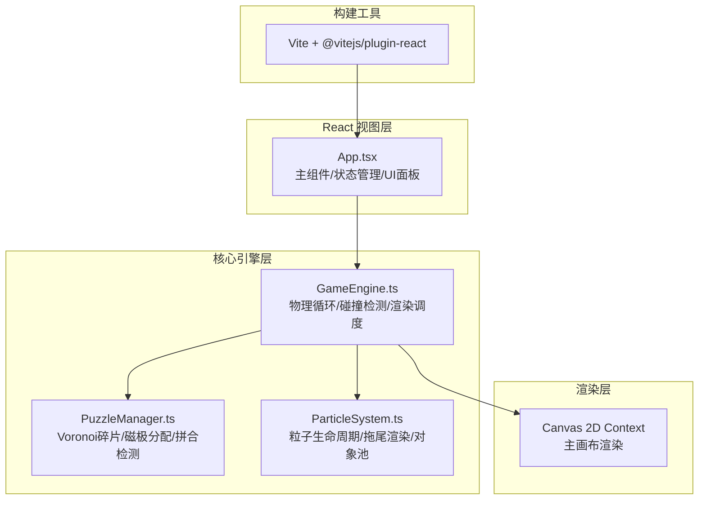

## 1. 架构设计



## 2. 技术选型说明

- **前端框架**：React 18 + TypeScript（严格模式）
- **构建工具**：Vite 5.x + @vitejs/plugin-react
- **渲染引擎**：Canvas 2D API（原生实现，无第三方物理/渲染库）
- **音频**：Web Audio API（原生合成音效）
- **目标标准**：ES2020
- **状态管理**：React useState/useRef（局部状态，避免全局状态影响性能）

**设计原则**：
1. 零第三方游戏/物理/粒子库依赖，所有核心逻辑原生实现
2. 物理更新与渲染分离，固定时间步长60FPS物理更新
3. 性能敏感逻辑使用对象池模式（粒子复用）
4. 引用优先于值传递（碎片/粒子使用引用而非频繁创建销毁）

## 3. 文件结构

```
auto118/
├── package.json
├── index.html
├── vite.config.js
├── tsconfig.json
└── src/
    ├── App.tsx              # 主组件：游戏状态、关卡管理、UI面板
    ├── GameEngine.ts        # 核心引擎：物理更新、碰撞检测、渲染循环
    ├── PuzzleManager.ts     # 谜题管理：Voronoi分割、碎片生成、拼合检测
    ├── ParticleSystem.ts    # 粒子系统：生命周期管理、对象池、拖尾渲染
    └── types.ts             # （可选）共享类型定义
```

## 4. 核心数据模型

### 4.1 关卡配置

```typescript
interface LevelConfig {
  level: number;          // 1-5
  canvasSize: number;     // 500 -> 700
  pieceCount: number;     // 4 -> 9
  colorCount: number;     // 6-8种色块
  magnetStrengthVariance: number; // 后两关 0-0.3
}
```

### 4.2 碎片数据结构

```typescript
interface PuzzlePiece {
  id: number;
  // 物理状态
  x: number;
  y: number;
  vx: number;
  vy: number;
  // 目标位置
  targetX: number;
  targetY: number;
  // 磁力属性
  pole: '+' | '-';
  magnetStrength: number;  // 1.0 + variance
  // 几何形状 (Voronoi多边形顶点相对坐标)
  vertices: { x: number; y: number }[];
  // 视觉属性
  color: string;
  gradientColors: [string, string];
  // 状态
  isSnapped: boolean;      // 是否已正确拼合
  isDragging: boolean;
  dragStartTime: number;
  // 渲染缓存
  cachedCanvas?: HTMLCanvasElement;
}
```

### 4.3 粒子数据结构

```typescript
interface Particle {
  x: number;
  y: number;
  vx: number;
  vy: number;
  life: number;            // 剩余寿命 (秒)
  maxLife: number;         // 初始寿命 (1.2s)
  size: number;            // 2-4px
  color: string;
  alpha: number;
  active: boolean;         // 对象池激活标志
}
```

### 4.4 游戏状态

```typescript
type GameState = 'idle' | 'playing' | 'levelComplete' | 'gameComplete';

interface GameStats {
  currentLevel: number;
  snappedCount: number;
  totalPieces: number;
  elapsedSeconds: number;
}
```

## 5. 核心算法设计

### 5.1 磁力物理计算 (每帧)

```
对每对碎片 (A, B):
  dx = B.x - A.x
  dy = B.y - A.y
  distance = sqrt(dx² + dy²)
  
  if distance < 80px 且 distance > 0:
    单位向量 = (dx/distance, dy/distance)
    forceMagnitude = ?
    
    if A.pole != B.pole:  // 异极相吸
      forceMagnitude = 0.5 * (1 - distance/80)
      施加相向的力
    else:                  // 同极相斥
      forceMagnitude = 1.0 * (1 - distance/80)
      施加相背的力
    
    A.vx/dt += forceX * A.magnetStrength
    A.vy/dt += forceY * A.magnetStrength
    (B反之)
```

### 5.2 Voronoi碎片生成

1. 在画布范围内生成 N 个随机种子点（碎片中心），使用 Lloyd松弛优化分布
2. Delaunay三角剖分构建Voronoi图
3. 每个Voronoi单元格 = 一个碎片多边形
4. 面积过滤：检查面积 2000-5000px²，不满足则重新生成
5. 对多边形顶点进行圆滑处理（二次贝塞尔插值，圆角效果）

### 5.3 拼合检测算法

```
对每个碎片每帧检查:
  offsetX = abs(piece.x - piece.targetX)
  offsetY = abs(piece.y - piece.targetY)
  distance = sqrt(offsetX² + offsetY²)
  
  if distance < 30:
    触发目标区域高亮（绿色脉冲）
    
  if distance < 15 且 !piece.isSnapped:
    piece.isSnapped = true
    吸附到精确位置 (x,y) = (targetX, targetY)
    vx = vy = 0
    播放咔嗒音效 (Web Audio: 800Hz, 0.2s)
    触发碎片闪烁动画
```

### 5.4 碰撞响应

```
碎片A与B碰撞（多边形-多边形SAT检测）:
  计算穿透向量 (最小平移方向MTV)
  位置修正: 将两碎片沿MTV分离
  相对速度投影到法线
  弹性系数 e=0.3, 摩擦 f=0.85
  更新后速度:
    v_A' = v_A - (1+e) * j * normal (沿法线反弹)
    切向分量 *= f
```

### 5.5 粒子对象池策略

- 预分配500个Particle对象的数组池
- `spawn()`: 查找第一个active=false的粒子，重置属性后标记active=true
- `update(dt)`: 遍历所有active粒子，更新位置/寿命，寿命归零则标记active=false
- `render()`: 只渲染active=true的粒子
- 拖尾发射频率: 20-30粒子/秒（使用时间累积器）

## 6. 性能优化策略

1. **Canvas离屏缓存**：每个碎片的静态视觉（多边形+渐变+磨砂）预渲染到离屏Canvas，主循环只drawImage
2. **脏矩形渲染**：（可选）仅重绘变化区域；简化方案：每帧清屏全绘
3. **空间划分**：碎片数量>6时使用Grid网格空间划分，减少O(n²)磁力计算
4. **requestAnimationFrame**：渲染与浏览器V-Sync同步
5. **固定物理步长**：物理更新使用accumulator模式，60FPS固定步长（16.667ms）
6. **引用传递**：粒子/碎片数组原地修改，不创建新数组
7. **减少GC**：避免循环内创建对象，向量计算使用局部变量
