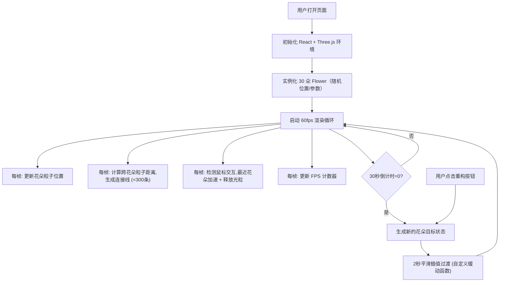

## 1. 产品概述
「量子花园」是一款在浏览器中运行的 3D 交互可视化艺术应用，面向数字艺术家和视觉创意爱好者，通过 Three.js 渲染由发光粒子花朵构成的动态三维空间。应用以混沌算法驱动的永不重复的视觉奇观为核心卖点，用户可以与场景进行实时交互，观察粒子网络的动态演化。

## 2. 核心功能

### 2.1 用户角色
| 角色 | 注册方式 | 核心权限 |
|------|----------|----------|
| 访客用户 | 无需注册，直接访问 | 观看花园动画、鼠标交互、视角控制、手动触发重构 |

### 2.2 功能模块
1. **主场景页面**：3D 量子花园渲染、粒子花朵动画、引力连接线网络
2. **信息面板**：花朵总数显示、重构倒计时、FPS 计数器
3. **交互控制**：鼠标交互反馈、OrbitControls 视角操控、手动重构按钮
4. **重构引擎**：30 秒定时全局重构、2 秒平滑插值过渡

### 2.3 页面详情
| 页面名称 | 模块名称 | 功能描述 |
|----------|----------|----------|
| 主场景页面 | 花朵粒子系统 | 30 朵由 80-120 个粒子构成的发光花朵，混沌旋转 + 径向呼吸变形 |
| 主场景页面 | 引力连接网络 | 跨花朵粒子距离 <3 单位时生成半透明发光线条，动态断裂重连 |
| 主场景页面 | 鼠标交互反馈 | 最近花朵加速旋转、释放光粒朝向光标飞散 |
| 主场景页面 | 视角控制 | 拖拽旋转、滚轮缩放（0.5-20 单位） |
| 信息面板 | 状态显示 | 花朵总数、重构倒计时、FPS 实时显示 |
| 交互控制 | 重构按钮 | 右下角圆形按钮，手动触发额外重构 |
| 重构引擎 | 全局重构 | 每 30 秒重置所有花朵位置/形态/颜色，2 秒平滑过渡 |

## 3. 核心流程

应用启动后，初始化 30 朵随机分布的粒子花朵并启动动画循环。每帧更新花朵粒子位置、计算引力连接网络、检测鼠标交互。每 30 秒触发一次全局重构，所有花朵状态通过 2 秒缓动插值平滑过渡到新状态。用户可通过鼠标交互增强特定花朵的动画效果，或点击按钮立即触发重构。

## 4. 用户界面设计

### 4.1 设计风格
- **主色调**：暗色背景 `#0a0a0f`，柔和青色文字 `#88ccff`，按钮 `#2a2a4a` → 悬停 `#5a5aff`
- **按钮风格**：圆形重构按钮（48px → 悬停 54px），圆角 12px 信息面板
- **字体**：微软雅黑（Microsoft YaHei）
- **布局风格**：全屏沉浸式 3D 场景，半透明 UI 浮层叠加（避免遮挡）
- **动画风格**：倒计时数字淡入淡出（0.2s），按钮尺寸/颜色过渡（0.3s ease-out）

### 4.2 页面设计概述
| 页面名称 | 模块名称 | UI 元素 |
|----------|----------|----------|
| 主场景页面 | 全屏 Canvas | Three.js 3D 渲染，暗色背景，发光粒子，动态线条 |
| 主场景页面 | 左上角信息面板 | `rgba(0,0,0,0.6)` 半透明，圆角 12px，内边距 16px，三行文字（花朵数/倒计时/FPS） |
| 主场景页面 | 右下角重构按钮 | 圆形 48px，刷新图标，悬停放大变蓝，`transition: all 0.3s ease-out` |
| 主场景页面 | 鼠标光粒特效 | 花朵主色细小粒子（1-2px），1 秒生命周期朝向光标飞散 |

### 4.3 响应式
- 桌面端优先设计，移动端自适应缩放
- 信息面板在移动端缩小内边距（8-12px）和字号
- 重构按钮在移动端缩小至 40px，悬停 46px
- 支持触摸屏手势（双指缩放、单指拖拽视角）

### 4.4 3D 场景引导
- **环境/氛围**：深空暗色背景（#0a0a0f），无额外光源，粒子自发光（ emissive 材质），营造宇宙花园的神秘感
- **光照设置**：使用 PointsMaterial 的 emissive 属性，粒子颜色即发光色，无需场景光源
- **相机设置**：PerspectiveCamera，初始距离 15 单位，fov 60°，OrbitControls 限制距离 0.5-20
- **构图与焦点元素**：30 朵花均匀分布于半径 10 球壳内，中心区域视觉密度稍高，形成球对称构图
- **交互与动画**：花朵自转 + 呼吸变形（10s 循环），粒子间蛛网连接线，鼠标悬停花朵激活动画，30s 全局重构带平滑过渡
- **后处理效果**：建议 Bloom（发光泛光）后处理提升发光效果（可选，如果性能允许）
- **资源与性能预算**：粒子 ≤ 3600 个，连接线 ≤ 300 条/帧，距离检测 ≤ 1000 对/帧，目标 FPS ≥ 45，最低 ≥ 30
