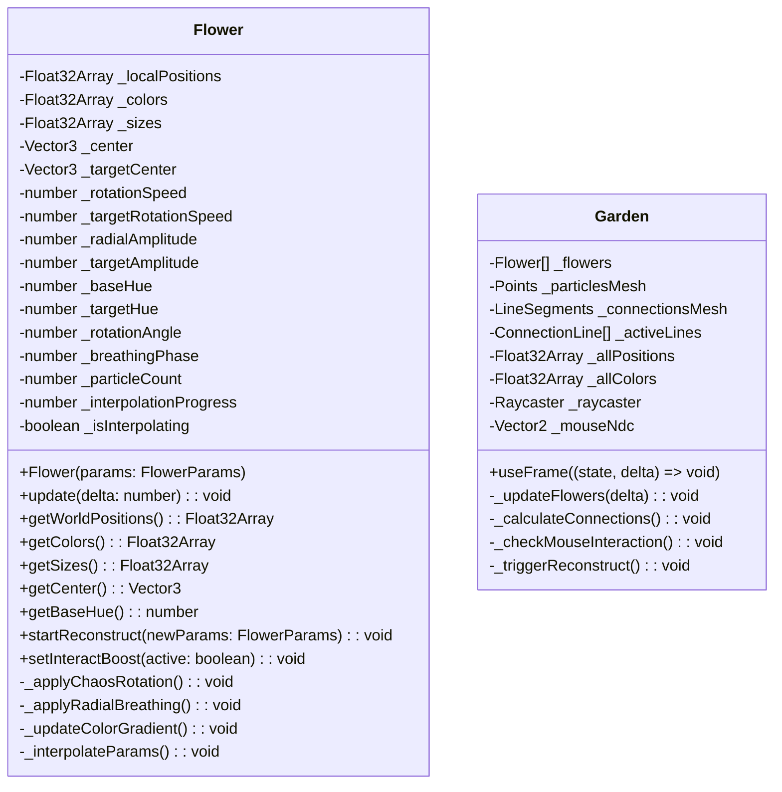

## 1. 架构设计

```mermaid
graph TD
    subgraph "前端层 (React + TypeScript)"
        A["App.tsx (主组件)"]
        B["components/Garden.tsx (3D 场景)"]
        C["utils/Flower.ts (花朵类)"]
    end
    subgraph "渲染层 (Three.js + R3F)"
        D["Canvas (@react-three/fiber)"]
        E["OrbitControls (@react-three/drei)"]
        F["BufferGeometry + PointsMaterial"]
        G["LineSegments + BufferGeometry"]
    end
    subgraph "状态与动画"
        H["useState/useRef (全局状态)"]
        I["requestAnimationFrame 循环"]
        J["自定义缓动插值 (重构过渡)"]
    end

    A -->|1. 传递重构触发信号 + 鼠标位置| B
    B -->|2. 实例化 30 个 Flower 实例| C
    B -->|3. 每帧调用 update() 获取粒子数据| C
    B -->|4. 更新 Points + LineSegments 属性| F
    B -->|5. 挂载到 Canvas 场景| D
    A -->|6. 30秒定时器 / 按钮点击| B
    H -->|存储重构倒计时/FPS/花朵数| A
    J -->|2秒平滑插值重构| B
```

**数据流向说明**：
1. App.tsx → Garden.tsx：传递 `reconstructTrigger`（重构信号计数器）、`mousePos`（归一化鼠标坐标），接收 `onStatsUpdate` 回调更新花朵数/FPS
2. Garden.tsx → Flower.ts：实例化时传入初始参数，每帧调用 `flower.update(deltaTime)` 更新粒子，调用 `flower.reset(newParams)` 执行重构
3. Flower.ts → Garden.ts：通过 `getParticlePositions()`、`getParticleColors()` 返回当前粒子状态数组
4. Garden.tsx → Three.js：直接写入 BufferAttribute 的 array，标记 `needsUpdate = true`，避免重建 Geometry

## 2. 技术描述
- **前端框架**：React@18 + TypeScript@5（严格模式）+ Vite@5 构建
- **初始化工具**：`npm init vite-init@latest . -- --template react-ts --force`
- **3D 渲染栈**：
  - three@0.160：核心 3D 引擎
  - @react-three/fiber@8：React 声明式 Three.js 封装
  - @react-three/drei@9：OrbitControls 等常用组件
  - @types/three：TypeScript 类型定义
- **后端**：无（纯前端应用）
- **数据库**：无
- **状态管理**：React 内置 useState/useRef/useCallback（无需 zustand，应用规模较小）
- **无外部服务**：完全本地运行

## 3. 路由定义
| 路由 | 用途 |
|------|------|
| / | 主页面，量子花园 3D 场景 + UI 浮层 |

单页应用，无路由切换。

## 4. API 定义（无后端）

无后端 API。所有逻辑在前端完成。

内部 TypeScript 类型定义：

```typescript
// Flower 类相关类型
interface FlowerParams {
  center: THREE.Vector3;          // 花朵中心坐标（球壳内随机）
  rotationSpeed: number;          // 自转速度 0.01-0.05 rad/s
  radialAmplitude: number;        // 径向波动振幅 0.3-0.8
  baseHue: number;                // 基础色相 0-360
  particleCount: number;          // 粒子数 80-120
}

interface ParticleData {
  positions: Float32Array;        // 粒子世界坐标 [x1,y1,z1, ...]
  colors: Float32Array;           // 粒子颜色 RGB [r1,g1,b1, ...]
  sizes: Float32Array;            // 粒子大小 2-5px
}

// 连接线条类型
interface ConnectionLine {
  startIdx: number;               // 起始粒子全局索引
  endIdx: number;                 // 结束粒子全局索引
  createdAt: number;              // 创建时间戳 (ms)
  distance: number;               // 粒子距离 (用于透明度)
}
```

## 5. 服务器架构图（无后端）

无后端服务器。纯前端静态资源部署。

## 6. 数据模型（内存数据）

### 6.1 数据模型定义（类图）



### 6.2 性能优化策略（关键）

1. **粒子渲染**：使用单 BufferGeometry + Points，每朵花更新属性时直接写入 `geometry.attributes.position.array`，设置 `needsUpdate = true`，不重建对象
2. **连接线优化**：预分配固定大小 Buffer（300 条 × 2 点 × 3 = 1800 坐标），从后往前替换超出的旧线条，避免每帧 new Float32Array
3. **距离检测优化**：
   - 每帧只对不同花朵的粒子进行采样检测（跳过同花内粒子）
   - 使用空间网格分桶（可选）或限制每帧最多检测 1000 对
   - 使用距离平方比较避免开根号
4. **重构插值**：直接在 Flower 类内维护目标参数 + 当前参数，每帧线性插值 + easeOutCubic 缓动
5. **FPS 监控**：使用 `performance.now()` 滑动窗口统计最近 30 帧平均帧率，每秒更新 UI 一次
