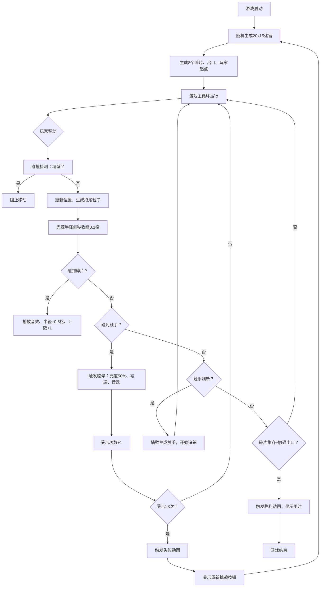

## 1. 产品概述

「千影迷宫·光痕逃脱」是一款基于浏览器的2D迷宫解谜游戏，通过动态光影与空间交互机制为传统迷宫游戏增添趣味性。玩家操控由光点组成的小人，在黑暗迷宫中探索、收集光之碎片、躲避暗影触手，最终找到出口逃离迷宫。

- **目标用户**：休闲解谜游戏爱好者、浏览器游戏玩家
- **核心价值**：创新的光暗机制营造紧张刺激的探索体验，随机生成迷宫保证高重玩性

## 2. 核心功能

### 2.1 功能模块

1. **迷宫生成与光效渲染模块**：递归回溯算法生成20x15网格迷宫，径向渐变光源效果，动态粒子拖尾
2. **光之碎片收集系统**：8个旋转菱形晶体，碰撞拾取，永久扩大光源半径
3. **暗影触手AI系统**：定时刷新追踪型敌人，触碰触发眩晕和亮度衰减
4. **胜利/失败判定模块**：完整收集碎片+找到出口=胜利；被击中3次=失败
5. **游戏状态管理**：重新开始、重置迷宫、UI状态显示

### 2.2 功能详情

| 模块名称 | 子功能 | 功能描述 |
|---------|-------|---------|
| 迷宫生成 | 递归回溯算法 | 生成20x15完美迷宫，确保从起点可达所有区域 |
| 光效渲染 | 径向渐变光源 | 从暖黄#FFD700到透明的圆形光照，照亮周围3格 |
| 光效渲染 | 粒子拖尾 | 移动时每秒生成10个2px粒子，0.8秒内渐隐 |
| 光效渲染 | 半径收缩 | 光点半径每秒缩小0.1格 |
| 碎片收集 | 碎片生成 | 8个随机位置碎片，不在同一行/列 |
| 碎片收集 | 视觉效果 | 菱形晶体(8px边长)，2秒周期旋转，#00FFFF色 |
| 碎片收集 | 拾取反馈 | Web Audio 880Hz/0.15秒音效，半径永久+0.5格 |
| 暗影触手 | 刷新机制 | 每30秒刷新，距玩家至少5格的墙壁位置 |
| 暗影触手 | AI追踪 | 0.5格/秒速度追踪玩家位置 |
| 暗影触手 | 触碰反馈 | 50%亮度骤降，1.5秒眩晕，220Hz/0.5秒音效 |
| UI界面 | 光点半径 | 左上角显示剩余格数+进度条 |
| UI界面 | 碎片计数 | 右上角显示 当前/总数 (如4/8) |
| UI界面 | 受击计数 | 底部中央3个紫色圆圈标记 |
| 胜利条件 | 出口识别 | 收集全部碎片后触碰边缘金色门框 |
| 胜利条件 | 胜利动画 | 中心金色光环扩散2秒，墙壁渐隐，显示用时 |
| 失败条件 | 失败判定 | 被触手连续击中3次 |
| 失败条件 | 失败动画 | 光点收缩消失1秒，显示「暗影吞噬」+重玩按钮 |

## 3. 核心流程

玩家打开游戏 → 随机生成迷宫、碎片、出口 → 玩家使用方向键/WASD移动光点 → 探索迷宫，收集碎片扩大光源 → 躲避暗影触手 → 收集全部8个碎片后找到出口 → 触发胜利动画显示用时

或：被暗影触手击中3次 → 触发失败动画 → 点击重新挑战按钮重置游戏

## 4. 用户界面设计

### 4.1 设计风格
- **整体风格**：黑暗深邃的哥特式风格，神秘、紧张、探索感
- **主色调**：黑(#0a0a0f)、深灰(#1a1a1a/#2a2a2a)、暗紫(#3d1a5c)
- **高亮色**：暖黄(#FFD700-光源)、青蓝(#00FFFF-碎片)、金色(#FFD700-出口)
- **按钮样式**：毛玻璃半透明背景，圆角4px，hover时发光效果
- **字体**：细体无衬线字体，柔和发光阴影
- **UI容器**：backdrop-filter: blur(4px)，背景rgba(20,20,30,0.7)

### 4.2 页面布局
| 区域 | 模块名称 | UI元素 |
|-----|---------|-------|
| 画布中央 | 游戏主视图 | 20x15迷宫、光源、碎片、触手、出口 |
| 左上角 | 光点半径显示 | 半径数字(格)、水平进度条(最大半径/当前半径) |
| 右上角 | 碎片计数 | "X/8"文本，青蓝色发光 |
| 底部中央 | 受击标记 | 3个紫色圆圈，已击中的用实心填充 |
| 失败覆盖层 | 失败界面 | "暗影吞噬"文字、重新挑战按钮 |
| 胜利覆盖层 | 胜利界面 | "逃离成功"文字、总用时显示 |

### 4.3 响应式设计
- 桌面优先设计，适配1024x768到1920x1080分辨率
- 迷宫网格按窗口大小自动缩放，保持16:9宽高比(20:15=4:3网格，画布适配窗口)
- 画布始终居中显示，周围背景填充纯色

### 4.4 性能要求
- 60FPS稳定运行，每帧渲染时间≤12ms
- 使用requestAnimationFrame游戏循环
- 粒子对象池复用，避免频繁GC
- Canvas 2D离屏缓存迷宫静态纹理
