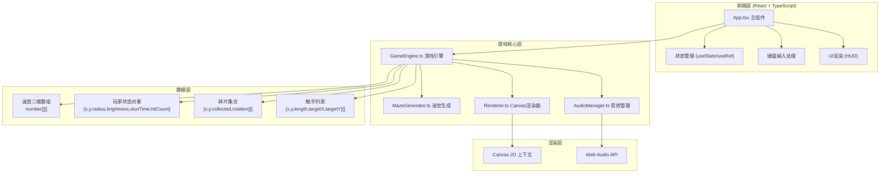

## 1. 架构设计



## 2. 技术选型说明

- **前端框架**：React 18 + TypeScript 5 - 类型安全，组件化开发，HMR热更新
- **构建工具**：Vite 5 - 快速冷启动，原生ESM支持，构建速度快
- **渲染技术**：Canvas 2D - 高性能2D图形绘制，适合60FPS游戏渲染
- **音频技术**：Web Audio API - 低延迟音效合成，无需外部音频文件
- **状态管理**：React useRef + useState - useRef存储游戏状态避免闭包问题，useState触发UI重渲染

## 3. 核心模块说明

### 3.1 MazeGenerator.ts - 迷宫生成器
```typescript
// 核心类型
interface MazeCell {
  x: number;
  y: number;
  walls: { top: boolean; right: boolean; bottom: boolean; left: boolean };
  visited: boolean;
}

// 核心方法
class MazeGenerator {
  generate(width: number, height: number): number[][];  // 递归回溯生成
  getStartPosition(): { x: number; y: number };        // 起点(左上角)
  getExitPosition(): { x: number; y: number };         // 出口(边缘随机)
  getFragmentPositions(count: number): {x:number;y:number}[]; // 8个碎片位置
  isWall(x: number, y: number): boolean;               // 碰撞检测
}
```

### 3.2 AudioManager.ts - 音效管理器
```typescript
class AudioManager {
  private ctx: AudioContext;
  constructor();  // 创建AudioContext
  playPickup();   // 880Hz正弦波, 0.15秒, 线性衰减
  playStun();     // 220Hz锯齿波, 0.5秒, 低频嗡鸣
  playVictory();  // 上升音阶C-E-G-B, 各0.2秒
  playDefeat();   // 下降音阶G-E-C-A, 各0.3秒
}
```

### 3.3 Renderer.ts - Canvas渲染器
```typescript
class Renderer {
  private ctx: CanvasRenderingContext2D;
  private cellSize: number;
  private particlePool: Particle[];
  
  setCellSize(size: number): void;
  clear(): void;
  drawMaze(maze: number[][]): void;                    // 墙壁+地面半透明
  drawPlayer(x:number, y:number, radius:number, brightness:number): void;  // 径向渐变光源
  drawFragments(fragments: Fragment[]): void;          // 旋转菱形晶体
  drawTentacles(tentacles: Tentacle[]): void;          // 深紫色半透明条
  drawExit(x:number, y:number, time:number): void;     // 闪烁金色门框
  drawParticles(): void;                               // 拖尾粒子渲染更新
  drawStunWave(time:number, duration:number): void;    // 眩晕紫色波纹
  drawVictoryAnimation(progress:number): void;         // 金色光环扩散
  drawDefeatAnimation(progress:number): void;          // 光点收缩消失
  spawnParticle(x:number, y:number): void;             // 对象池取粒子
}
```

### 3.4 GameEngine.ts - 游戏引擎
```typescript
type GameState = 'playing' | 'victory' | 'defeat';

interface EngineState {
  maze: number[][];
  player: { x:number; y:number; vx:number; vy:number; radius:number; baseRadius:number; brightness:number; stunTimer:number; hitCount:number };
  fragments: { x:number; y:number; collected:boolean; rotation:number }[];
  tentacles: { x:number; y:number; length:number; targetX:number; targetY:number; speed:number; active:boolean }[];
  exit: { x:number; y:number };
  state: GameState;
  tentacleSpawnTimer: number;
  elapsedTime: number;
  victoryProgress: number;
  defeatProgress: number;
  onFragmentPickup: () => void;
  onStunned: () => void;
  onVictory: (time:number) => void;
  onDefeat: () => void;
}

class GameEngine {
  state: EngineState;
  private audio: AudioManager;
  private renderer: Renderer;
  
  constructor(audio: AudioManager, renderer: Renderer);
  init(): void;              // 初始化新游戏
  update(dt:number): void;   // 帧更新(1/60秒)
  setInput(vx:number, vy:number): void;  // 方向输入(-1/0/1)
  private checkCollisions(): void;
  private updateTentacles(dt:number): void;
  private spawnTentacle(): void;
  private checkVictory(): boolean;
  private checkDefeat(): boolean;
}
```

### 3.5 App.tsx - 主组件
```tsx
// 核心职责
// 1. 创建Canvas元素，处理窗口resize自适应
// 2. 初始化AudioManager、Renderer、GameEngine
// 3. requestAnimationFrame游戏循环
// 4. 键盘事件监听(WASD/方向键)
// 5. HUD渲染(半径条、碎片计数、受击标记)
// 6. 胜利/失败覆盖层渲染
```

## 4. 文件结构

```
auto122/
├── package.json                    # 依赖配置
├── vite.config.js                  # Vite构建配置
├── tsconfig.json                   # TS严格模式配置
├── index.html                      # 入口HTML
└── src/
    ├── App.tsx                     # 主组件+游戏循环+UI
    ├── MazeGenerator.ts            # 递归回溯迷宫算法
    ├── GameEngine.ts               # 游戏主循环引擎
    ├── Renderer.ts                 # Canvas 2D渲染器
    └── AudioManager.ts             # Web Audio音效管理
```

## 5. 关键实现要点

### 5.1 性能优化
- **迷宫缓存**：首次渲染后将迷宫墙壁绘制到离屏Canvas，每帧直接拷贝
- **粒子对象池**：预分配50个Particle，spawn从池取，超出生命周期重置
- **光源裁剪**：只绘制光源半径3格范围内的墙壁/地面，其余区域保持黑暗

### 5.2 碰撞检测
- 玩家与墙壁：AABB检测，分轴检测(x先y后)，支持滑行碰撞
- 玩家与碎片：圆形碰撞检测(距离 < 0.5格)
- 玩家与触手：线段与圆形检测

### 5.3 迷宫生成算法
- 递归回溯(Recursive Backtracker)：
  1. 初始化所有格子四面为墙
  2. 随机选择起点，标记已访问，压入栈
  3. 循环：取栈顶，找未访问邻居，随机选一个，打通墙壁，新格入栈
  4. 无未访问邻居则出栈，直到栈空

### 5.4 输入处理
- 键盘keydown/keyup事件，维护按键集合
- 每帧根据按键状态合成vx, vy方向向量，归一化处理斜向移动
- 眩晕期间(1.5s)速度乘以0.5系数，1.5s后恢复
