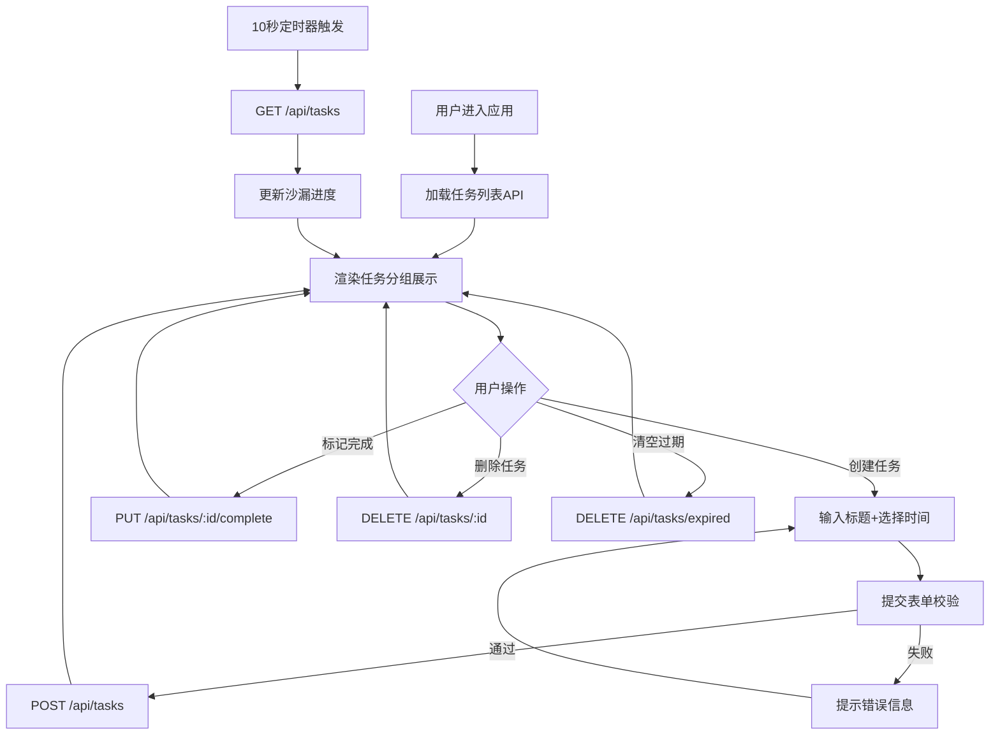

## 1. 产品概述

沙漏任务板是一款面向忙碌职场人的时间可视化任务管理Web应用。通过将任务进度映射为真实沙漏的流沙效果，让用户直观感知任务的紧急程度和剩余时间，从而更好地规划每日工作优先级。

- 核心价值：将抽象的"时间流逝"转化为具象的视觉反馈，降低任务管理的认知负荷
- 目标用户：需要高效管理多任务并行的职场人士、自由职业者、学生

## 2. 核心功能

### 2.1 用户角色

| 角色 | 注册方式 | 核心权限 |
|------|----------|----------|
| 普通用户 | 无需注册，浏览器本地使用 | 创建任务、管理任务状态、清空过期任务 |

### 2.2 功能模块

1. **任务创建模块**：标题输入、提醒时间选择、表单校验
2. **任务展示模块**：沙漏动画卡片、剩余时间标签、分组排序展示
3. **任务状态管理**：标记完成、删除任务、自动过期检测
4. **批量操作模块**：一键清空所有过期任务
5. **实时同步模块**：10秒轮询更新任务状态和沙漏进度

### 2.3 页面详情

| 页面名称 | 模块名称 | 功能描述 |
|----------|----------|----------|
| 主页面 | 顶部固定栏 | 展示应用标题"沙漏任务板"和"一键清空过期"按钮 |
| 主页面 | 创建任务表单 | 标题输入（必填，20字符上限）、提醒时间选择（1-24小时整点）、提交按钮 |
| 主页面 | 进行中任务组 | 按剩余时间升序排列的任务卡片列表，展示沙漏进度动画 |
| 主页面 | 已过期任务组 | 按过期时间降序排列的灰化任务卡片，带呼吸动画 |
| 主页面 | 已完成任务区 | 页面底部收起展示已完成任务 |
| 主页面 | 背景水印层 | 大号半透明罗马数字时钟水印，20秒缓慢旋转 |

## 3. 核心流程

用户进入应用后，首先看到顶部标题栏和任务创建区。用户输入任务标题并选择提醒时间后提交，任务立即出现在"进行中"分组。系统每10秒自动刷新任务状态，沙漏动画根据时间进度实时更新，沙子从上往下逐渐填满。当进度超过100%时，任务自动移入"已过期"分组并变灰。用户可随时勾选完成或删除单个任务，也可点击顶部按钮一键清空所有过期任务。

## 4. 用户界面设计

### 4.1 设计风格

- **主色调**：深蓝色背景 `#0B1D3A`，营造沉静专注的工作氛围
- **强调色**：亮金色 `#FFD700`，用于沙漏、按钮高亮，象征时间的珍贵
- **辅助色**：白色 `#FFFFFF` 用于文字，半透明白色用于卡片背景
- **按钮风格**：圆角胶囊按钮，主按钮使用金色渐变边框+深色填充
- **字体**：标题使用衬线字体（如 Playfair Display）提升质感，正文使用无衬线字体（如 Outfit）保证可读性
- **布局风格**：上下分栏固定布局，卡片采用毛玻璃效果，带微妙边框和阴影
- **图标风格**：纯CSS绘制沙漏图形，避免外部图标库依赖

### 4.2 页面设计概览

| 页面名称 | 模块名称 | UI元素 |
|----------|----------|--------|
| 主页面 | 顶部固定栏 | 衬线字体大标题+金色装饰线+胶囊形清空按钮 |
| 主页面 | 创建表单 | 毛玻璃输入框+下拉时间选择器+金色提交按钮 |
| 主页面 | 任务卡片 | 毛玻璃背景（backdrop-filter: blur(10px)）、左上角微型旋转沙漏、大号沙漏进度条、任务标题、剩余时间标签、完成/删除按钮 |
| 主页面 | 分组标题 | 金色下划线分隔，"进行中"配沙漏图标，"已过期"配灰色警示图标 |
| 主页面 | 背景层 | 居中大号半透明罗马数字时钟，20秒一圈缓慢旋转，深蓝色渐变叠加 |
| 主页面 | 动效层 | 卡片排序0.5s ease-out平滑移动、过期任务1.5s明暗呼吸、沙漏沙子CSS渐变流动 |

### 4.3 响应式

采用桌面优先设计，移动端自适应：
- **桌面端（≥768px）**：任务卡片两列网格布局，最大宽度1200px居中
- **移动端（<768px）**：卡片改为单列满宽，顶部栏标题缩小字号，创建表单输入框换行堆叠
- **触摸优化**：按钮点击区域≥44px，无hover状态依赖，使用touch-action: manipulation防止缩放

### 4.4 动画性能规范

- 沙漏动画使用 `transform` 和 `opacity` 触发GPU合成层，避免重绘
- 卡片排序使用 CSS transitions 作用于 `transform` 属性
- 背景旋转使用 `will-change: transform` 提前声明
- 所有动画目标60FPS，JS计算仅在轮询回调时批量执行
