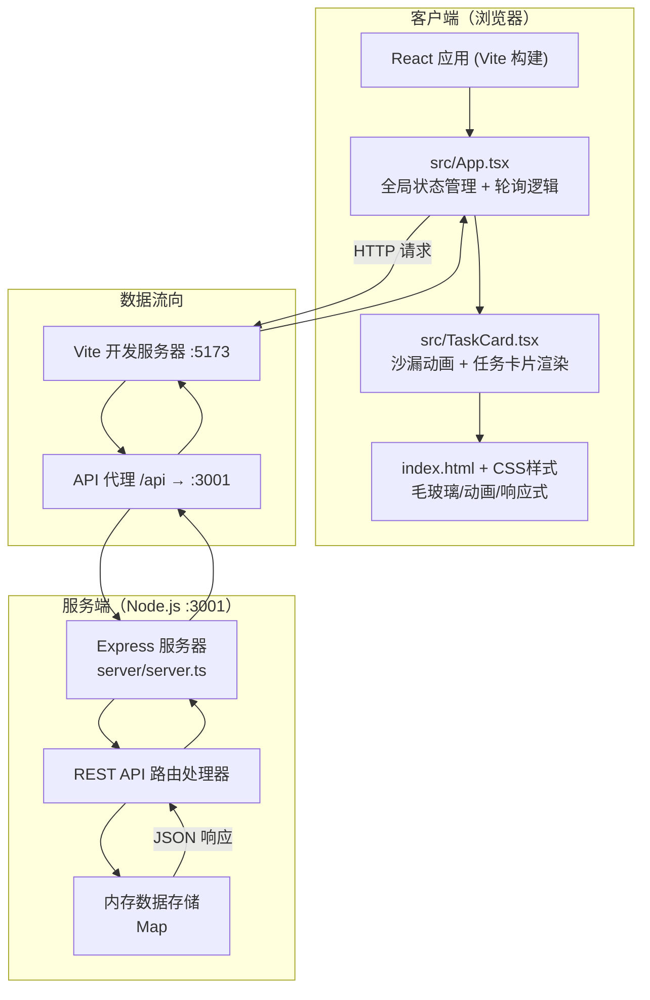
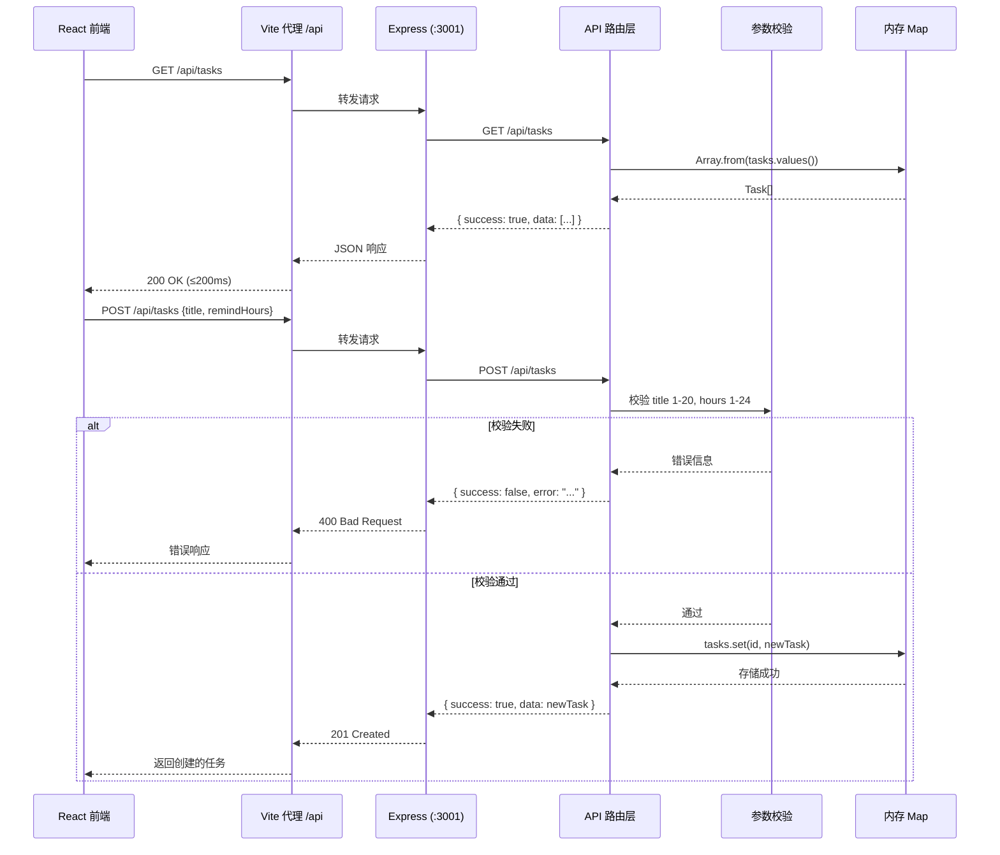
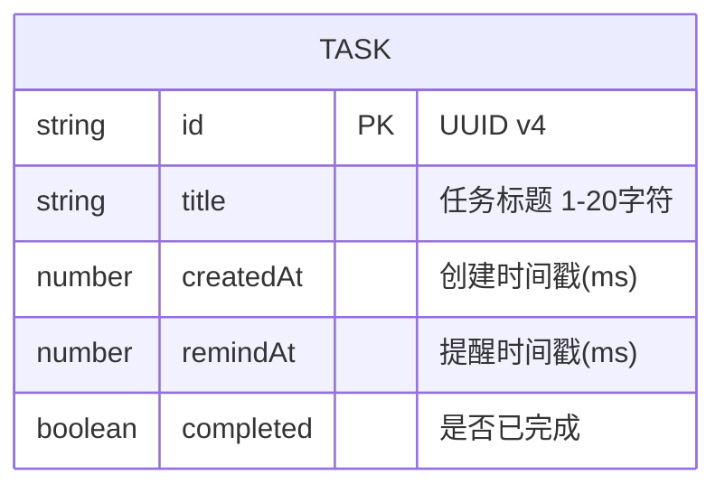

## 1. 架构设计



## 2. 技术描述

- **前端框架**：React@18 + TypeScript@5，函数式组件 + Hooks 架构
- **构建工具**：Vite@5 + @vitejs/plugin-react@4，HMR 热更新
- **样式方案**：原生 CSS3（CSS Variables、Keyframes、Grid/Flex、backdrop-filter），零 UI 库依赖
- **后端框架**：Express@4 + TypeScript@5，ts-node 运行时编译
- **数据存储**：服务端内存 `Map<string, Task>`，进程级持久化（重启清空）
- **ID 生成**：uuid@9 生成唯一任务 ID
- **开发模式**：Vite (:5173) + Express (:3001) 双进程，通过 vite.config.js 代理 `/api` 请求
- **启动命令**：`npm run dev` 使用 `concurrently` 同时启动前后端

## 3. 路由定义

| 路由（前端） | 用途 |
|--------------|------|
| `/` | SPA 单页应用主入口，渲染完整任务板界面 |

## 4. API 定义

### 4.1 TypeScript 类型定义

```typescript
interface Task {
  id: string;
  title: string;
  createdAt: number;
  remindAt: number;
  completed: boolean;
}

interface TaskCreateRequest {
  title: string;
  remindHours: number;
}

interface ApiResponse<T> {
  success: boolean;
  data?: T;
  error?: string;
}
```

### 4.2 REST API 端点

| 方法 | 路径 | 描述 | 请求体 | 响应体 |
|------|------|------|--------|--------|
| `GET` | `/api/tasks` | 获取所有任务列表（含完成/未完成/过期） | 无 | `ApiResponse<Task[]>` |
| `POST` | `/api/tasks` | 创建新任务 | `{ title: string, remindHours: number }` | `ApiResponse<Task>` |
| `PUT` | `/api/tasks/:id/complete` | 标记任务为已完成 | 无 | `ApiResponse<Task>` |
| `DELETE` | `/api/tasks/:id` | 删除指定任务 | 无 | `ApiResponse<{ deletedId: string }>` |
| `DELETE` | `/api/tasks/expired` | 批量删除所有已过期任务（未完成且 remindAt < now） | 无 | `ApiResponse<{ deletedCount: number }>` |

### 4.3 业务校验规则

- `title`：必填，去除首尾空格后长度 1-20 字符
- `remindHours`：整数，范围 1-24，表示从当前时间起 N 小时后的整点
- `remindAt` 计算：`Math.ceil(now/3600000 + remindHours) * 3600000`
- 过期判定：`!completed && remindAt < Date.now()`
- 进度百分比：`min(100, (now - createdAt) / (remindAt - createdAt) * 100)`

## 5. 服务端架构图



## 6. 数据模型

### 6.1 数据模型定义



### 6.2 内存存储结构

服务端使用原生 JavaScript Map 存储，键为 `Task.id`，值为完整 Task 对象：

```typescript
const tasks: Map<string, Task> = new Map();

// 典型查询操作（O(n)，n≤1000 满足 200ms 性能要求）：
const allTasks = Array.from(tasks.values());
const inProgress = allTasks.filter(t => !t.completed && t.remindAt >= now);
const expired = allTasks.filter(t => !t.completed && t.remindAt < now);
const completed = allTasks.filter(t => t.completed);
```

### 6.3 数据流向总结

| 方向 | 调用关系 | 数据内容 |
|------|----------|----------|
| 前端→后端 | App.tsx → fetch('/api/*') → Express 路由 | 创建请求、状态变更请求、删除请求 |
| 后端内部 | 路由处理器 → 校验函数 → Map 操作 | 校验后的任务字段、时间戳 |
| 后端→前端 | Express res.json() → App.tsx setState | Task 对象数组、操作结果 |
| 父组件→子组件 | App.tsx props → TaskCard.tsx | 单个 Task 对象 + 操作回调 |
| 子组件→父组件 | TaskCard 按钮 → App.tsx 回调函数 → 发起 API | 任务 ID |
