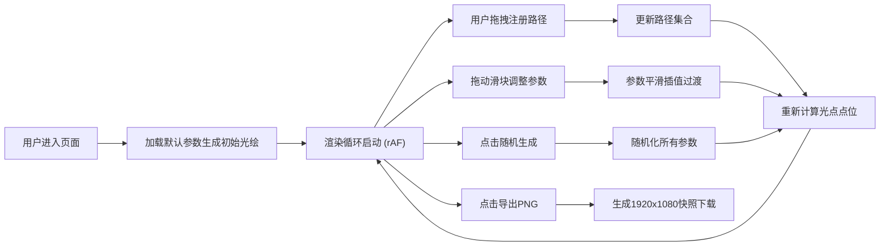

## 1. 产品概述

「光绘图谱」是一款基于浏览器的动态光绘艺术生成器，解决传统矢量绘图工具无法通过数学规则实时生成复杂动态图案的问题。用户通过调节角度、振幅、频率等参数，系统每帧生成数千个彩色光点构成的连续波形，形成富有生命感的流动光绘作品。

- 核心目标：让非专业用户通过简单参数调节创造极具视觉冲击力的动态艺术
- 目标用户：数字艺术爱好者、视觉设计师、创意开发者
- 产品价值：将数学美感转化为可交互、可导出的视觉艺术

## 2. 核心特性

### 2.1 用户角色

| 角色 | 注册方式 | 核心权限 |
|------|----------|----------|
| 访客用户 | 无需注册，直接使用 | 调节参数、拖拽路径、导出PNG |

### 2.2 功能模块

1. **参数控制面板**：角度/振幅/频率/颜色偏移/光点数量滑条 + 随机生成 + 导出PNG
2. **交互式光绘画布**：Canvas 2D渲染引擎，支持多点拖拽路径注册
3. **动态光绘引擎**：光点位置计算、拖尾轨迹、发光效果
4. **快照导出模块**：1920×1080透明背景PNG导出

### 2.3 页面详情

| 页面名称 | 模块名称 | 功能描述 |
|----------|----------|----------|
| 主页面 | 参数控制面板 | 5个滑块实时调节参数，随机按钮一键生成，导出按钮保存快照 |
| 主页面 | 光绘画布 | 全屏Canvas渲染，鼠标拖拽注册多条起终点路径，网格参考线 |
| 主页面 | 光绘引擎 | requestAnimationFrame循环，光点位置/拖尾/发光计算 |

## 3. 核心流程

用户打开页面后默认看到预设参数生成的单条光绘路径。通过拖拽画布注册新路径，通过左侧滑块实时调整图案形态，调整过程中图案平滑过渡。满意后点击「导出PNG」保存作品。

## 4. 用户界面设计

### 4.1 设计风格

- **主色调**：背景 `#0B0E1A`（深空蓝黑），强调色 `#00D4FF`（赛博青霓虹）
- **辅助色**：光点颜色使用HSL动态色域，根据颜色偏移参数循环
- **面板风格**：半透明毛玻璃 `backdrop-filter: blur(10px)`，背景 `rgba(20, 26, 48, 0.6)`，1px边框 `rgba(0, 212, 255, 0.15)`
- **按钮风格**：圆角8px，悬停时霓虹光晕 `box-shadow: 0 0 12px rgba(0, 212, 255, 0.6)`，点击缩放0.97
- **滑块风格**：自定义range thumb为圆形霓虹点，track为深色细条
- **字体**：主标题使用 `Orbitron` / `JetBrains Mono`（科技感等宽/几何字体），正文使用系统无衬线
- **布局**：左侧固定300px控制面板 + 右侧自适应Canvas区域

### 4.2 页面设计概览

| 页面名称 | 模块名称 | UI元素 |
|----------|----------|--------|
| 主页面 | 控制面板 | 毛玻璃面板、5组滑块(标签+数值显示)、随机生成按钮、导出PNG按钮、面板入场动画0.3s ease-out |
| 主页面 | 光绘画布 | 深色背景、50px间隔网格线(#1A2040)、光点带shadowBlur发光、拖尾透明度渐变、拖拽时起终点高亮标记 |

### 4.3 响应式

- 桌面端优先（最小宽度1280px）
- 控制面板固定宽度300px，画布取剩余宽度
- 触控设备支持手指拖拽注册路径
- 当视窗宽度 < 900px，控制面板改为顶部悬浮抽屉

### 4.4 动画与微动效

- 控制面板入场：从左侧滑入 + 透明度0→1，0.3s ease-out
- 滑块/按钮悬停：轻微缩放1.05倍 + 霓虹光晕渐入，0.15s
- 按钮点击：缩放0.97，0.1s回弹
- 参数变化：光点运动参数在当前值与目标值之间线性插值，避免突变
- 拖拽注册：起终点标记以脉冲动画呈现（scale 1→1.3→1循环）
