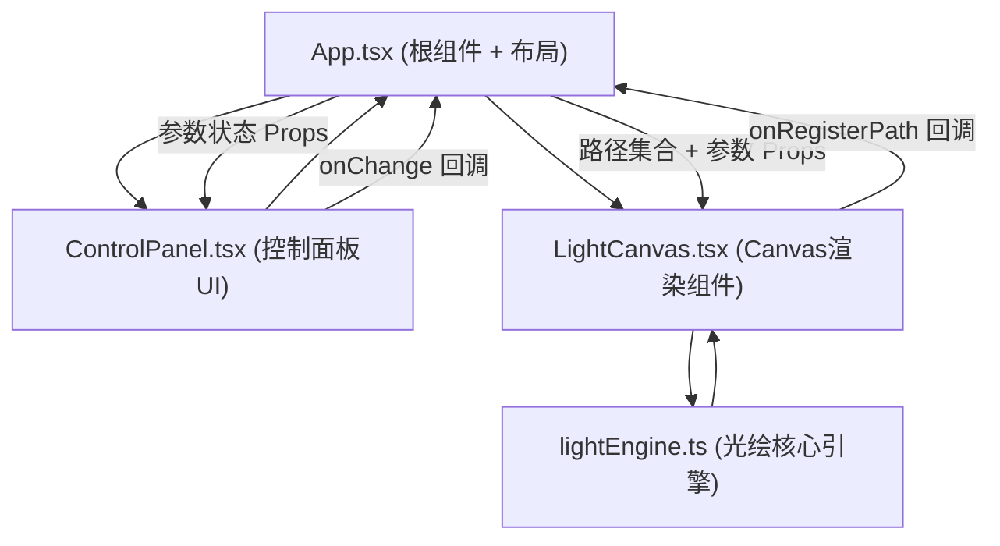

## 1. 架构设计

纯前端单页应用，采用分层架构：UI组件层 → 状态管理层 → 渲染引擎层 → 工具函数层。无后端依赖，所有逻辑在浏览器内运行。



## 2. 技术描述

- **前端框架**：React@18 + TypeScript（严格模式）
- **构建工具**：Vite@5 + @vitejs/plugin-react
- **渲染层**：HTML5 Canvas 2D API（requestAnimationFrame驱动循环）
- **样式方案**：原生CSS（CSS变量 + 选择器，不引入Tailwind以避免额外依赖）
- **状态管理**：React useState + useRef（轻量场景无需Zustand）
- **性能优化**：
  - 参数平滑插值：目标值与当前值按帧插值，避免参数突变
  - 拖尾复用：每帧使用半透明矩形覆盖而非重绘整段轨迹
  - 对象池：光点对象复用，避免频繁GC
  - 离屏画布：导出PNG时使用独立1920×1080离屏Canvas渲染
- **依赖列表**（package.json）：
  - `react` ^18.2.0
  - `react-dom` ^18.2.0
  - `typescript` ^5.4.0
  - `vite` ^5.2.0
  - `@vitejs/plugin-react` ^4.2.0

## 3. 路由定义

| 路由 | 用途 |
|------|------|
| / | 主应用页面（单页应用仅此一个路由） |

## 4. 类型定义（核心数据模型）

```typescript
// src/utils/lightEngine.ts

// 用户可调参数集合
interface LightParams {
  angle: number;          // 角度 0-360
  amplitude: number;      // 振幅 10-200
  frequency: number;      // 频率 1-20
  colorShift: number;     // 颜色偏移 0-360
  pointCount: number;     // 光点数量 100-5000
  trailLength: number;    // 拖尾长度 50-200
  glowRadius: number;     // 发光半径 8-30
}

// 一条用户注册的路径（起点→终点）
interface LightPath {
  id: string;
  startX: number;
  startY: number;
  endX: number;
  endY: number;
}

// 单个光点运行时状态
interface LightPoint {
  x: number;
  y: number;
  baseProgress: number;   // 在路径上的基准进度 0-1
  pathId: string;
  trail: Array<{ x: number; y: number; alpha: number }>;
}

// 引擎对外导出函数
export function generateFrame(
  ctx: CanvasRenderingContext2D,
  paths: LightPath[],
  params: LightParams,
  currentParams: LightParams,   // 插值用当前参数
  frame: number,
  width: number,
  height: number
): LightParams;  // 返回更新后的currentParams

export function takeSnapshot(
  paths: LightPath[],
  params: LightParams,
  frame: number,
  outWidth = 1920,
  outHeight = 1080
): HTMLCanvasElement;
```

## 5. 文件结构

```
auto125/
├── package.json
├── vite.config.js
├── tsconfig.json
├── index.html
└── src/
    ├── App.tsx               # 根组件 + 布局 + 全局状态
    ├── index.css             # 全局样式 (CSS变量、主题、面板样式)
    ├── main.tsx              # React 入口
    ├── components/
    │   ├── ControlPanel.tsx  # 参数滑条 + 按钮组件
    │   └── LightCanvas.tsx   # Canvas组件 + rAF循环
    └── utils/
        └── lightEngine.ts    # 光点计算、拖尾、发光、导出
```

## 6. 关键实现要点

### 6.1 参数平滑插值
ControlPanel触发的参数变更写入`targetParams`，`currentParams`每帧按`lerp(current, target, 0.1)`向目标逼近，保证图案过渡平滑无跳变。

### 6.2 光点位置算法
对每条路径，按`pointCount / paths.length`分配光点。每个光点沿路径基准进度 `p = (i / n + frame * 0.003) % 1` 推进，叠加正弦偏移：
```
offset = sin(p * PI * 2 * frequency + frame * 0.02) * amplitude
normal = perpendicular(pathDirection)
finalX = lerp(startX, endX, p) + normal.x * offset
finalY = lerp(startY, endY, p) + normal.y * offset
```

### 6.3 拖尾渲染
每个光点维护长度为`trailLength`的坐标数组，每帧将当前位置unshift、pop尾部。渲染时遍历数组，`alpha = 1 - index / trailLength`，绘制`shadowBlur = glowRadius`的连续弧线。

### 6.4 画布交互拖拽
LightCanvas监听`mousedown/mousemove/mouseup`：
- mousedown：记录起点，显示脉冲标记
- mousemove（拖拽中）：实时更新终点预览
- mouseup：生成新LightPath对象，回调给App加入路径集合

### 6.5 PNG导出
创建离屏1920×1080 Canvas，调用`generateFrame`渲染一帧，然后`canvas.toDataURL('image/png')`，创建`<a download>`触发下载。
