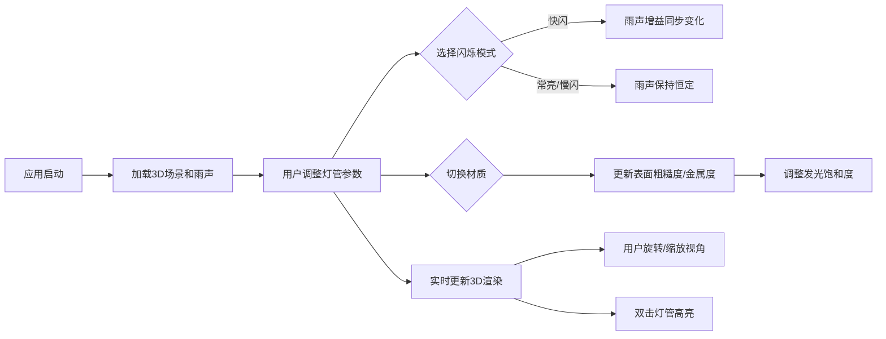

## 1. 产品概述
「霓虹雨夜」是一款面向光效设计师的3D交互可视化工具，用于在浏览器中模拟霓虹灯管在潮湿夜雨环境下的真实发光效果。
- 目标用户：光效设计师、视觉艺术家、场景概念设计师
- 核心价值：提供直观的3D交互界面，实时预览不同参数组合下的霓虹视觉效果，辅助设计决策

## 2. 核心功能

### 2.1 用户角色
| 角色 | 注册方式 | 核心权限 |
|------|---------|---------|
| 设计师用户 | 无需注册，直接使用 | 全部功能：调整灯管参数、切换材质、预览效果、控制视角 |

### 2.2 功能模块
1. **3D主场景模块**：动态雨幕粒子、霓虹灯管渲染、地面倒影、环境光照
2. **灯管参数编辑模块**：弯曲度滑块、颜色选择器、闪烁模式选择、材质切换
3. **音频模块**：雨声背景音效、闪烁模式与音效增益联动
4. **视角控制模块**：轨道旋转、滚轮缩放、双击高亮交互

### 2.3 页面详情
| 页面名称 | 模块名称 | 功能描述 |
|---------|---------|---------|
| 主界面 | 3D场景渲染区 | 渲染霓虹灯管、雨滴粒子、地面倒影，支持OrbitControls轨道控制 |
| 主界面 | 控制面板 | 灯管弯曲度滑块(0-90°)、颜色选择器(初始#FF3366)、闪烁模式下拉、材质切换 |
| 主界面 | 音频控制 | 雨声背景音播放/停止，快闪模式时增益同步变化 |

## 3. 核心流程

设计师打开应用 → 初始场景加载（默认霓虹灯管+雨夜环境+雨声）→ 通过控制面板调整参数 → 实时预览3D场景变化 → 切换材质观察表面纹理 → 旋转/缩放视角查看细节 → 双击灯管触发高亮特效 → 完成设计预览

## 4. 用户界面设计

### 4.1 设计风格
- **主色调**：深夜色背景 #0a0a1a，霓虹主题色随灯管颜色动态变化
- **面板样式**：半透明毛玻璃效果 rgba(20,20,40,0.7)，圆角12px
- **控件样式**：滑块轨道色#444，滑块按钮使用当前灯管色；颜色选择器圆形φ40px；下拉菜单选项带发光边框
- **过渡动画**：所有UI元素颜色切换0.3秒平滑过渡
- **字体**：使用现代无衬线字体，标题加粗，正文清晰可读

### 4.2 页面设计概览
| 页面名称 | 模块名称 | UI元素 |
|---------|---------|--------|
| 主界面 | 3D场景(80%宽) | Canvas渲染区、OrbitControls交互、粒子系统、贝塞尔曲线灯管 |
| 主界面 | 控制面板(右侧/底部) | 标题、弯曲度滑块组、颜色选择器、闪烁模式下拉、材质切换按钮组 |

### 4.3 响应式设计
- **桌面端(≥768px)**：左侧80% 3D场景，右侧20%悬浮控制面板
- **移动端(<768px)**：3D场景占满上部，控制面板折叠至底部横向滚动

### 4.4 3D场景指导
- **环境**：深夜色(#0a0a1a)，无HDRI，使用点光源+环境光组合
- **光照设置**：灯管作为主要发光源，外发光通过多层透明球体叠加实现；环境光弱(强度0.1)
- **相机设置**：PerspectiveCamera初始位置(0, 2, 8)，fov 60°；缩放范围1-10倍
- **构图**：灯管居中偏上，地面位于y=0平面，倒影在地面可见
- **交互与动画**：雨滴持续下落动画、灯管闪烁动画、快闪时雨声增益联动、双击灯管1秒高亮动画
- **后处理**：地面反射平面模糊度0.3模拟湿滑地面
- **性能预算**：1500雨滴粒子(CPU端计算)、灯管几何体10分段、帧率≥50FPS、首屏≤3秒
